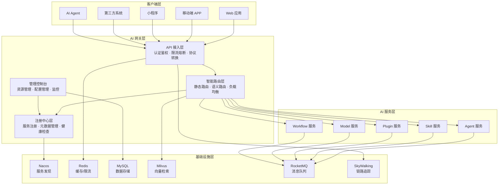
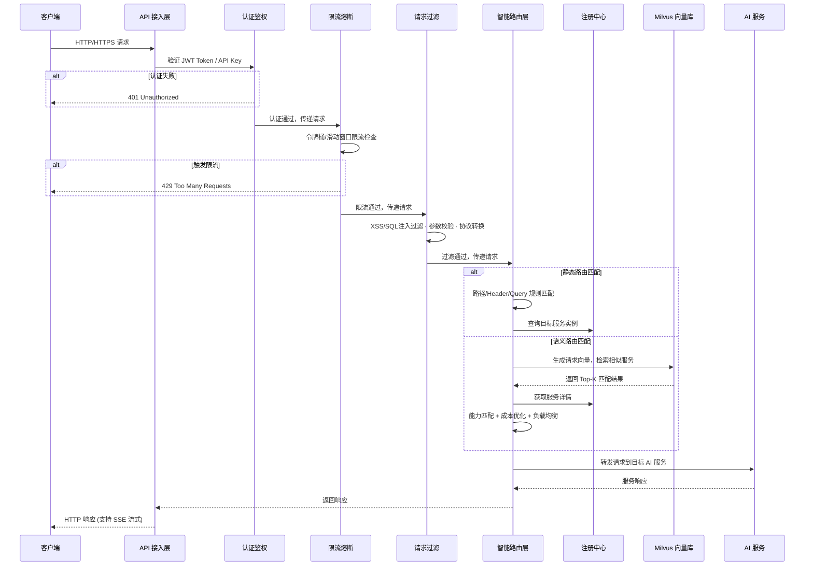
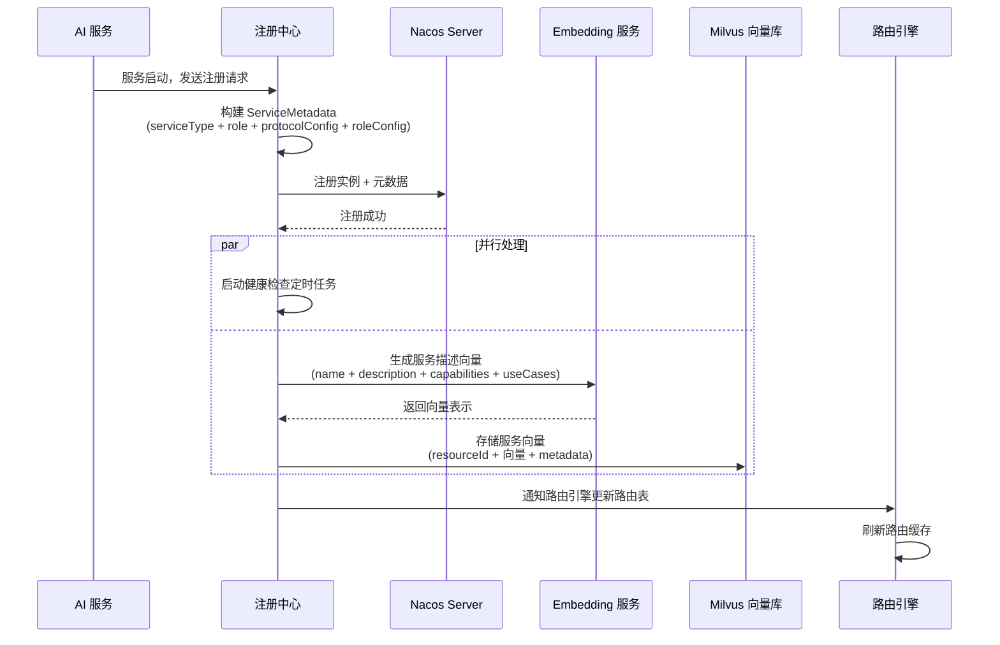
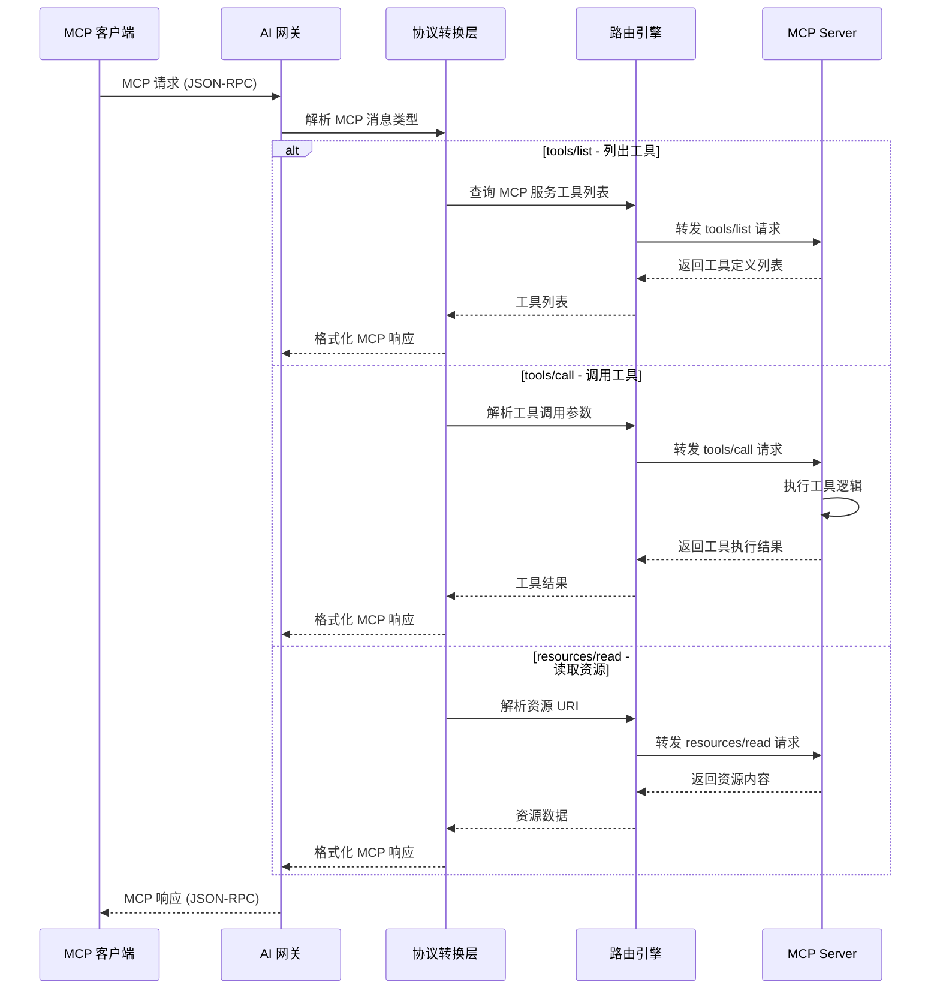
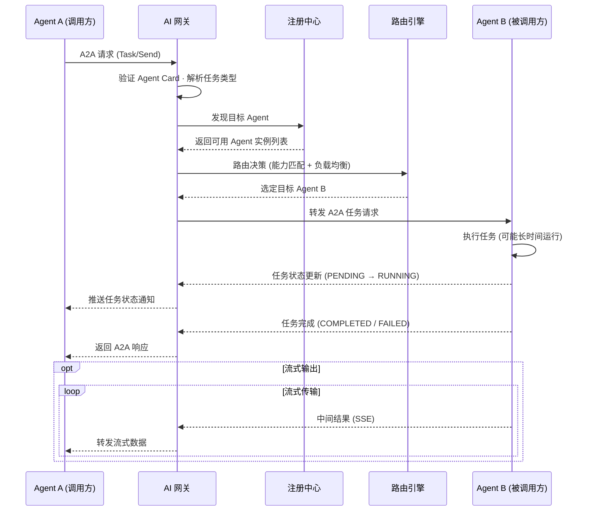
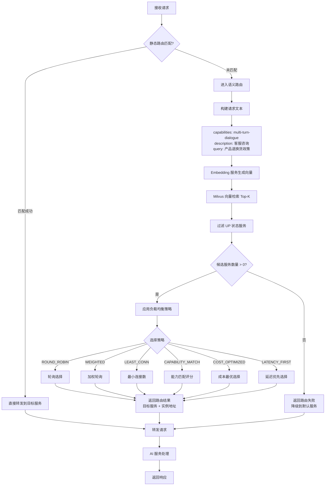
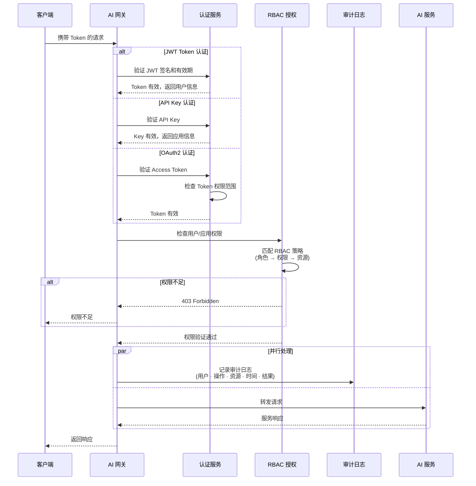
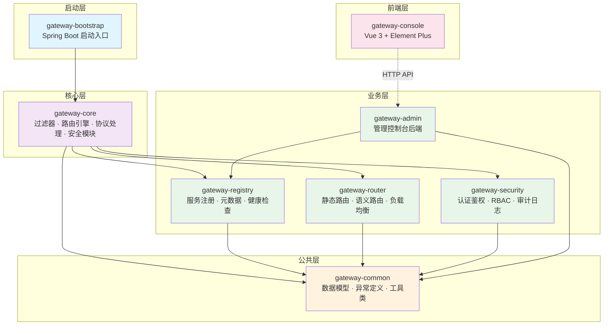
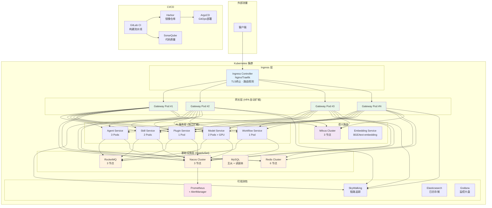

# AI 网关架构设计文档

## 目录

- [1. 概述](#1-概述)
  - [1.1 项目背景](#11-项目背景)
  - [1.2 设计原则](#12-设计原则)
  - [1.3 技术栈](#13-技术栈)
- [2. 系统架构](#2-系统架构)
  - [2.1 高层架构](#21-高层架构)
  - [2.2 组件概览](#22-组件概览)
  - [2.3 数据流](#23-数据流)
    - [2.3.1 AI 请求处理流程](#231-ai-请求处理流程)
    - [2.3.2 AI 资源注册流程](#232-ai-资源注册流程)
    - [2.3.3 MCP 协议处理流程](#233-mcp-协议处理流程)
    - [2.3.4 A2A 协议处理流程](#234-a2a-协议处理流程)
    - [2.3.5 语义路由详细流程](#235-语义路由详细流程)
    - [2.3.6 安全认证流程](#236-安全认证流程)
- [3. 详细设计](#3-详细设计)
  - [3.1 目录结构](#31-目录结构)
  - [3.2 模块设计](#32-模块设计)
    - [3.2.1 注册中心模块 (Registry)](#321-注册中心模块-registry)
    - [3.2.2 智能路由模块 (Router)](#322-智能路由模块-router)
  - [3.3 模块依赖关系](#33-模块依赖关系)
- [4. 注册中心元数据定义](#4-注册中心元数据定义)
  - [4.1 通用元数据结构](#41-通用元数据结构)
  - [4.2 协议配置统一模型](#42-协议配置统一模型)
    - [4.2.1 API 服务协议配置](#421-api-服务协议配置)
    - [4.2.2 MCP 服务协议配置](#422-mcp-服务协议配置)
    - [4.2.3 ACP 服务协议配置](#423-acp-服务协议配置)
    - [4.2.4 A2A 服务协议配置](#424-a2a-服务协议配置)
  - [4.3 角色配置统一模型](#43-角色配置统一模型)
    - [4.3.1 Agent 角色配置](#431-agent-角色配置)
    - [4.3.2 Skill 角色配置](#432-skill-角色配置)
    - [4.3.3 Plugin 角色配置](#433-plugin-角色配置)
    - [4.3.4 Model 角色配置](#434-model-角色配置)
  - [4.4 服务元数据构建示例](#44-服务元数据构建示例)
  - [4.9 Nacos 注册元数据详细定义](#49-nacos-注册元数据详细定义)
    - [4.9.1 API 服务 Nacos 注册元数据（Agent 角色）](#491-api-服务-nacos-注册元数据agent-角色)
    - [4.9.2 API 服务 Nacos 注册元数据（Skill 角色）](#492-api-服务-nacos-注册元数据skill-角色)
    - [4.9.3 API 服务 Nacos 注册元数据（Plugin 角色）](#493-api-服务-nacos-注册元数据plugin-角色)
    - [4.9.4 API 服务 Nacos 注册元数据（Model 角色）](#494-api-服务-nacos-注册元数据model-角色)
    - [4.9.5 MCP 服务 Nacos 注册元数据（Plugin 角色）](#495-mcp-服务-nacos-注册元数据plugin-角色)
    - [4.9.6 MCP 服务 Nacos 注册元数据（Agent 角色）](#496-mcp-服务-nacos-注册元数据agent-角色)
    - [4.9.7 A2A 服务 Nacos 注册元数据（Agent 角色）](#497-a2a-服务-nacos-注册元数据agent-角色)
    - [4.9.8 ACP 服务 Nacos 注册元数据（Agent 角色）](#498-acp-服务-nacos-注册元数据agent-角色)
    - [4.9.9 Nacos 注册元数据使用示例](#499-nacos-注册元数据使用示例)
    - [4.9.10 Nacos 元数据查询示例](#4910-nacos-元数据查询示例)
- [5. 基础设施](#5-基础设施)
  - [5.1 部署架构](#51-部署架构)
  - [5.2 可扩展性策略](#52-可扩展性策略)
  - [5.3 安全考虑](#53-安全考虑)
- [6. 开发工作流](#6-开发工作流)
  - [6.1 本地开发](#61-本地开发)
  - [6.2 CI/CD 流水线](#62-cicd-流水线)
  - [6.3 代码质量](#63-代码质量)
- [7. 监控与可观测性](#7-监控与可观测性)
  - [7.1 日志](#71-日志)
  - [7.2 指标](#72-指标)
  - [7.3 告警](#73-告警)
- [8. 风险评估](#8-风险评估)
- [9. 实施路线图](#9-实施路线图)
  - [第一阶段：基础框架（第 1-2 周）](#第一阶段基础框架第-1-2-周)
  - [第二阶段：注册中心（第 3-4 周）](#第二阶段注册中心第-3-4-周)
  - [第三阶段：MCP/ACP/A2A 协议（第 5-6 周）](#第三阶段mcpacpa2a-协议第-5-6-周)
  - [第四阶段：智能路由（第 7-8 周）](#第四阶段智能路由第-7-8-周)
  - [第五阶段：安全与运维（第 9-10 周）](#第五阶段安全与运维第-9-10-周)
  - [第六阶段：监控与可观测性（第 11-12 周）](#第六阶段监控与可观测性第-11-12-周)
  - [第七阶段：生产就绪（第 13-14 周）](#第七阶段生产就绪第-13-14-周)
- [附录](#附录)
  - [A. 术语表](#a-术语表)
  - [B. 参考资料](#b-参考资料)
  - [C. 配置示例](#c-配置示例)

---

## 1. 概述

### 1.1 项目背景

本项目旨在构建一个企业级 AI 网关（AI Gateway），作为 AI 能力的统一入口和管理平台。网关负责管理 AI 资源的注册与发现、请求的智能路由、安全防护以及全链路观测，为企业提供统一、安全、可观测的 AI 服务接入层。

**核心价值：**
- **统一入口**：屏蔽后端 AI 服务差异，提供标准化接入接口
- **多协议支持**：统一管理 API、MCP、A2A 等多种 AI 协议
- **智能路由**：支持静态路由和基于语义理解的动态路由
- **安全可控**：统一鉴权、审计、限流，保障 AI 服务安全
- **可观测性**：全链路追踪、指标采集、日志聚合，运维无忧

**目标用户：**
- AI 服务提供者：注册和管理 Agent、Skill、Plugin、Model 等 AI 资源
- 业务开发团队：通过网关快速接入 AI 能力
- 运维团队：监控网关及 AI 服务运行状态
- 安全团队：审计 AI 调用行为，管控访问权限

### 1.2 设计原则

- **高可用性**：网关无单点故障，支持多实例部署和故障自动转移
- **高性能**：低延迟转发，支持高并发 AI 请求处理
- **可扩展性**：插件化架构，支持自定义扩展功能模块
- **协议兼容**：统一抽象多种 AI 协议，提供标准化接入
- **安全合规**：统一鉴权、审计日志、数据脱敏，符合企业安全规范
- **可观测性**：全链路追踪、实时指标、智能告警

### 1.3 技术栈

| 层级 | 技术 | 选择理由 |
|-----|------|---------|
| 编程语言 | Java 17+ | 企业级生态成熟，性能稳定 |
| 基础框架 | Spring Boot 3.x + Spring Cloud | 微服务架构标准，组件丰富 |
| 网关框架 | Spring Cloud Gateway | 响应式架构，高性能，与 Spring 生态无缝集成 |
| 服务注册 | Nacos 2.x | 阿里开源，支持服务发现与配置管理，社区活跃 |
| 配置中心 | Nacos Config | 动态配置管理，支持热更新 |
| RPC 框架 | gRPC + Dubbo | 高性能服务调用，支持流式传输 |
| 认证鉴权 | Spring Security + OAuth2 + JWT | 企业级安全框架，支持多种认证方式 |
| 缓存 | Redis 7+ Cluster | 高速缓存、分布式锁、限流计数 |
| 向量数据库 | Milvus / Weaviate | 语义路由向量存储与检索 |
| 消息队列 | RocketMQ / Kafka | 异步解耦、事件驱动、审计日志 |
| 数据库 | MySQL 8.0 + MyBatis-Plus | 关系型数据存储，ORM 框架 |
| 搜索引擎 | Elasticsearch 8+ | 日志聚合、全文检索 |
| 链路追踪 | SkyWalking / Zipkin | 分布式链路追踪，性能分析 |
| 指标监控 | Prometheus + Grafana | 指标采集与可视化 |
| 日志管理 | ELK Stack | 集中式日志管理与分析 |
| 容器化 | Docker + Kubernetes | 容器化部署，弹性伸缩 |
| API 文档 | Knife4j (Swagger) | 在线 API 文档，便于调试 |

---

## 2. 系统架构

### 2.1 高层架构

> 📐 **高清架构图**: [system-architecture.svg](docs/diagrams/system-architecture.svg) | [Mermaid 源码](docs/diagrams/system-architecture.mmd)

```
┌─────────────────────────────────────────────────────────────────────────────────────────┐
│                               客户端层 (Client Layer)                                    │
│                                                                                         │
│  ┌────────────┐ ┌────────────┐ ┌────────────┐ ┌────────────┐ ┌──────────┐ ┌──────────┐ │
│  │  Web 应用   │ │ 移动端 APP  │ │   小程序    │ │ 第三方系统  │ │ AI Agent │ │  CLI 工具 │ │
│  │  (Vue/React)│ │ (iOS/Android)│ │ (微信/支付宝)│ │  (ERP/CRM) │ │ (LangChain)│ │ (Python) │ │
│  └─────┬──────┘ └─────┬──────┘ └─────┬──────┘ └─────┬──────┘ └────┬─────┘ └────┬─────┘ │
│        └───────────────┴───────────────┴───────────────┴─────────────┴────────────┘       │
│                                        │                                                  │
│                                   HTTP/HTTPS                                              │
└────────────────────────────────────────┼──────────────────────────────────────────────────┘
                                         │
                                         ▼
┌─────────────────────────────────────────────────────────────────────────────────────────┐
│                            AI 网关层 (AI Gateway)                                        │
│                                                                                         │
│  ┌───────────────────────────────────────────────────────────────────────────────────┐  │
│  │                          API 接入层 (Gateway Layer)                                │  │
│  │                                                                                   │  │
│  │  ┌──────────┐  ┌──────────┐  ┌──────────┐  ┌──────────┐  ┌──────────┐           │  │
│  │  │ 认证鉴权  │  │ 限流熔断  │  │ 协议转换  │  │ 请求过滤  │  │ 响应缓存  │           │  │
│  │  │ OAuth2   │  │ Sentinel │  │ REST↔MCP │  │ XSS/SQL  │  │  Redis   │           │  │
│  │  │ JWT      │  │ 令牌桶   │  │ REST↔A2A │  │ 过滤     │  │          │           │  │
│  │  │ API Key  │  │ 滑动窗口 │  │ REST↔ACP │  │ 参数校验  │  │          │           │  │
│  │  └──────────┘  └──────────┘  └──────────┘  └──────────┘  └──────────┘           │  │
│  └───────────────────────────────────────┬───────────────────────────────────────────┘  │
│                                          │                                              │
│                                          ▼                                              │
│  ┌───────────────────────────────────────────────────────────────────────────────────┐  │
│  │                         智能路由层 (Router Layer)                                  │  │
│  │                                                                                   │  │
│  │  ┌──────────────┐  ┌──────────────┐  ┌──────────────┐  ┌──────────────┐          │  │
│  │  │   静态路由     │  │   语义路由    │  │  负载均衡     │  │  故障转移     │          │  │
│  │  │  路径匹配     │  │ 向量相似度    │  │  轮询/加权    │  │  熔断降级    │          │  │
│  │  │  Header匹配   │  │ 能力匹配     │  │  最小连接     │  │  重试策略    │          │  │
│  │  │  Query匹配    │  │ 成本优化     │  │  延迟优先     │  │  备用服务    │          │  │
│  │  └──────────────┘  └──────┬───────┘  └──────────────┘  └──────────────┘          │  │
│  │                           │                                                       │  │
│  │                           ▼                                                       │  │
│  │                 ┌──────────────────┐                                              │  │
│  │                 │   Milvus 向量库   │                                              │  │
│  │                 │  服务描述向量检索  │                                              │  │
│  │                 └──────────────────┘                                              │  │
│  └───────────────────────────────────────┬───────────────────────────────────────────┘  │
│                                          │                                              │
│                                          ▼                                              │
│  ┌───────────────────────────────────────────────────────────────────────────────────┐  │
│  │                        注册中心 (Registry Layer)                                  │  │
│  │                                                                                   │  │
│  │  ┌─────────────────────────────────────────────────────────────────────────────┐  │  │
│  │  │                    ServiceType 统一注册模型                                   │  │  │
│  │  │   ┌──────────┐  ┌──────────┐  ┌──────────┐  ┌──────────┐                   │  │  │
│  │  │   │   API    │  │   MCP    │  │   ACP    │  │   A2A    │                   │  │  │
│  │  │   │ REST接口  │  │ 工具调用  │  │ Agent通信 │  │ Agent协作 │                   │  │  │
│  │  │   └──────────┘  └──────────┘  └──────────┘  └──────────┘                   │  │  │
│  │  └─────────────────────────────────────────────────────────────────────────────┘  │  │
│  │                                                                                   │  │
│  │  ┌─────────────────────────────────────────────────────────────────────────────┐  │  │
│  │  │                    ServiceRole 角色分类                                      │  │  │
│  │  │   ┌──────────┐  ┌──────────┐  ┌──────────┐  ┌──────────┐                   │  │  │
│  │  │   │  AGENT   │  │  SKILL   │  │  PLUGIN  │  │  MODEL   │                   │  │  │
│  │  │   │ 智能体    │  │ 技能      │  │ 插件      │  │ 模型      │                   │  │  │
│  │  │   └──────────┘  └──────────┘  └──────────┘  └──────────┘                   │  │  │
│  │  └─────────────────────────────────────────────────────────────────────────────┘  │  │
│  │                                                                                   │  │
│  │  ┌──────────┐  ┌──────────┐  ┌──────────┐  ┌──────────┐  ┌──────────┐          │  │
│  │  │ 健康检查  │  │ 元数据管理 │  │ 向量生成  │  │ 能力发现  │  │ Nacos集成 │          │  │
│  │  └──────────┘  └──────────┘  └──────────┘  └──────────┘  └──────────┘          │  │
│  └───────────────────────────────────────┬───────────────────────────────────────────┘  │
│                                          │                                              │
│  ┌───────────────────────────────────────▼───────────────────────────────────────────┐  │
│  │                       管理控制台 (Admin Console)                                   │  │
│  │                                                                                   │  │
│  │  ┌──────────┐  ┌──────────┐  ┌──────────┐  ┌──────────┐  ┌──────────┐          │  │
│  │  │ 资源管理  │  │ 配置管理  │  │ 权限管理  │  │ 审计日志  │  │ 监控大盘  │          │  │
│  │  │ CRUD操作  │  │ 动态配置  │  │ RBAC     │  │ 操作审计  │  │ Grafana  │          │  │
│  │  │ 批量导入  │  │ 灰度发布  │  │ API Key  │  │ 调用日志  │  │ 告警通知  │          │  │
│  │  └──────────┘  └──────────┘  └──────────┘  └──────────┘  └──────────┘          │  │
│  └───────────────────────────────────────────────────────────────────────────────────┘  │
└─────────────────────────────────────────────────────────────────────────────────────────┘
                                         │
                          ┌──────────────┼──────────────┐
                          ▼              ▼              ▼
┌─────────────────────────────────────────────────────────────────────────────────────────┐
│                           AI 服务层 (AI Services)                                        │
│                                                                                         │
│  ┌──────────────┐ ┌──────────────┐ ┌──────────────┐ ┌──────────────┐ ┌──────────────┐ │
│  │  Agent 服务   │ │  Skill 服务   │ │  Plugin 服务  │ │  Model 服务   │ │ Workflow 服务 │ │
│  │              │ │              │ │              │ │              │ │              │ │
│  │ ┌──────────┐ │ │ ┌──────────┐ │ │ ┌──────────┐ │ │ ┌──────────┐ │ │ ┌──────────┐ │ │
│  │ │ 客服Agent │ │ │ │ 文本摘要  │ │ │ │ 文件系统  │ │ │ │ GPT-4    │ │ │ │ 工作流   │ │ │
│  │ │ 研究Agent │ │ │ │ 代码生成  │ │ │ │ Web搜索   │ │ │ │ Claude   │ │ │ │ 编排引擎  │ │ │
│  │ │ 编码Agent │ │ │ │ 翻译技能  │ │ │ │ 数据库    │ │ │ │ 本地模型  │ │ │ │ DAG调度  │ │ │
│  │ └──────────┘ │ │ └──────────┘ │ │ └──────────┘ │ │ └──────────┘ │ │ └──────────┘ │ │
│  └──────────────┘ └──────────────┘ └──────────────┘ └──────────────┘ └──────────────┘ │
│                                                                                         │
│  支持协议: REST API · MCP (Model Context Protocol) · ACP · A2A (Agent-to-Agent)        │
└─────────────────────────────────────────────────────────────────────────────────────────┘
                                         │
                          ┌──────────────┼──────────────┐
                          ▼              ▼              ▼
┌─────────────────────────────────────────────────────────────────────────────────────────┐
│                          基础设施层 (Infrastructure)                                      │
│                                                                                         │
│  ┌──────────────┐ ┌──────────────┐ ┌──────────────┐ ┌──────────────┐ ┌──────────────┐ │
│  │    Nacos     │ │    Redis     │ │    MySQL     │ │  RocketMQ    │ │ SkyWalking   │ │
│  │  服务发现     │ │  缓存/限流    │ │  数据存储     │ │  消息队列     │ │  链路追踪     │ │
│  │  配置中心     │ │  分布式锁     │ │  审计日志     │ │  事件驱动     │ │  性能分析     │ │
│  │  3节点集群    │ │  Cluster模式  │ │  主从复制     │ │  异步解耦     │ │  拓扑发现     │ │
│  └──────────────┘ └──────────────┘ └──────────────┘ └──────────────┘ └──────────────┘ │
│                                                                                         │
│  ┌──────────────┐ ┌──────────────┐ ┌──────────────┐ ┌──────────────────────────────┐  │
│  │   Milvus     │ │ Elasticsearch│ │   Prometheus │ │          Grafana             │  │
│  │  向量数据库   │ │  日志聚合     │ │  指标采集     │ │        监控可视化             │  │
│  │  语义检索     │ │  全文检索     │ │  告警规则     │ │        仪表板                │  │
│  └──────────────┘ └──────────────┘ └──────────────┘ └──────────────────────────────┘  │
└─────────────────────────────────────────────────────────────────────────────────────────┘
```

**架构分层说明：**

| 层级 | 职责 | 关键技术 |
|-----|------|---------|
| 客户端层 | 多终端接入，统一 HTTP/HTTPS 协议 | Vue/React, iOS/Android, 小程序 |
| API 接入层 | 认证鉴权、限流熔断、协议转换、请求过滤 | Spring Cloud Gateway, Sentinel |
| 智能路由层 | 静态路由、语义路由、负载均衡、故障转移 | 自研路由引擎, Milvus |
| 注册中心层 | 统一服务注册、多协议支持、健康检查、元数据管理 | Nacos 2.x, 自研扩展 |
| 管理控制台 | 资源管理、配置管理、权限管理、审计日志、监控展示 | Vue 3 + Element Plus |
| AI 服务层 | Agent/Skill/Plugin/Model/Workflow 服务 | 多协议 (REST/MCP/ACP/A2A) |
| 基础设施层 | 服务发现、缓存、存储、消息、监控 | Nacos, Redis, MySQL, RocketMQ, Milvus |

**模块依赖关系图：**



### 2.2 组件概览

| 组件 | 职责 | 技术实现 |
|-----|------|---------|
| API 网关 | 请求接入、协议转换、认证鉴权、限流熔断 | Spring Cloud Gateway |
| 注册中心 | AI 资源注册发现、多协议支持、健康检查、元数据管理 | Nacos 2.x + 自研扩展 |
| 智能路由 | 静态路由、语义路由、负载均衡、能力匹配 | 自研路由引擎 + Milvus |
| 安全模块 | 认证鉴权、权限控制、审计日志 | Spring Security + OAuth2 |
| 管理控制台 | 资源管理、配置管理、监控展示 | Vue 3 + Element Plus |
| 链路追踪 | 全链路追踪、性能分析 | SkyWalking |
| 指标监控 | 指标采集、告警通知 | Prometheus + Grafana |
| 日志中心 | 日志聚合、检索分析 | ELK Stack |

### 2.3 数据流

> 📐 **高清流程图**: [request-flow.svg](docs/diagrams/request-flow.svg) | [Mermaid 源码](docs/diagrams/request-flow.mmd)

#### 2.3.1 AI 请求处理流程



#### 2.3.2 AI 资源注册流程



#### 2.3.3 MCP 协议处理流程



#### 2.3.4 A2A 协议处理流程



#### 2.3.5 语义路由详细流程

> 📐 **高清流程图**: [semantic-routing.svg](docs/diagrams/semantic-routing.svg) | [Mermaid 源码](docs/diagrams/semantic-routing.mmd)



#### 2.3.6 安全认证流程



---

## 3. 详细设计

### 3.1 目录结构

```
ai-gateway/
├── gateway-bootstrap/              # 启动模块
│   └── src/main/java/
│       └── com/ai/gateway/
│           └── GatewayApplication.java
│
├── gateway-core/                   # 核心模块
│   └── src/main/java/
│       └── com/ai/gateway/core/
│           ├── config/             # 配置类
│           ├── filter/             # 网关过滤器
│           ├── route/              # 路由引擎
│           ├── registry/           # 注册中心客户端
│           ├── protocol/           # 协议处理
│           └── security/           # 安全模块
│
├── gateway-registry/               # 注册中心模块
│   └── src/main/java/
│       └── com/ai/gateway/registry/
│           ├── agent/              # Agent 注册
│           ├── skill/              # Skill 注册
│           ├── plugin/             # Plugin 注册
│           ├── model/              # Model 注册
│           ├── protocol/           # 协议处理器
│           │   ├── api/            # API 协议
│           │   ├── mcp/            # MCP 协议
│           │   └── a2a/            # A2A 协议
│           ├── health/             # 健康检查
│           └── metadata/           # 元数据管理
│
├── gateway-router/                 # 智能路由模块
│   └── src/main/java/
│       └── com/ai/gateway/router/
│           ├── static/             # 静态路由
│           ├── semantic/           # 语义路由
│           ├── loadbalance/        # 负载均衡
│           ├── matcher/            # 能力匹配
│           └── fallback/           # 故障转移
│
├── gateway-security/               # 安全模块
│   └── src/main/java/
│       └── com/ai/gateway/security/
│           ├── auth/               # 认证
│           ├── authorization/      # 授权
│           ├── audit/              # 审计
│           └── token/              # Token 管理
│
├── gateway-admin/                  # 管理控制台
│   └── src/main/java/
│       └── com/ai/gateway/admin/
│           ├── controller/         # API 控制器
│           ├── service/            # 业务服务
│           └── repository/         # 数据访问
│
├── gateway-common/                 # 公共模块
│   └── src/main/java/
│       └── com/ai/gateway/common/
│           ├── model/              # 数据模型
│           ├── exception/          # 异常定义
│           └── utils/              # 工具类
│
├── gateway-console/                # 前端控制台
│   ├── src/
│   │   ├── views/                  # 页面组件
│   │   ├── components/             # 公共组件
│   │   ├── api/                    # API 接口
│   │   └── store/                  # 状态管理
│   └── package.json
│
└── docs/                           # 文档
    ├── api/                        # API 文档
    └── design/                     # 设计文档
```

### 3.2 模块设计

#### 3.2.1 注册中心模块 (Registry)

**核心功能：**
- Agent 注册与发现
- Skill 注册与发现
- Plugin 注册与发现
- Model 注册与发现
- 多协议支持 (API/MCP/A2A)
- 服务健康检查
- 元数据管理与向量化

**服务类型枚举：**

向 Nacos 注册 AI 服务时，统一使用 `ServiceType` 枚举标识服务类型。每种服务类型对应一种接入协议，注册时不再按资源类型（Agent/Skill/Plugin/Model）和协议类型分别注册，而是以服务类型为统一维度。

```java
/**
 * 服务类型枚举
 * 向 Nacos 注册时，所有 AI 服务统一归类为以下四种类型之一
 */
public enum ServiceType {
    API("REST API 服务", "标准 RESTful 接口，支持 HTTP/HTTPS 协议接入"),
    MCP("MCP 服务", "Model Context Protocol 服务，提供工具调用、资源访问等能力"),
    ACP("ACP 服务", "Agent Communication Protocol 服务，支持 Agent 间通信与协作"),
    A2A("A2A 服务", "Agent-to-Agent 服务，基于 Google A2A 协议的 Agent 间通信");

    private final String name;
    private final String description;
}
```

**服务类型与内部角色的对应关系：**

每种 `ServiceType` 下可以承载不同的 AI 内部角色（Agent/Skill/Plugin/Model），通过元数据中的 `role` 字段区分：

```java
/**
 * 服务角色枚举
 * 标识 AI 服务在系统中的内部角色，用于路由匹配和能力发现
 */
public enum ServiceRole {
    AGENT("智能体", "具有自主决策能力的 AI 组件"),
    SKILL("技能", "特定领域的 AI 能力单元"),
    PLUGIN("插件", "可扩展的功能模块"),
    MODEL("模型", "大语言模型或专用模型服务");

    private final String name;
    private final String description;
}
```

**Nacos 集成配置：**

```yaml
spring:
  cloud:
    nacos:
      discovery:
        server-addr: ${NACOS_SERVER:localhost:8848}
        namespace: ${NACOS_NAMESPACE:ai-gateway}
        group: AI_GATEWAY_GROUP
        metadata:
          version: ${APP_VERSION:1.0.0}
          environment: ${APP_ENV:dev}
      config:
        server-addr: ${NACOS_SERVER:localhost:8848}
        namespace: ${NACOS_NAMESPACE:ai-gateway}
        group: AI_GATEWAY_GROUP
        file-extension: yaml
```

**Nacos 注册元数据规范：**

所有 AI 资源注册到 Nacos 时，使用统一的元数据结构。Nacos 实例元数据 (Instance Metadata) 采用扁平化 KV 结构，复杂数据使用 JSON 字符串序列化。

**Nacos 元数据通用字段：**

| 元数据 Key | 类型 | 必填 | 说明 |
|-----------|------|------|------|
| resourceId | String | 是 | 服务唯一标识 (UUID) |
| serviceType | String | 是 | 服务类型: API/MCP/ACP/A2A |
| role | String | 否 | 服务角色: AGENT/SKILL/PLUGIN/MODEL |
| name | String | 是 | 服务名称 |
| version | String | 是 | 服务版本 |
| description | String | 否 | 服务描述 |
| serviceAddress | String | 是 | 服务地址 (host:port 或 URL) |
| capabilities | String | 否 | 能力标签列表 (JSON Array) |
| tags | String | 否 | 标签 (JSON Map) |
| status | String | 是 | 服务状态: UP/DOWN/STARTING/STOPPING |
| weight | Integer | 否 | 负载权重 (1-100)，默认 50 |
| healthCheckInterval | Integer | 否 | 健康检查间隔 (秒)，默认 30 |
| createTime | String | 是 | 创建时间 (ISO 8601) |
| updateTime | String | 是 | 更新时间 (ISO 8601) |
| protocol.endpointPath | String | 否 | 服务端点路径 |
| protocol.authenticationType | String | 否 | 认证方式 |

**Nacos 元数据扩展字段前缀规范：**

根据 `serviceType` 的不同，使用对应的前缀存放协议特定字段。每种服务类型使用独立的前缀命名空间，不再按 Agent/Skill/Plugin/Model 划分前缀。

| 前缀 | 适用 serviceType | 用途 | 说明 |
|------|-----------------|------|------|
| api.* | API | REST API 服务配置 | API 类型、认证方式、限流配置、请求示例、端点定义等 |
| mcp.* | MCP | MCP 协议配置 | 协议版本、传输类型、工具列表（含 inputSchema/outputSchema）、资源列表、提示模板等 |
| acp.* | ACP | ACP 协议配置 | Agent 通信协议版本、能力声明、消息格式、动作定义、事件定义等 |
| a2a.* | A2A | A2A 协议配置 | Agent Card、任务类型、任务定义（含状态流转/重试策略）、输入输出模式、认证配置等 |
| role.* | 全部 | 服务角色信息 | 内部角色类型、角色专属配置（如 Agent 的工具列表、Model 的定价信息等） |

**Nacos 元数据接口定义字段：**

各协议类型的接口参数定义使用以下元数据 Key 存储（JSON 字符串格式）：

| 元数据 Key | 适用 serviceType | 说明 |
|-----------|-----------------|------|
| api.endpoints | API | API 端点定义列表，包含 method、path、parameters、requestBody、response 等 |
| api.endpoints[].endpointId | API | 端点唯一标识 |
| api.endpoints[].name | API | 端点名称 |
| api.endpoints[].method | API | HTTP 方法 (GET/POST/PUT/DELETE/PATCH) |
| api.endpoints[].path | API | 端点路径 |
| api.endpoints[].parameters | API | 请求参数列表 (path/query/header/cookie) |
| api.endpoints[].requestBody | API | 请求体 Schema (JSON Schema) |
| api.endpoints[].response | API | 响应体 Schema (JSON Schema) |
| api.endpoints[].streaming | API | 是否支持流式响应 |
| api.endpoints[].timeout | API | 超时时间 (毫秒) |
| mcp.tools | MCP | MCP 工具列表 |
| mcp.tools[].inputSchema | MCP | 工具输入参数 Schema (JSON Schema) |
| mcp.tools[].outputSchema | MCP | 工具输出参数 Schema (JSON Schema) |
| mcp.tools[].annotations | MCP | 工具注解 (readOnlyHint/destructiveHint/idempotentHint/openWorldHint) |
| mcp.tools[].examples | MCP | 工具调用示例列表 |
| mcp.tools[].requiresConfirmation | MCP | 是否需要确认才能执行 |
| mcp.resources[].uriTemplate | MCP | 资源模板 URI (支持动态参数) |
| mcp.resources[].subscribable | MCP | 是否支持订阅 |
| acp.actions | ACP | ACP 动作定义列表 |
| acp.actions[].actionType | ACP | 动作类型 (TASK/QUERY/COMMAND/EVENT) |
| acp.actions[].inputSchema | ACP | 动作输入参数 Schema (JSON Schema) |
| acp.actions[].outputSchema | ACP | 动作输出参数 Schema (JSON Schema) |
| acp.actions[].asynchronous | ACP | 是否异步执行 |
| acp.actions[].requiredPermissions | ACP | 所需权限列表 |
| acp.messageTypes | ACP | 消息类型定义列表 |
| acp.messageTypes[].direction | ACP | 消息方向 (INBOUND/OUTBOUND/BIDIRECTIONAL) |
| acp.messageTypes[].schema | ACP | 消息 Schema (JSON Schema) |
| acp.events | ACP | 事件定义列表 |
| acp.events[].eventType | ACP | 事件类型 (STATE_CHANGE/PROGRESS/ERROR/CUSTOM) |
| acp.events[].schema | ACP | 事件 Schema (JSON Schema) |
| a2a.taskDefinitions | A2A | 任务定义列表 |
| a2a.taskDefinitions[].inputSchema | A2A | 任务输入参数 Schema (JSON Schema) |
| a2a.taskDefinitions[].outputSchema | A2A | 任务输出参数 Schema (JSON Schema) |
| a2a.taskDefinitions[].statuses | A2A | 任务状态定义 (含状态流转) |
| a2a.taskDefinitions[].retryPolicy | A2A | 重试策略 |
| a2a.taskDefinitions[].streaming | A2A | 是否支持流式输出 |
| a2a.agentCard.capabilitiesList | A2A | Agent 能力列表 (含 inputSchema/outputSchema) |

---

#### 3.2.2 智能路由模块 (Router)

**核心功能：**
- 静态路由：基于路径、Header、Query 参数的确定性路由
- 语义路由：基于请求内容语义理解的智能路由
- 负载均衡策略
- 能力匹配
- 成本优化路由
- 故障转移机制

**路由类型枚举：**

```java
/**
 * 路由类型枚举
 */
public enum RouteType {
    STATIC("静态路由", "基于规则的确定性路由"),
    SEMANTIC("语义路由", "基于内容理解的智能路由"),
    HYBRID("混合路由", "静态路由优先，未匹配时使用语义路由");
    
    private final String name;
    private final String description;
}
```

**语义路由引擎：**

```java
/**
 * 语义路由引擎
 * 基于向量相似度匹配最合适的AI服务
 */
@Service
@Slf4j
@RequiredArgsConstructor
public class SemanticRouteEngine {
    
    private final EmbeddingService embeddingService;
    private final VectorStore vectorStore;
    private final AiResourceRegistryService registryService;
    
    /**
     * 语义路由决策
     */
    public RouteResult routeBySemantic(SemanticRouteContext context) {
        // 1. 生成请求文本的向量表示
        String requestText = buildRequestText(context);
        float[] queryEmbedding = embeddingService.embed(requestText);
        
        // 2. 向量检索相似服务
        List<VectorMatch> matches = vectorStore.search(
            queryEmbedding,
            context.getTargetType(),
            context.getTopK() != null ? context.getTopK() : 5
        );
        
        // 3. 过滤可用服务
        List<AiResourceRegistry> candidates = matches.stream()
            .map(match -> registryService.getByResourceId(match.getResourceId()))
            .filter(Objects::nonNull)
            .filter(r -> r.getStatus() == ServiceStatus.UP)
            .collect(Collectors.toList());
        
        // 4. 应用负载均衡
        if (candidates.isEmpty()) {
            return RouteResult.failure("No semantic match found");
        }
        
        AiResourceRegistry selected = loadBalanceStrategy.select(
            candidates, context);
        
        return RouteResult.success(selected, buildRouteTarget(selected));
    }
    
    /**
     * 构建请求文本用于向量化
     */
    private String buildRequestText(SemanticRouteContext context) {
        StringBuilder sb = new StringBuilder();
        
        // 添加能力标签
        if (CollectionUtils.isNotEmpty(context.getRequiredCapabilities())) {
            sb.append("capabilities: ")
              .append(String.join(", ", context.getRequiredCapabilities()));
        }
        
        // 添加请求描述
        if (StringUtils.isNotBlank(context.getDescription())) {
            sb.append(" description: ").append(context.getDescription());
        }
        
        // 添加查询内容
        if (StringUtils.isNotBlank(context.getQuery())) {
            sb.append(" query: ").append(context.getQuery());
        }
        
        return sb.toString();
    }
}
```

**路由策略模型：**

```java
/**
 * 路由策略枚举
 */
public enum RouteStrategy {
    ROUND_ROBIN("轮询"),
    WEIGHTED_ROUND_ROBIN("加权轮询"),
    LEAST_CONNECTION("最小连接数"),
    CAPABILITY_MATCH("能力匹配"),
    COST_OPTIMIZED("成本优化"),
    LATENCY_FIRST("延迟优先"),
    SEMANTIC_MATCH("语义匹配");
    
    private final String description;
}
```

### 3.3 模块依赖关系

> 📐 **高清架构图**: [module-dependency.svg](docs/diagrams/module-dependency.svg) | [Mermaid 源码](docs/diagrams/module-dependency.mmd)



**模块职责与依赖说明：**

| 模块 | 职责 | 依赖模块 | 技术实现 |
|-----|------|---------|---------|
| gateway-bootstrap | 应用启动入口，加载配置 | gateway-core | Spring Boot 3.x |
| gateway-core | 过滤器链、路由引擎、协议处理、安全集成 | gateway-registry, gateway-router, gateway-security, gateway-common | Spring Cloud Gateway |
| gateway-registry | 服务注册发现、元数据管理、健康检查 | gateway-common | Nacos 2.x + 自研扩展 |
| gateway-router | 静态路由、语义路由、负载均衡、故障转移 | gateway-registry, gateway-common | 自研路由引擎 + Milvus |
| gateway-security | OAuth2/JWT 认证、RBAC 授权、审计日志 | gateway-common | Spring Security + OAuth2 |
| gateway-admin | 管理控制台后端 API | gateway-registry, gateway-common | Spring Boot + MyBatis-Plus |
| gateway-common | 共享数据模型、异常定义、工具类 | 无 | Java 17+ |
| gateway-console | 管理控制台前端 | gateway-admin (HTTP API) | Vue 3 + Element Plus |

---

## 4. 注册中心元数据定义

### 4.1 通用元数据结构

所有 AI 服务共享的基础元数据结构。注册时以 `serviceType`（API/MCP/ACP/A2A）为统一维度，`role` 字段标识服务在系统中的内部角色（Agent/Skill/Plugin/Model），不再将资源类型和协议类型分开定义。

```java
/**
 * 基础元数据结构
 * 所有 AI 服务注册到 Nacos 时共享的通用字段
 */
@Data
@Builder
@NoArgsConstructor
@AllArgsConstructor
public class BaseMetadata {
    
    /**
     * 服务唯一标识 (UUID)
     */
    private String resourceId;
    
    /**
     * 服务类型: API / MCP / ACP / A2A
     */
    private ServiceType serviceType;
    
    /**
     * 服务角色: AGENT / SKILL / PLUGIN / MODEL
     * 标识该服务在系统中的内部角色，用于语义路由匹配
     */
    private ServiceRole role;
    
    /**
     * 服务名称
     */
    private String name;
    
    /**
     * 服务描述
     */
    private String description;
    
    /**
     * 服务版本
     */
    private String version;
    
    /**
     * 服务地址 (host:port 或 URL)
     */
    private String serviceAddress;
    
    /**
     * 能力标签列表
     */
    private List<String> capabilities;
    
    /**
     * 标签 (用于分类和筛选)
     */
    private Map<String, String> tags;
    
    /**
     * 服务状态
     */
    private ServiceStatus status;
    
    /**
     * 负载权重 (1-100)
     */
    private Integer weight;
    
    /**
     * 健康检查间隔 (秒)
     */
    private Integer healthCheckInterval;
    
    /**
     * 创建时间
     */
    private LocalDateTime createTime;
    
    /**
     * 更新时间
     */
    private LocalDateTime updateTime;
    
    /**
     * 协议配置 (按 serviceType 类型存放对应的协议配置)
     */
    private ProtocolConfig protocolConfig;
    
    /**
     * 角色配置 (按 role 类型存放对应的角色专属配置)
     */
    private RoleConfig roleConfig;
}
```

### 4.2 协议配置统一模型

根据 `serviceType` 的不同，`protocolConfig` 存放对应的协议配置实现。四种服务类型各自有独立的协议配置结构。

```java
/**
 * 协议配置基类
 * 根据 serviceType 使用对应的子类
 */
@Data
@Builder
@NoArgsConstructor
@AllArgsConstructor
public abstract class ProtocolConfig {
    /**
     * 协议版本
     */
    private String protocolVersion;
    
    /**
     * 端点路径
     */
    private String endpointPath;
    
    /**
     * 认证方式
     */
    private String authenticationType;
    
    /**
     * 接口定义列表（该服务暴露的所有端点）
     */
    private List<EndpointDefinition> endpoints;
}

/**
 * 统一端点定义
 * 描述服务暴露的单个 API 端点，适用于所有协议类型
 */
@Data
@Builder
@NoArgsConstructor
@AllArgsConstructor
public class EndpointDefinition {
    
    /**
     * 端点唯一标识
     */
    private String endpointId;
    
    /**
     * 端点名称
     */
    private String name;
    
    /**
     * 端点描述
     */
    private String description;
    
    /**
     * HTTP 方法 (GET/POST/PUT/DELETE/PATCH)
     * 对于非 HTTP 协议，映射为对应的操作类型
     */
    private HttpMethod method;
    
    /**
     * 端点路径（相对于 basePath）
     */
    private String path;
    
    /**
     * 请求参数列表
     */
    private List<ParameterDefinition> parameters;
    
    /**
     * 请求体定义
     */
    private SchemaDefinition requestBody;
    
    /**
     * 响应体定义
     */
    private SchemaDefinition response;
    
    /**
     * 需要的请求头
     */
    private List<HeaderDefinition> requestHeaders;
    
    /**
     * 响应头
     */
    private List<HeaderDefinition> responseHeaders;
    
    /**
     * 错误响应定义
     */
    private List<ErrorDefinition> errorResponses;
    
    /**
     * 是否支持流式响应
     */
    private Boolean streaming;
    
    /**
     * 超时时间（毫秒）
     */
    private Long timeout;
    
    /**
     * 标签（用于分类和筛选）
     */
    private Map<String, String> tags;
}

public enum HttpMethod {
    GET("GET"),
    POST("POST"),
    PUT("PUT"),
    DELETE("DELETE"),
    PATCH("PATCH"),
    HEAD("HEAD"),
    OPTIONS("OPTIONS");
    
    private final String method;
}

/**
 * 参数定义
 * 支持 query、path、header、cookie 等参数位置
 */
@Data
@Builder
@NoArgsConstructor
@AllArgsConstructor
public class ParameterDefinition {
    
    /**
     * 参数名
     */
    private String name;
    
    /**
     * 参数描述
     */
    private String description;
    
    /**
     * 参数位置: query / path / header / cookie
     */
    private ParameterLocation location;
    
    /**
     * 参数类型: string, integer, number, boolean, array, object
     */
    private String type;
    
    /**
     * 是否必填
     */
    private Boolean required;
    
    /**
     * 默认值
     */
    private Object defaultValue;
    
    /**
     * 枚举值列表
     */
    private List<Object> enumValues;
    
    /**
     * 值示例
     */
    private Object example;
    
    /**
     * 值格式（如 date-time, email, uri 等）
     */
    private String format;
    
    /**
     * 最小值（数字类型）
     */
    private Object minimum;
    
    /**
     * 最大值（数字类型）
     */
    private Object maximum;
    
    /**
     * 正则表达式校验
     */
    private String pattern;
    
    /**
     * 当 type=array 时，元素类型
     */
    private String itemsType;
}

public enum ParameterLocation {
    QUERY("query"),
    PATH("path"),
    HEADER("header"),
    COOKIE("cookie");
    
    private final String location;
}

/**
 * Schema 定义
 * 使用 JSON Schema 规范描述请求体/响应体结构
 */
@Data
@Builder
@NoArgsConstructor
@AllArgsConstructor
public class SchemaDefinition {
    
    /**
     * Schema 类型: object, array, string, integer, number, boolean
     */
    private String type;
    
    /**
     * 对象属性定义
     */
    private Map<String, SchemaProperty> properties;
    
    /**
     * 必填属性列表
     */
    private List<String> required;
    
    /**
     * 当 type=array 时，元素的 Schema
     */
    private SchemaProperty items;
    
    /**
     * 描述
     */
    private String description;
    
    /**
     * 示例
     */
    private Object example;
}

/**
 * Schema 属性定义
 */
@Data
@Builder
@NoArgsConstructor
@AllArgsConstructor
public class SchemaProperty {
    
    /**
     * 属性类型
     */
    private String type;
    
    /**
     * 属性描述
     */
    private String description;
    
    /**
     * 是否必填
     */
    private Boolean required;
    
    /**
     * 默认值
     */
    private Object defaultValue;
    
    /**
     * 枚举值
     */
    private List<Object> enumValues;
    
    /**
     * 值示例
     */
    private Object example;
    
    /**
     * 格式
     */
    private String format;
    
    /**
     * 嵌套属性（对象类型）
     */
    private Map<String, SchemaProperty> properties;
    
    /**
     * 数组元素类型
     */
    private SchemaProperty items;
}

/**
 * Header 定义
 */
@Data
@Builder
@NoArgsConstructor
@AllArgsConstructor
public class HeaderDefinition {
    
    /**
     * Header 名称
     */
    private String name;
    
    /**
     * Header 描述
     */
    private String description;
    
    /**
     * 是否必填
     */
    private Boolean required;
    
    /**
     * 值类型
     */
    private String type;
    
    /**
     * 值示例
     */
    private String example;
}

/**
 * 错误响应定义
 */
@Data
@Builder
@NoArgsConstructor
@AllArgsConstructor
public class ErrorDefinition {
    
    /**
     * HTTP 状态码
     */
    private Integer statusCode;
    
    /**
     * 错误码
     */
    private String errorCode;
    
    /**
     * 错误描述
     */
    private String description;
    
    /**
     * 响应体 Schema
     */
    private SchemaDefinition schema;
}

#### 4.2.1 API 服务协议配置

```java
/**
 * API 服务协议配置
 * 适用于 serviceType = API 的服务
 */
@Data
@Builder
@NoArgsConstructor
@AllArgsConstructor
@EqualsAndHashCode(callSuper = true)
public class ApiProtocolConfig extends ProtocolConfig {
    
    /**
     * API 类型
     */
    private ApiType apiType;
    
    /**
     * 基础路径
     */
    private String basePath;
    
    /**
     * 认证方式列表
     */
    private List<ApiAuthType> authTypes;
    
    /**
     * 请求示例
     */
    private List<ApiExample> examples;
    
    /**
     * 限流配置
     */
    private ApiRateLimitConfig rateLimitConfig;
    
    /**
     * API 版本管理
     */
    private String apiVersion;
    
    /**
     * 通用响应头
     */
    private List<HeaderDefinition> commonHeaders;
}

public enum ApiType {
    REST("RESTful API"),
    GRAPHQL("GraphQL"),
    SOAP("SOAP");
    
    private final String description;
}

public enum ApiAuthType {
    API_KEY("API Key"),
    BEARER_TOKEN("Bearer Token"),
    OAUTH2("OAuth2"),
    BASIC("Basic Auth"),
    NONE("无认证");
    
    private final String description;
}

@Data
@Builder
@NoArgsConstructor
@AllArgsConstructor
public class ApiExample {
    private String name;
    private String description;
    private String requestExample;
    private String responseExample;
}

@Data
@Builder
@NoArgsConstructor
@AllArgsConstructor
public class ApiRateLimitConfig {
    private Integer requestsPerSecond;
    private Integer requestsPerMinute;
    private Integer requestsPerDay;
    private Integer concurrentLimit;
}
```

#### 4.2.2 MCP 服务协议配置

```java
/**
 * MCP 服务协议配置
 * 适用于 serviceType = MCP 的服务
 */
@Data
@Builder
@NoArgsConstructor
@AllArgsConstructor
@EqualsAndHashCode(callSuper = true)
public class McpProtocolConfig extends ProtocolConfig {
    
    /**
     * MCP 服务器能力
     */
    private McpServerCapabilities serverCapabilities;
    
    /**
     * MCP 客户端能力
     */
    private McpClientCapabilities clientCapabilities;
    
    /**
     * 支持的传输类型
     */
    private List<McpTransportType> transportTypes;
    
    /**
     * 工具列表
     */
    private List<McpToolDefinition> tools;
    
    /**
     * 资源列表
     */
    private List<McpResourceDefinition> resources;
    
    /**
     * 提示模板列表
     */
    private List<McpPromptDefinition> prompts;
    
    /**
     * 采样支持
     */
    private McpSamplingConfig sampling;
}

public enum McpTransportType {
    STDIO("标准输入输出"),
    HTTP("HTTP传输"),
    SSE("Server-Sent Events"),
    WEBSOCKET("WebSocket");
    
    private final String description;
}

@Data
@Builder
@NoArgsConstructor
@AllArgsConstructor
public class McpServerCapabilities {
    private Boolean tools;
    private Boolean resources;
    private Boolean prompts;
    private Boolean logging;
    private Boolean sampling;
}

@Data
@Builder
@NoArgsConstructor
@AllArgsConstructor
public class McpClientCapabilities {
    private Boolean tools;
    private Boolean resources;
    private Boolean prompts;
    private Boolean sampling;
}

/**
 * MCP 工具定义
 * 描述 MCP Server 提供的工具及其调用接口
 */
@Data
@Builder
@NoArgsConstructor
@AllArgsConstructor
public class McpToolDefinition {
    
    /**
     * 工具名称（唯一标识）
     */
    private String name;
    
    /**
     * 工具描述
     */
    private String description;
    
    /**
     * 输入参数 Schema（JSON Schema 格式）
     */
    private String inputSchema;
    
    /**
     * 输出参数 Schema（JSON Schema 格式）
     */
    private String outputSchema;
    
    /**
     * 是否支持注解（annotations）
     */
    private McpToolAnnotations annotations;
    
    /**
     * 请求示例
     */
    private List<McpToolExample> examples;
    
    /**
     * 超时时间（毫秒）
     */
    private Long timeout;
    
    /**
     * 是否需要确认才能执行
     */
    private Boolean requiresConfirmation;
    
    /**
     * 工具分类标签
     */
    private List<String> tags;
}

/**
 * MCP 工具注解
 */
@Data
@Builder
@NoArgsConstructor
@AllArgsConstructor
public class McpToolAnnotations {
    
    /**
     * 工具是否只读（不产生副作用）
     */
    private Boolean readOnlyHint;
    
    /**
     * 工具是否具有破坏性
     */
    private Boolean destructiveHint;
    
    /**
     * 工具是否具有幂等性
     */
    private Boolean idempotentHint;
    
    /**
     * 工具是否开放世界（可访问外部资源）
     */
    private Boolean openWorldHint;
}

/**
 * MCP 工具调用示例
 */
@Data
@Builder
@NoArgsConstructor
@AllArgsConstructor
public class McpToolExample {
    
    /**
     * 示例名称
     */
    private String name;
    
    /**
     * 示例描述
     */
    private String description;
    
    /**
     * 请求参数示例（JSON）
     */
    private String inputExample;
    
    /**
     * 响应结果示例（JSON）
     */
    private String outputExample;
}

/**
 * MCP 资源定义
 * 描述 MCP Server 提供的可读取资源
 */
@Data
@Builder
@NoArgsConstructor
@AllArgsConstructor
public class McpResourceDefinition {
    
    /**
     * 资源 URI
     */
    private String uri;
    
    /**
     * 资源名称
     */
    private String name;
    
    /**
     * 资源描述
     */
    private String description;
    
    /**
     * MIME 类型
     */
    private String mimeType;
    
    /**
     * 是否支持订阅
     */
    private Boolean subscribable;
    
    /**
     * 资源模板 URI（支持动态参数）
     */
    private String uriTemplate;
}

/**
 * MCP 提示模板定义
 */
@Data
@Builder
@NoArgsConstructor
@AllArgsConstructor
public class McpPromptDefinition {
    private String name;
    private String description;
    private List<McpPromptArgument> arguments;
    
    /**
     * 提示模板内容
     */
    private String template;
}

@Data
@Builder
@NoArgsConstructor
@AllArgsConstructor
public class McpPromptArgument {
    private String name;
    private String description;
    private Boolean required;
    
    /**
     * 参数类型
     */
    private String type;
    
    /**
     * 参数默认值
     */
    private String defaultValue;
}

/**
 * MCP 采样配置
 */
@Data
@Builder
@NoArgsConstructor
@AllArgsConstructor
public class McpSamplingConfig {
    
    /**
     * 是否支持采样
     */
    private Boolean enabled;
    
    /**
     * 支持的模型列表
     */
    private List<String> supportedModels;
    
    /**
     * 最大上下文窗口
     */
    private Integer maxContextWindow;
    
    /**
     * 是否支持流式采样
     */
    private Boolean streaming;
}
```

#### 4.2.3 ACP 服务协议配置

```java
/**
 * ACP 服务协议配置
 * 适用于 serviceType = ACP 的服务
 * ACP (Agent Communication Protocol) 用于 Agent 间通信与协作
 */
@Data
@Builder
@NoArgsConstructor
@AllArgsConstructor
@EqualsAndHashCode(callSuper = true)
public class AcpProtocolConfig extends ProtocolConfig {
    
    /**
     * ACP 协议版本
     */
    private String acpVersion;
    
    /**
     * Agent 能力声明
     */
    private AcpCapabilities capabilities;
    
    /**
     * 支持的消息格式
     */
    private List<String> supportedMessageFormats;
    
    /**
     * 支持的交互模式
     */
    private List<AcpInteractionMode> supportedInteractionModes;
    
    /**
     * 超时配置
     */
    private AcpTimeoutConfig timeoutConfig;
    
    /**
     * 消息类型定义
     */
    private List<AcpMessageType> messageTypes;
    
    /**
     * 动作（Action）定义列表
     */
    private List<AcpActionDefinition> actions;
    
    /**
     * 事件订阅定义
     */
    private List<AcpEventDefinition> events;
}

public enum AcpInteractionMode {
    SYNCHRONOUS("同步交互"),
    ASYNCHRONOUS("异步交互"),
    STREAMING("流式交互"),
    REQUEST_REPLY("请求-回复"),
    FIRE_AND_FORGET("发射后不管");
    
    private final String description;
}

@Data
@Builder
@NoArgsConstructor
@AllArgsConstructor
public class AcpCapabilities {
    private Boolean toolCalling;
    private Boolean resourceAccess;
    private Boolean promptTemplates;
    private Boolean streaming;
    private Boolean multiTurn;
    private Boolean pubSub;
    private Boolean taskManagement;
}

@Data
@Builder
@NoArgsConstructor
@AllArgsConstructor
public class AcpTimeoutConfig {
    private Integer requestTimeout;
    private Integer connectionTimeout;
    private Integer streamingTimeout;
    private Integer taskTimeout;
}

/**
 * ACP 消息类型定义
 */
@Data
@Builder
@NoArgsConstructor
@AllArgsConstructor
public class AcpMessageType {
    
    /**
     * 消息类型名称
     */
    private String name;
    
    /**
     * 消息类型描述
     */
    private String description;
    
    /**
     * 消息方向: INBOUND / OUTBOUND / BIDIRECTIONAL
     */
    private AcpMessageDirection direction;
    
    /**
     * 消息格式
     */
    private String format;
    
    /**
     * 消息 Schema（JSON Schema 格式）
     */
    private String schema;
    
    /**
     * 是否支持压缩
     */
    private Boolean compressible;
    
    /**
     * 最大消息大小（字节）
     */
    private Long maxMessageSize;
}

public enum AcpMessageDirection {
    INBOUND("入站消息"),
    OUTBOUND("出站消息"),
    BIDIRECTIONAL("双向消息");
    
    private final String description;
}

/**
 * ACP 动作定义
 * 描述 Agent 可执行的动作及其参数
 */
@Data
@Builder
@NoArgsConstructor
@AllArgsConstructor
public class AcpActionDefinition {
    
    /**
     * 动作名称
     */
    private String name;
    
    /**
     * 动作描述
     */
    private String description;
    
    /**
     * 动作类型: TASK / QUERY / COMMAND / EVENT
     */
    private AcpActionType actionType;
    
    /**
     * 输入参数 Schema（JSON Schema 格式）
     */
    private String inputSchema;
    
    /**
     * 输出参数 Schema（JSON Schema 格式）
     */
    private String outputSchema;
    
    /**
     * 是否异步执行
     */
    private Boolean asynchronous;
    
    /**
     * 超时时间（毫秒）
     */
    private Long timeout;
    
    /**
     * 权限要求
     */
    private List<String> requiredPermissions;
    
    /**
     * 请求示例
     */
    private List<AcpActionExample> examples;
    
    /**
     * 错误码定义
     */
    private List<AcpErrorDefinition> errorCodes;
}

public enum AcpActionType {
    TASK("任务执行"),
    QUERY("查询"),
    COMMAND("命令"),
    EVENT("事件");
    
    private final String description;
}

/**
 * ACP 动作调用示例
 */
@Data
@Builder
@NoArgsConstructor
@AllArgsConstructor
public class AcpActionExample {
    private String name;
    private String description;
    private String inputExample;
    private String outputExample;
}

/**
 * ACP 错误码定义
 */
@Data
@Builder
@NoArgsConstructor
@AllArgsConstructor
public class AcpErrorDefinition {
    private String errorCode;
    private String description;
    private String httpStatusCode;
}

/**
 * ACP 事件定义
 * 描述 Agent 发布的事件及其格式
 */
@Data
@Builder
@NoArgsConstructor
@AllArgsConstructor
public class AcpEventDefinition {
    
    /**
     * 事件名称
     */
    private String name;
    
    /**
     * 事件描述
     */
    private String description;
    
    /**
     * 事件类型: STATE_CHANGE / PROGRESS / ERROR / CUSTOM
     */
    private AcpEventType eventType;
    
    /**
     * 事件 Schema（JSON Schema 格式）
     */
    private String schema;
    
    /**
     * 是否支持过滤
     */
    private Boolean filterable;
    
    /**
     * 事件示例
     */
    private String example;
}

public enum AcpEventType {
    STATE_CHANGE("状态变更"),
    PROGRESS("进度更新"),
    ERROR("错误事件"),
    CUSTOM("自定义事件");
    
    private final String description;
}
```

#### 4.2.4 A2A 服务协议配置

```java
/**
 * A2A 服务协议配置
 * 适用于 serviceType = A2A 的服务
 * 基于 Google A2A 协议规范
 */
@Data
@Builder
@NoArgsConstructor
@AllArgsConstructor
@EqualsAndHashCode(callSuper = true)
public class A2aProtocolConfig extends ProtocolConfig {
    
    /**
     * Agent Card 信息
     */
    private AgentCard agentCard;
    
    /**
     * 支持的任务类型
     */
    private List<String> supportedTaskTypes;
    
    /**
     * 默认输入模式
     */
    private A2aInputMode defaultInputMode;
    
    /**
     * 支持的输入模式
     */
    private List<A2aInputMode> supportedInputModes;
    
    /**
     * 超时配置
     */
    private A2aTimeoutConfig timeoutConfig;
    
    /**
     * 任务定义列表
     */
    private List<A2aTaskDefinition> taskDefinitions;
    
    /**
     * 任务状态定义
     */
    private List<A2aTaskStatusDefinition> taskStatuses;
}

@Data
@Builder
@NoArgsConstructor
@AllArgsConstructor
public class AgentCard {
    private String name;
    private String description;
    private String url;
    private String version;
    private String documentationUrl;
    private A2aCapabilities capabilities;
    private A2aInputMode defaultInputMode;
    private List<A2aInputMode> supportedInputModes;
    private List<A2aOutputMode> supportedOutputModes;
    private A2aAuthentication authentication;
    private List<String> tags;
    
    /**
     * Agent 提供的能力列表
     */
    private List<A2aCapability> capabilitiesList;
}

/**
 * A2A 能力定义
 */
@Data
@Builder
@NoArgsConstructor
@AllArgsConstructor
public class A2aCapability {
    
    /**
     * 能力名称
     */
    private String name;
    
    /**
     * 能力描述
     */
    private String description;
    
    /**
     * 能力版本
     */
    private String version;
    
    /**
     * 输入 Schema（JSON Schema 格式）
     */
    private String inputSchema;
    
    /**
     * 输出 Schema（JSON Schema 格式）
     */
    private String outputSchema;
    
    /**
     * 是否需要认证
     */
    private Boolean requiresAuth;
    
    /**
     * 超时时间（毫秒）
     */
    private Long timeout;
}

@Data
@Builder
@NoArgsConstructor
@AllArgsConstructor
public class A2aCapabilities {
    private Boolean streaming;
    private Boolean pushNotifications;
    private Boolean stateTransitionHistory;
    private Boolean longRunningTasks;
    private Boolean multiTurn;
}

public enum A2aInputMode {
    TEXT("文本"),
    FILE("文件"),
    STRUCTURED_DATA("结构化数据"),
    MULTIMODAL("多模态");
    
    private final String description;
}

public enum A2aOutputMode {
    TEXT("文本"),
    FILE("文件"),
    STRUCTURED_DATA("结构化数据"),
    MULTIMODAL("多模态");
    
    private final String description;
}

@Data
@Builder
@NoArgsConstructor
@AllArgsConstructor
public class A2aAuthentication {
    private A2aAuthType authType;
    private A2aOAuth2Config oauth2Config;
    private A2aApiKeyConfig apiKeyConfig;
}

public enum A2aAuthType {
    API_KEY("API Key"),
    OAUTH2("OAuth2"),
    NONE("无认证");
    
    private final String description;
}

@Data
@Builder
@NoArgsConstructor
@AllArgsConstructor
public class A2aOAuth2Config {
    private String authorizationServerUrl;
    private String clientId;
    private List<String> scopes;
}

@Data
@Builder
@NoArgsConstructor
@AllArgsConstructor
public class A2aApiKeyConfig {
    private String headerName;
    private String keyPrefix;
}

@Data
@Builder
@NoArgsConstructor
@AllArgsConstructor
public class A2aTimeoutConfig {
    private Integer taskExecutionTimeout;
    private Integer connectionTimeout;
    private Integer pushNotificationTimeout;
}

/**
 * A2A 任务定义
 * 描述 Agent 可执行的任务类型及其参数
 */
@Data
@Builder
@NoArgsConstructor
@AllArgsConstructor
public class A2aTaskDefinition {
    
    /**
     * 任务类型名称
     */
    private String taskType;
    
    /**
     * 任务描述
     */
    private String description;
    
    /**
     * 输入参数 Schema（JSON Schema 格式）
     */
    private String inputSchema;
    
    /**
     * 输出参数 Schema（JSON Schema 格式）
     */
    private String outputSchema;
    
    /**
     * 任务状态定义
     */
    private List<A2aTaskStatusDefinition> statuses;
    
    /**
     * 是否支持流式输出
     */
    private Boolean streaming;
    
    /**
     * 超时时间（毫秒）
     */
    private Long timeout;
    
    /**
     * 重试策略
     */
    private A2aRetryPolicy retryPolicy;
    
    /**
     * 任务示例
     */
    private List<A2aTaskExample> examples;
}

/**
 * A2A 任务状态定义
 */
@Data
@Builder
@NoArgsConstructor
@AllArgsConstructor
public class A2aTaskStatusDefinition {
    
    /**
     * 状态名称
     */
    private String status;
    
    /**
     * 状态描述
     */
    private String description;
    
    /**
     * 允许的下一状态列表
     */
    private List<String> allowedNextStatuses;
}

/**
 * A2A 重试策略
 */
@Data
@Builder
@NoArgsConstructor
@AllArgsConstructor
public class A2aRetryPolicy {
    
    /**
     * 是否允许重试
     */
    private Boolean enabled;
    
    /**
     * 最大重试次数
     */
    private Integer maxRetries;
    
    /**
     * 初始重试间隔（毫秒）
     */
    private Long initialInterval;
    
    /**
     * 重试间隔倍数
     */
    private Double multiplier;
    
    /**
     * 最大重试间隔（毫秒）
     */
    private Long maxInterval;
}

/**
 * A2A 任务调用示例
 */
@Data
@Builder
@NoArgsConstructor
@AllArgsConstructor
public class A2aTaskExample {
    private String name;
    private String description;
    private String inputExample;
    private String outputExample;
}
```

### 4.3 角色配置统一模型

根据 `role` 的不同，`roleConfig` 存放对应角色的专属配置。角色配置关注的是 AI 服务的内部能力描述（如 Agent 的工具列表、Model 的定价信息），与接入协议无关。

```java
/**
 * 角色配置基类
 * 根据 role 使用对应的子类
 */
@Data
@Builder
@NoArgsConstructor
@AllArgsConstructor
public abstract class RoleConfig {
    /**
     * 角色描述摘要（用于语义路由）
     */
    private String summary;
    
    /**
     * 适用场景
     */
    private List<String> useCases;
}
```

#### 4.3.1 Agent 角色配置

```java
/**
 * Agent 角色配置
 * 适用于 role = AGENT 的服务
 */
@Data
@Builder
@NoArgsConstructor
@AllArgsConstructor
@EqualsAndHashCode(callSuper = true)
public class AgentRoleConfig extends RoleConfig {
    
    /**
     * Agent 类型
     */
    private AgentType agentType;
    
    /**
     * 输入描述
     */
    private String inputDescription;
    
    /**
     * 输出描述
     */
    private String outputDescription;
    
    /**
     * 能力定义
     */
    private AgentCapabilityDefinition capabilities;
    
    /**
     * 工具列表 (Agent 可调用的工具)
     */
    private List<ToolDefinition> tools;
    
    /**
     * 部署配置
     */
    private DeploymentConfig deploymentConfig;
}

public enum AgentType {
    REACTIVE("反应式Agent", "基于规则的简单响应Agent"),
    PROACTIVE("主动式Agent", "具有规划能力的Agent"),
    AUTONOMOUS("自主式Agent", "完全自主决策的Agent"),
    MULTI_AGENT("多Agent", "协调多个子Agent的Agent"),
    WORKFLOW("工作流Agent", "基于工作流编排的Agent");
    
    private final String name;
    private final String description;
}

@Data
@Builder
@NoArgsConstructor
@AllArgsConstructor
public class AgentCapabilityDefinition {
    private List<String> taskTypes;
    private List<String> supportedLanguages;
    private Integer contextWindowSize;
    private Boolean streamingSupport;
    private Boolean multiModalSupport;
    private List<String> supportedModalities;
}

@Data
@Builder
@NoArgsConstructor
@AllArgsConstructor
public class ToolDefinition {
    private String name;
    private String description;
    private String parametersSchema;
    private String returnDescription;
}

@Data
@Builder
@NoArgsConstructor
@AllArgsConstructor
public class DeploymentConfig {
    private String deploymentMode;
    private Integer instanceCount;
    private String cpuRequirement;
    private String memoryRequirement;
    private String gpuRequirement;
    private TimeoutConfig timeoutConfig;
}

@Data
@Builder
@NoArgsConstructor
@AllArgsConstructor
public class TimeoutConfig {
    private Long connectTimeout;
    private Long readTimeout;
    private Long writeTimeout;
}
```

#### 4.3.2 Skill 角色配置

```java
/**
 * Skill 角色配置
 * 适用于 role = SKILL 的服务
 */
@Data
@Builder
@NoArgsConstructor
@AllArgsConstructor
@EqualsAndHashCode(callSuper = true)
public class SkillRoleConfig extends RoleConfig {
    
    /**
     * Skill 类型
     */
    private SkillType skillType;
    
    /**
     * 输入格式描述
     */
    private String inputFormat;
    
    /**
     * 输出格式描述
     */
    private String outputFormat;
    
    /**
     * 输入参数定义
     */
    private List<ParameterDefinition> inputParameters;
    
    /**
     * 输出参数定义
     */
    private List<ParameterDefinition> outputParameters;
    
    /**
     * 依赖的模型
     */
    private List<String> requiredModels;
    
    /**
     * 依赖的工具
     */
    private List<String> requiredTools;
    
    /**
     * 示例
     */
    private List<SkillExample> examples;
}

public enum SkillType {
    TEXT_GENERATION("文本生成", "文本内容生成"),
    TEXT_ANALYSIS("文本分析", "文本内容分析与理解"),
    CODE_GENERATION("代码生成", "代码自动生成"),
    TRANSLATION("翻译", "多语言翻译"),
    SUMMARIZATION("摘要", "文本摘要生成"),
    EXTRACTION("信息抽取", "结构化信息抽取"),
    CLASSIFICATION("分类", "文本分类"),
    QA("问答", "问答系统"),
    CUSTOM("自定义", "自定义技能");
    
    private final String name;
    private final String description;
}

@Data
@Builder
@NoArgsConstructor
@AllArgsConstructor
public class SkillExample {
    private String input;
    private String output;
    private String description;
}

@Data
@Builder
@NoArgsConstructor
@AllArgsConstructor
public class ParameterDefinition {
    private String name;
    private String description;
    private String type;
    private Boolean required;
    private Object defaultValue;
    private List<Object> enumValues;
}
```

#### 4.3.3 Plugin 角色配置

```java
/**
 * Plugin 角色配置
 * 适用于 role = PLUGIN 的服务
 */
@Data
@Builder
@NoArgsConstructor
@AllArgsConstructor
@EqualsAndHashCode(callSuper = true)
public class PluginRoleConfig extends RoleConfig {
    
    /**
     * Plugin 类型
     */
    private PluginType pluginType;
    
    /**
     * 配置说明
     */
    private String configurationGuide;
    
    /**
     * 配置参数定义
     */
    private List<ParameterDefinition> configParameters;
    
    /**
     * 依赖的其他 Plugin
     */
    private List<String> dependencies;
}

public enum PluginType {
    TOOL("工具", "提供外部工具调用能力"),
    CONNECTOR("连接器", "连接外部系统"),
    TRANSFORMER("转换器", "数据格式转换"),
    ENRICHER("增强器", "数据增强处理"),
    FILTER("过滤器", "请求/响应过滤"),
    CACHE("缓存", "缓存插件"),
    CUSTOM("自定义", "自定义插件");
    
    private final String name;
    private final String description;
}
```

#### 4.3.4 Model 角色配置

```java
/**
 * Model 角色配置
 * 适用于 role = MODEL 的服务
 */
@Data
@Builder
@NoArgsConstructor
@AllArgsConstructor
@EqualsAndHashCode(callSuper = true)
public class ModelRoleConfig extends RoleConfig {
    
    /**
     * Model 类型
     */
    private ModelType modelType;
    
    /**
     * 擅长任务
     */
    private List<String> bestFor;
    
    /**
     * 不擅长任务
     */
    private List<String> notRecommendedFor;
    
    /**
     * 适用领域
     */
    private List<String> domains;
    
    /**
     * 语言支持
     */
    private List<String> supportedLanguages;
    
    /**
     * 模型能力
     */
    private ModelCapabilityDefinition modelCapabilities;
    
    /**
     * 资源需求
     */
    private ResourceRequirements resourceRequirements;
    
    /**
     * 定价信息
     */
    private PricingInfo pricing;
}

public enum ModelType {
    LLM("大语言模型", "通用大语言模型"),
    VLM("视觉语言模型", "支持图像输入的多模态模型"),
    EMBEDDING("嵌入模型", "文本向量化模型"),
    RERANKER("重排模型", "检索结果重排模型"),
    CLASSIFIER("分类模型", "文本分类模型"),
    CUSTOM("自定义模型", "自定义模型服务");
    
    private final String name;
    private final String description;
}

@Data
@Builder
@NoArgsConstructor
@AllArgsConstructor
public class ModelCapabilityDefinition {
    private Integer contextWindowSize;
    private Integer maxOutputLength;
    private List<String> inputModalities;
    private List<String> outputModalities;
    private Boolean functionCallingSupport;
    private Boolean streamingSupport;
    private Boolean jsonModeSupport;
    private Boolean structuredOutputSupport;
    private Range temperatureRange;
    private Range topPRange;
}

@Data
@Builder
@NoArgsConstructor
@AllArgsConstructor
public class Range {
    private Double min;
    private Double max;
}

@Data
@Builder
@NoArgsConstructor
@AllArgsConstructor
public class ResourceRequirements {
    private Integer minGpuCount;
    private String gpuType;
    private Integer minGpuMemory;
    private Integer minMemory;
    private Integer minCpuCores;
}

@Data
@Builder
@NoArgsConstructor
@AllArgsConstructor
public class PricingInfo {
    private PricingModel pricingModel;
    private BigDecimal inputPricePer1K;
    private BigDecimal outputPricePer1K;
    private BigDecimal pricePerRequest;
    private String currency;
}

public enum PricingModel {
    TOKEN_BASED("按Token计费"),
    REQUEST_BASED("按请求计费"),
    SUBSCRIPTION("订阅制"),
    FREE("免费");
    
    private final String description;
}
```

### 4.4 服务元数据构建示例

以下示例展示如何构建不同服务类型的完整元数据。所有服务统一使用 `ServiceMetadata` 类，通过 `serviceType` + `role` + `protocolConfig` + `roleConfig` 组合表达完整的注册信息。

```java
/**
 * 统一服务元数据
 * 所有 AI 服务注册时使用同一个模型，通过字段组合区分不同服务类型和角色
 */
@Data
@Builder
@NoArgsConstructor
@AllArgsConstructor
public class ServiceMetadata extends BaseMetadata {
    // 继承 BaseMetadata 的所有字段
    // serviceType + role + protocolConfig + roleConfig 组合使用
}

/**
 * 构建 API 类型 + Agent 角色的服务元数据示例（包含完整端点定义）
 */
public ServiceMetadata buildApiAgentMetadata() {
    return ServiceMetadata.builder()
        .resourceId(UUID.randomUUID().toString())
        .serviceType(ServiceType.API)
        .role(ServiceRole.AGENT)
        .name("customer-service-agent")
        .version("1.0.0")
        .description("客服智能体，支持多轮对话和问题解答")
        .serviceAddress("10.0.1.100:8080")
        .capabilities(List.of("multi-turn-dialogue", "intent-recognition", "knowledge-qa"))
        .tags(Map.of("domain", "customer-service", "language", "zh-CN"))
        .status(ServiceStatus.UP)
        .weight(80)
        .protocolConfig(ApiProtocolConfig.builder()
            .protocolVersion("1.0")
            .apiType(ApiType.REST)
            .apiVersion("v1")
            .basePath("/api/v1/agent")
            .authenticationType("BEARER_TOKEN")
            .authTypes(List.of(ApiAuthType.BEARER_TOKEN))
            .rateLimitConfig(ApiRateLimitConfig.builder()
                .requestsPerSecond(100)
                .requestsPerMinute(5000)
                .build())
            .endpoints(List.of(
                EndpointDefinition.builder()
                    .endpointId("chat")
                    .name("对话接口")
                    .description("与客服Agent进行对话交互")
                    .method(HttpMethod.POST)
                    .path("/chat")
                    .parameters(List.of(
                        ParameterDefinition.builder()
                            .name("sessionId")
                            .description("会话ID")
                            .location(ParameterLocation.HEADER)
                            .type("string")
                            .required(false)
                            .example("session-12345")
                            .build(),
                        ParameterDefinition.builder()
                            .name("stream")
                            .description("是否启用流式输出")
                            .location(ParameterLocation.QUERY)
                            .type("boolean")
                            .required(false)
                            .defaultValue(false)
                            .build()
                    ))
                    .requestBody(SchemaDefinition.builder()
                        .type("object")
                        .properties(Map.of(
                            "message", SchemaProperty.builder()
                                .type("string")
                                .description("用户消息内容")
                                .required(true)
                                .example("你好，我想咨询产品信息")
                                .build(),
                            "history", SchemaProperty.builder()
                                .type("array")
                                .description("历史对话")
                                .items(SchemaProperty.builder()
                                    .type("object")
                                    .properties(Map.of(
                                        "role", SchemaProperty.builder().type("string").build(),
                                        "content", SchemaProperty.builder().type("string").build()
                                    ))
                                    .build())
                                .required(false)
                                .build()
                        ))
                        .required(List.of("message"))
                        .build())
                    .response(SchemaDefinition.builder()
                        .type("object")
                        .properties(Map.of(
                            "reply", SchemaProperty.builder()
                                .type("string")
                                .description("Agent回复内容")
                                .build(),
                            "confidence", SchemaProperty.builder()
                                .type("number")
                                .description("回复置信度")
                                .build()
                        ))
                        .build())
                    .streaming(true)
                    .timeout(30000L)
                    .build(),
                EndpointDefinition.builder()
                    .endpointId("health")
                    .name("健康检查接口")
                    .method(HttpMethod.GET)
                    .path("/health")
                    .response(SchemaDefinition.builder()
                        .type("object")
                        .properties(Map.of(
                            "status", SchemaProperty.builder().type("string").build()
                        ))
                        .build())
                    .build()
            ))
            .build())
        .roleConfig(AgentRoleConfig.builder()
            .summary("智能客服Agent，能够理解用户意图并提供精准的问题解答")
            .useCases(List.of("售前咨询", "售后服务", "投诉处理", "产品推荐"))
            .agentType(AgentType.PROACTIVE)
            .inputDescription("用户自然语言输入，支持文本和语音转文本")
            .outputDescription("结构化回复，包含回答内容、置信度、推荐操作")
            .capabilities(AgentCapabilityDefinition.builder()
                .taskTypes(List.of("dialogue", "qa", "recommendation"))
                .supportedLanguages(List.of("zh-CN", "en-US"))
                .contextWindowSize(32000)
                .streamingSupport(true)
                .multiModalSupport(false)
                .build())
            .tools(List.of(ToolDefinition.builder()
                .name("knowledge_search")
                .description("知识库检索")
                .parametersSchema("{\"type\":\"object\",\"properties\":{\"query\":{\"type\":\"string\"}}}")
                .build()))
            .build())
        .build();
}

/**
 * 构建 API 类型 + Agent 角色的服务元数据示例
 */
public ServiceMetadata buildApiAgentMetadata() {
    return ServiceMetadata.builder()
        .resourceId(UUID.randomUUID().toString())
        .serviceType(ServiceType.API)
        .role(ServiceRole.AGENT)
        .name("customer-service-agent")
        .version("1.0.0")
        .description("客服智能体，支持多轮对话和问题解答")
        .serviceAddress("10.0.1.100:8080")
        .capabilities(List.of("multi-turn-dialogue", "intent-recognition", "knowledge-qa"))
        .tags(Map.of("domain", "customer-service", "language", "zh-CN"))
        .status(ServiceStatus.UP)
        .weight(80)
        .protocolConfig(ApiProtocolConfig.builder()
            .protocolVersion("1.0")
            .apiType(ApiType.REST)
            .basePath("/api/v1/agent")
            .endpointPath("/chat")
            .authenticationType("BEARER_TOKEN")
            .authTypes(List.of(ApiAuthType.BEARER_TOKEN))
            .rateLimitConfig(ApiRateLimitConfig.builder()
                .requestsPerSecond(100)
                .requestsPerMinute(5000)
                .build())
            .build())
        .roleConfig(AgentRoleConfig.builder()
            .summary("智能客服Agent，能够理解用户意图并提供精准的问题解答")
            .useCases(List.of("售前咨询", "售后服务", "投诉处理", "产品推荐"))
            .agentType(AgentType.PROACTIVE)
            .inputDescription("用户自然语言输入，支持文本和语音转文本")
            .outputDescription("结构化回复，包含回答内容、置信度、推荐操作")
            .capabilities(AgentCapabilityDefinition.builder()
                .taskTypes(List.of("dialogue", "qa", "recommendation"))
                .supportedLanguages(List.of("zh-CN", "en-US"))
                .contextWindowSize(32000)
                .streamingSupport(true)
                .multiModalSupport(false)
                .build())
            .tools(List.of(ToolDefinition.builder()
                .name("knowledge_search")
                .description("知识库检索")
                .parametersSchema("{\"type\":\"object\",\"properties\":{\"query\":{\"type\":\"string\"}}}")
                .build()))
            .build())
        .build();
}

/**
 * 构建 MCP 类型 + Plugin 角色的服务元数据示例
 */
public ServiceMetadata buildMcpPluginMetadata() {
    return ServiceMetadata.builder()
        .resourceId(UUID.randomUUID().toString())
        .serviceType(ServiceType.MCP)
        .role(ServiceRole.PLUGIN)
        .name("filesystem-mcp-server")
        .version("1.0.0")
        .description("文件系统MCP Server，提供文件读写和目录操作能力")
        .serviceAddress("10.0.1.104:3000")
        .capabilities(List.of("file-read", "file-write", "directory-list"))
        .tags(Map.of("category", "tool", "type", "filesystem"))
        .status(ServiceStatus.UP)
        .weight(50)
        .protocolConfig(McpProtocolConfig.builder()
            .protocolVersion("2024-11-05")
            .endpointPath("/mcp")
            .authenticationType("API_KEY")
            .transportTypes(List.of(McpTransportType.STDIO, McpTransportType.HTTP))
            .serverCapabilities(McpServerCapabilities.builder()
                .tools(true).resources(true).prompts(false).logging(true).build())
            .tools(List.of(
                McpToolDefinition.builder().name("read_file").description("读取文件内容")
                    .inputSchema("{\"type\":\"object\",\"properties\":{\"path\":{\"type\":\"string\",\"description\":\"文件路径\"}},\"required\":[\"path\"]}").build(),
                McpToolDefinition.builder().name("write_file").description("写入文件内容")
                    .inputSchema("{\"type\":\"object\",\"properties\":{\"path\":{\"type\":\"string\"},\"content\":{\"type\":\"string\"}},\"required\":[\"path\",\"content\"]}").build(),
                McpToolDefinition.builder().name("list_directory").description("列出目录内容")
                    .inputSchema("{\"type\":\"object\",\"properties\":{\"path\":{\"type\":\"string\"}},\"required\":[\"path\"]}").build()))
            .resources(List.of(McpResourceDefinition.builder()
                .uri("file:///workspace").name("workspace").description("工作空间根目录").mimeType("inode/directory").build()))
            .build())
        .roleConfig(PluginRoleConfig.builder()
            .summary("文件系统MCP插件，提供文件读写和目录操作")
            .useCases(List.of("文件管理", "目录浏览", "文件搜索"))
            .pluginType(PluginType.TOOL)
            .configurationGuide("需要配置访问路径和权限")
            .build())
        .build();
}

/**
 * 构建 A2A 类型 + Agent 角色的服务元数据示例
 */
public ServiceMetadata buildA2aAgentMetadata() {
    return ServiceMetadata.builder()
        .resourceId(UUID.randomUUID().toString())
        .serviceType(ServiceType.A2A)
        .role(ServiceRole.AGENT)
        .name("research-assistant-agent")
        .version("1.0.0")
        .description("研究助手Agent，支持A2A协议与其他Agent协作")
        .serviceAddress("10.0.1.106:8086")
        .capabilities(List.of("research", "analysis", "report-generation"))
        .tags(Map.of("domain", "research", "collaboration", "true"))
        .status(ServiceStatus.UP)
        .weight(65)
        .protocolConfig(A2aProtocolConfig.builder()
            .endpointPath("/a2a")
            .authenticationType("OAUTH2")
            .agentCard(AgentCard.builder()
                .name("Research Assistant Agent")
                .description("专业的研究助手，能够进行深度信息收集和分析")
                .url("https://agent.example.com/a2a/research-assistant")
                .version("1.0.0")
                .capabilities(A2aCapabilities.builder()
                    .streaming(true).pushNotifications(true).stateTransitionHistory(true).build())
                .defaultInputMode(A2aInputMode.TEXT)
                .supportedInputModes(List.of(A2aInputMode.TEXT, A2aInputMode.FILE))
                .supportedOutputModes(List.of(A2aOutputMode.TEXT, A2aOutputMode.FILE))
                .authentication(A2aAuthentication.builder()
                    .authType(A2aAuthType.OAUTH2)
                    .oauth2Config(A2aOAuth2Config.builder()
                        .authorizationServerUrl("https://auth.example.com")
                        .clientId("research-agent-client")
                        .scopes(List.of("agent:read", "agent:execute"))
                        .build())
                    .build())
                .tags(List.of("research", "analysis", "reporting"))
                .build())
            .supportedTaskTypes(List.of("research", "analysis", "report-generation"))
            .timeoutConfig(A2aTimeoutConfig.builder()
                .taskExecutionTimeout(300).connectionTimeout(10).build())
            .build())
        .roleConfig(AgentRoleConfig.builder()
            .summary("研究助手Agent，擅长信息收集、分析和报告生成")
            .useCases(List.of("市场调研", "竞品分析", "技术调研", "报告撰写"))
            .agentType(AgentType.MULTI_AGENT)
            .capabilities(AgentCapabilityDefinition.builder()
                .taskTypes(List.of("research", "analysis", "writing"))
                .streamingSupport(true)
                .build())
            .build())
        .build();
}

/**
 * 构建 MCP 类型 + Plugin 角色的服务元数据示例（包含完整工具定义）
 */
public ServiceMetadata buildMcpPluginMetadata() {
    return ServiceMetadata.builder()
        .resourceId(UUID.randomUUID().toString())
        .serviceType(ServiceType.MCP)
        .role(ServiceRole.PLUGIN)
        .name("filesystem-mcp-server")
        .version("1.0.0")
        .description("文件系统MCP Server，提供文件读写和目录操作能力")
        .serviceAddress("10.0.1.104:3000")
        .capabilities(List.of("file-read", "file-write", "directory-list"))
        .tags(Map.of("category", "tool", "type", "filesystem"))
        .status(ServiceStatus.UP)
        .weight(50)
        .protocolConfig(McpProtocolConfig.builder()
            .protocolVersion("2024-11-05")
            .endpointPath("/mcp")
            .authenticationType("API_KEY")
            .transportTypes(List.of(McpTransportType.STDIO, McpTransportType.HTTP))
            .serverCapabilities(McpServerCapabilities.builder()
                .tools(true).resources(true).prompts(false).logging(true).sampling(false).build())
            .tools(List.of(
                McpToolDefinition.builder()
                    .name("read_file")
                    .description("读取文件内容")
                    .inputSchema("{\"type\":\"object\",\"properties\":{\"path\":{\"type\":\"string\",\"description\":\"文件路径\"}},\"required\":[\"path\"]}")
                    .outputSchema("{\"type\":\"object\",\"properties\":{\"content\":{\"type\":\"string\",\"description\":\"文件内容\"},\"size\":{\"type\":\"integer\",\"description\":\"文件大小\"}}}")
                    .annotations(McpToolAnnotations.builder()
                        .readOnlyHint(true)
                        .destructiveHint(false)
                        .idempotentHint(true)
                        .openWorldHint(false)
                        .build())
                    .examples(List.of(
                        McpToolExample.builder()
                            .name("读取配置文件")
                            .description("读取JSON配置文件")
                            .inputExample("{\"path\":\"/etc/config.json\"}")
                            .outputExample("{\"content\":\"{...}\",\"size\":1024}")
                            .build()
                    ))
                    .build(),
                McpToolDefinition.builder()
                    .name("write_file")
                    .description("写入文件内容")
                    .inputSchema("{\"type\":\"object\",\"properties\":{\"path\":{\"type\":\"string\"},\"content\":{\"type\":\"string\"}},\"required\":[\"path\",\"content\"]}")
                    .annotations(McpToolAnnotations.builder()
                        .readOnlyHint(false)
                        .destructiveHint(true)
                        .idempotentHint(true)
                        .openWorldHint(false)
                        .build())
                    .requiresConfirmation(true)
                    .build(),
                McpToolDefinition.builder()
                    .name("list_directory")
                    .description("列出目录内容")
                    .inputSchema("{\"type\":\"object\",\"properties\":{\"path\":{\"type\":\"string\"}},\"required\":[\"path\"]}")
                    .outputSchema("{\"type\":\"array\",\"items\":{\"type\":\"object\",\"properties\":{\"name\":{\"type\":\"string\"},\"type\":{\"type\":\"string\",\"enum\":[\"file\",\"directory\"]},\"size\":{\"type\":\"integer\"}}}}")
                    .build()
            ))
            .resources(List.of(
                McpResourceDefinition.builder()
                    .uri("file:///workspace")
                    .name("workspace")
                    .description("工作空间根目录")
                    .mimeType("inode/directory")
                    .subscribable(false)
                    .build()
            ))
            .build())
        .roleConfig(PluginRoleConfig.builder()
            .summary("文件系统MCP插件，提供文件读写和目录操作")
            .useCases(List.of("文件管理", "目录浏览", "文件搜索"))
            .pluginType(PluginType.TOOL)
            .configurationGuide("需要配置访问路径和权限")
            .build())
        .build();
}

/**
 * 构建 A2A 类型 + Agent 角色的服务元数据示例（包含完整任务定义）
 */
public ServiceMetadata buildA2aAgentMetadata() {
    return ServiceMetadata.builder()
        .resourceId(UUID.randomUUID().toString())
        .serviceType(ServiceType.A2A)
        .role(ServiceRole.AGENT)
        .name("research-assistant-agent")
        .version("1.0.0")
        .description("研究助手Agent，支持A2A协议与其他Agent协作")
        .serviceAddress("10.0.1.106:8086")
        .capabilities(List.of("research", "analysis", "report-generation"))
        .tags(Map.of("domain", "research", "collaboration", "true"))
        .status(ServiceStatus.UP)
        .weight(65)
        .protocolConfig(A2aProtocolConfig.builder()
            .endpointPath("/a2a")
            .authenticationType("OAUTH2")
            .agentCard(AgentCard.builder()
                .name("Research Assistant Agent")
                .description("专业的研究助手，能够进行深度信息收集和分析")
                .url("https://agent.example.com/a2a/research-assistant")
                .version("1.0.0")
                .capabilities(A2aCapabilities.builder()
                    .streaming(true)
                    .pushNotifications(true)
                    .stateTransitionHistory(true)
                    .longRunningTasks(true)
                    .multiTurn(true)
                    .build())
                .defaultInputMode(A2aInputMode.TEXT)
                .supportedInputModes(List.of(A2aInputMode.TEXT, A2aInputMode.FILE))
                .supportedOutputModes(List.of(A2aOutputMode.TEXT, A2aOutputMode.FILE, A2aOutputMode.STRUCTURED_DATA))
                .authentication(A2aAuthentication.builder()
                    .authType(A2aAuthType.OAUTH2)
                    .oauth2Config(A2aOAuth2Config.builder()
                        .authorizationServerUrl("https://auth.example.com")
                        .clientId("research-agent-client")
                        .scopes(List.of("agent:read", "agent:execute"))
                        .build())
                    .build())
                .tags(List.of("research", "analysis", "reporting"))
                .capabilitiesList(List.of(
                    A2aCapability.builder()
                        .name("web_research")
                        .description("网络信息搜索与收集")
                        .version("1.0.0")
                        .inputSchema("{\"type\":\"object\",\"properties\":{\"query\":{\"type\":\"string\"},\"maxResults\":{\"type\":\"integer\"}}}")
                        .outputSchema("{\"type\":\"object\",\"properties\":{\"results\":{\"type\":\"array\"},\"summary\":{\"type\":\"string\"}}}")
                        .build(),
                    A2aCapability.builder()
                        .name("report_generation")
                        .description("生成研究报告")
                        .version("1.0.0")
                        .inputSchema("{\"type\":\"object\",\"properties\":{\"topic\":{\"type\":\"string\"},\"data\":{\"type\":\"array\"}}}")
                        .outputSchema("{\"type\":\"object\",\"properties\":{\"report\":{\"type\":\"string\"},\"format\":{\"type\":\"string\"}}}")
                        .build()
                ))
                .build())
            .supportedTaskTypes(List.of("research", "analysis", "report-generation"))
            .taskDefinitions(List.of(
                A2aTaskDefinition.builder()
                    .taskType("research")
                    .description("执行网络研究任务")
                    .inputSchema("{\"type\":\"object\",\"properties\":{\"query\":{\"type\":\"string\",\"description\":\"研究问题\"},\"depth\":{\"type\":\"string\",\"enum\":[\"shallow\",\"deep\"],\"description\":\"研究深度\"}}}")
                    .outputSchema("{\"type\":\"object\",\"properties\":{\"findings\":{\"type\":\"array\"},\"sources\":{\"type\":\"array\"},\"confidence\":{\"type\":\"number\"}}}")
                    .statuses(List.of(
                        A2aTaskStatusDefinition.builder()
                            .status("PENDING")
                            .description("任务等待执行")
                            .allowedNextStatuses(List.of("RUNNING", "CANCELLED"))
                            .build(),
                        A2aTaskStatusDefinition.builder()
                            .status("RUNNING")
                            .description("任务执行中")
                            .allowedNextStatuses(List.of("COMPLETED", "FAILED"))
                            .build(),
                        A2aTaskStatusDefinition.builder()
                            .status("COMPLETED")
                            .description("任务已完成")
                            .build(),
                        A2aTaskStatusDefinition.builder()
                            .status("FAILED")
                            .description("任务执行失败")
                            .build()
                    ))
                    .streaming(true)
                    .timeout(300000L)
                    .retryPolicy(A2aRetryPolicy.builder()
                        .enabled(true)
                        .maxRetries(3)
                        .initialInterval(1000L)
                        .multiplier(2.0)
                        .maxInterval(10000L)
                        .build())
                    .build(),
                A2aTaskDefinition.builder()
                    .taskType("report-generation")
                    .description("生成研究报告")
                    .inputSchema("{\"type\":\"object\",\"properties\":{\"data\":{\"type\":\"array\",\"description\":\"研究数据\"},\"template\":{\"type\":\"string\",\"description\":\"报告模板\"}}}")
                    .outputSchema("{\"type\":\"object\",\"properties\":{\"report\":{\"type\":\"string\"},\"sections\":{\"type\":\"array\"}}}")
                    .streaming(false)
                    .timeout(600000L)
                    .build()
            ))
            .timeoutConfig(A2aTimeoutConfig.builder()
                .taskExecutionTimeout(300)
                .connectionTimeout(10)
                .pushNotificationTimeout(5)
                .build())
            .build())
        .roleConfig(AgentRoleConfig.builder()
            .summary("研究助手Agent，擅长信息收集、分析和报告生成")
            .useCases(List.of("市场调研", "竞品分析", "技术调研", "报告撰写"))
            .agentType(AgentType.MULTI_AGENT)
            .capabilities(AgentCapabilityDefinition.builder()
                .taskTypes(List.of("research", "analysis", "writing"))
                .streamingSupport(true)
                .build())
            .build())
        .build();
}
```

### 4.9 Nacos 注册元数据详细定义

本节定义各服务类型在 Nacos 中注册时的完整元数据 KV 结构。所有服务统一使用 `serviceType`（API/MCP/ACP/A2A）标识服务类型，使用 `role` 标识内部角色（AGENT/SKILL/PLUGIN/MODEL），协议特定字段使用 `api.*`、`mcp.*`、`acp.*`、`a2a.*` 前缀，角色特定字段使用 `role.*` 前缀。

#### 4.9.1 API 服务 Nacos 注册元数据（Agent 角色）

```json
{
  "resourceId": "api-uuid-001",
  "serviceType": "API",
  "role": "AGENT",
  "name": "customer-service-agent",
  "version": "1.0.0",
  "description": "客服智能体，支持多轮对话和问题解答",
  "serviceAddress": "10.0.1.100:8080",
  "capabilities": "[\"multi-turn-dialogue\", \"intent-recognition\", \"knowledge-qa\"]",
  "tags": "{\"domain\":\"customer-service\", \"language\":\"zh-CN\", \"team\":\"ai-platform\"}",
  "status": "UP",
  "weight": "80",
  "healthCheckInterval": "30",
  "createTime": "2024-01-15T10:00:00Z",
  "updateTime": "2024-01-15T10:00:00Z",

  "api.apiType": "REST",
  "api.apiVersion": "v1",
  "api.basePath": "/api/v1/agent",
  "api.authTypes": "[\"BEARER_TOKEN\"]",
  "api.requestsPerSecond": "100",
  "api.requestsPerMinute": "5000",
  "api.requestsPerDay": "100000",
  "api.concurrentLimit": "50",

  "api.endpoints": "[{\"endpointId\":\"chat\",\"name\":\"对话接口\",\"method\":\"POST\",\"path\":\"/chat\",\"description\":\"与客服Agent进行对话交互\",\"streaming\":true,\"timeout\":30000,\"parameters\":[{\"name\":\"sessionId\",\"location\":\"header\",\"type\":\"string\",\"required\":false},{\"name\":\"stream\",\"location\":\"query\",\"type\":\"boolean\",\"required\":false}],\"requestBody\":{\"type\":\"object\",\"properties\":{\"message\":{\"type\":\"string\",\"description\":\"用户消息内容\",\"required\":true},\"history\":{\"type\":\"array\",\"description\":\"历史对话\",\"required\":false}}},\"response\":{\"type\":\"object\",\"properties\":{\"reply\":{\"type\":\"string\",\"description\":\"Agent回复\"},\"confidence\":{\"type\":\"number\",\"description\":\"置信度\"}}}},{\"endpointId\":\"health\",\"name\":\"健康检查\",\"method\":\"GET\",\"path\":\"/health\",\"response\":{\"type\":\"object\",\"properties\":{\"status\":{\"type\":\"string\"}}}}]",

  "role.agentType": "PROACTIVE",
  "role.summary": "智能客服Agent，能够理解用户意图并提供精准的问题解答",
  "role.useCases": "[\"售前咨询\", \"售后服务\", \"投诉处理\", \"产品推荐\"]",
  "role.inputDescription": "用户自然语言输入，支持文本和语音转文本",
  "role.outputDescription": "结构化回复，包含回答内容、置信度、推荐操作",
  "role.taskTypes": "[\"dialogue\", \"qa\", \"recommendation\"]",
  "role.supportedLanguages": "[\"zh-CN\", \"en-US\"]",
  "role.contextWindowSize": "32000",
  "role.streamingSupport": "true",
  "role.multiModalSupport": "false",
  "role.tools": "[{\"name\":\"knowledge_search\",\"description\":\"知识库检索\",\"parametersSchema\":\"{\\\"type\\\":\\\"object\\\",\\\"properties\\\":{\\\"query\\\":{\\\"type\\\":\\\"string\\\"}}}\"}]",
  "role.deploymentMode": "kubernetes",
  "role.instanceCount": "3",

  "protocol.endpointPath": "/chat",
  "protocol.authenticationType": "BEARER_TOKEN"
}
```

#### 4.9.2 API 服务 Nacos 注册元数据（Skill 角色）

```json
{
  "resourceId": "api-uuid-002",
  "serviceType": "API",
  "role": "SKILL",
  "name": "text-summarization-skill",
  "version": "1.2.0",
  "description": "文本摘要技能，支持长文本自动摘要生成",
  "serviceAddress": "10.0.1.101:8081",
  "capabilities": "[\"summarization\", \"text-generation\", \"chinese\", \"english\"]",
  "tags": "{\"domain\":\"nlp\", \"task\":\"summarization\", \"model\":\"gpt-4\"}",
  "status": "UP",
  "weight": "60",
  "healthCheckInterval": "30",
  "createTime": "2024-01-15T10:00:00Z",
  "updateTime": "2024-01-15T10:00:00Z",

  "api.apiType": "REST",
  "api.basePath": "/api/v1/skill",
  "api.authTypes": "[\"API_KEY\"]",
  "api.requestsPerSecond": "50",
  "api.requestsPerMinute": "2000",

  "role.skillType": "SUMMARIZATION",
  "role.summary": "自动摘要生成技能，支持多种长度和风格的摘要",
  "role.useCases": "[\"新闻摘要\", \"文档摘要\", \"会议纪要生成\"]",
  "role.inputFormat": "长文本字符串，最大支持 100K tokens",
  "role.outputFormat": "摘要文本，支持自定义长度",
  "role.inputParameters": "[{\"name\":\"text\",\"type\":\"string\",\"required\":true,\"description\":\"待摘要文本\"},{\"name\":\"maxLength\",\"type\":\"integer\",\"required\":false,\"description\":\"最大摘要长度\",\"defaultValue\":200}]",
  "role.outputParameters": "[{\"name\":\"summary\",\"type\":\"string\",\"description\":\"生成的摘要\"},{\"name\":\"keyPoints\",\"type\":\"array\",\"description\":\"关键点列表\"}]",
  "role.requiredModels": "[\"gpt-4\", \"claude-3\"]",
  "role.examples": "[{\"input\":\"长文本内容...\",\"output\":\"摘要内容\",\"description\":\"新闻摘要示例\"}]",

  "protocol.endpointPath": "/summarize",
  "protocol.authenticationType": "API_KEY"
}
```

#### 4.9.3 API 服务 Nacos 注册元数据（Plugin 角色）

```json
{
  "resourceId": "api-uuid-003",
  "serviceType": "API",
  "role": "PLUGIN",
  "name": "web-search-plugin",
  "version": "2.0.0",
  "description": "Web搜索插件，提供实时网络搜索能力",
  "serviceAddress": "10.0.1.102:8082",
  "capabilities": "[\"web-search\", \"real-time-data\", \"url-fetch\"]",
  "tags": "{\"category\":\"connector\", \"provider\":\"google\", \"rateLimit\":\"100/min\"}",
  "status": "UP",
  "weight": "70",
  "healthCheckInterval": "60",
  "createTime": "2024-01-15T10:00:00Z",
  "updateTime": "2024-01-15T10:00:00Z",

  "api.apiType": "REST",
  "api.basePath": "/api/v1/plugin",
  "api.authTypes": "[\"API_KEY\"]",
  "api.requestsPerSecond": "100",
  "api.requestsPerMinute": "5000",

  "role.pluginType": "CONNECTOR",
  "role.summary": "实时Web搜索插件，支持Google、Bing等搜索引擎",
  "role.useCases": "[\"实时信息查询\", \"新闻搜索\", \"学术论文检索\"]",
  "role.configurationGuide": "需要配置API Key和搜索引擎偏好",
  "role.configParameters": "[{\"name\":\"apiKey\",\"type\":\"string\",\"required\":true,\"description\":\"搜索引擎API Key\"},{\"name\":\"searchEngine\",\"type\":\"string\",\"required\":false,\"description\":\"搜索引擎\",\"defaultValue\":\"google\",\"enumValues\":[\"google\",\"bing\",\"duckduckgo\"]}]",
  "role.dependencies": "[]",

  "protocol.endpointPath": "/search",
  "protocol.authenticationType": "API_KEY"
}
```

#### 4.9.4 API 服务 Nacos 注册元数据（Model 角色）

```json
{
  "resourceId": "api-uuid-004",
  "serviceType": "API",
  "role": "MODEL",
  "name": "gpt-4-turbo",
  "version": "2024-04-09",
  "description": "GPT-4 Turbo 模型，支持128K上下文窗口",
  "serviceAddress": "10.0.1.103:8083",
  "capabilities": "[\"text-generation\", \"function-calling\", \"vision\", \"128k-context\"]",
  "tags": "{\"provider\":\"openai\", \"tier\":\"premium\", \"availability\":\"high\"}",
  "status": "UP",
  "weight": "90",
  "healthCheckInterval": "30",
  "createTime": "2024-01-15T10:00:00Z",
  "updateTime": "2024-01-15T10:00:00Z",

  "api.apiType": "REST",
  "api.basePath": "/v1",
  "api.authTypes": "[\"BEARER_TOKEN\"]",

  "role.modelType": "LLM",
  "role.summary": "OpenAI GPT-4 Turbo，支持文本生成、函数调用、视觉理解",
  "role.bestFor": "[\"复杂推理\", \"代码生成\", \"多轮对话\", \"内容创作\"]",
  "role.notRecommendedFor": "[\"简单分类\", \"关键词提取\"]",
  "role.domains": "[\"通用\", \"编程\", \"创意写作\", \"分析\"]",
  "role.supportedLanguages": "[\"zh-CN\", \"en-US\", \"ja-JP\", \"ko-KR\", \"fr-FR\", \"de-DE\", \"es-ES\"]",
  "role.contextWindowSize": "128000",
  "role.maxOutputLength": "4096",
  "role.inputModalities": "[\"text\", \"image\"]",
  "role.outputModalities": "[\"text\"]",
  "role.functionCallingSupport": "true",
  "role.streamingSupport": "true",
  "role.jsonModeSupport": "true",
  "role.structuredOutputSupport": "true",
  "role.temperatureRange": "{\"min\":0.0,\"max\":2.0}",
  "role.topPRange": "{\"min\":0.0,\"max\":1.0}",
  "role.minGpuCount": "8",
  "role.gpuType": "A100-80G",
  "role.minGpuMemory": "640",
  "role.minMemory": "128",
  "role.minCpuCores": "32",
  "role.pricingModel": "TOKEN_BASED",
  "role.inputPricePer1K": "0.01",
  "role.outputPricePer1K": "0.03",
  "role.currency": "USD",

  "protocol.endpointPath": "/chat/completions",
  "protocol.authenticationType": "BEARER_TOKEN"
}
```

#### 4.9.5 MCP 服务 Nacos 注册元数据（Plugin 角色）

```json
{
  "resourceId": "mcp-uuid-001",
  "serviceType": "MCP",
  "role": "PLUGIN",
  "name": "filesystem-mcp-server",
  "version": "1.0.0",
  "description": "文件系统MCP Server，提供文件读写和目录操作能力",
  "serviceAddress": "10.0.1.104:3000",
  "capabilities": "[\"file-read\", \"file-write\", \"directory-list\"]",
  "tags": "{\"category\":\"tool\", \"type\":\"filesystem\", \"mcp-version\":\"2024-11-05\"}",
  "status": "UP",
  "weight": "50",
  "healthCheckInterval": "30",
  "createTime": "2024-01-15T10:00:00Z",
  "updateTime": "2024-01-15T10:00:00Z",

  "mcp.protocolVersion": "2024-11-05",
  "mcp.transportTypes": "[\"STDIO\", \"HTTP\"]",
  "mcp.serverCapabilities.tools": "true",
  "mcp.serverCapabilities.resources": "true",
  "mcp.serverCapabilities.prompts": "false",
  "mcp.serverCapabilities.logging": "true",
  "mcp.serverCapabilities.sampling": "false",

  "mcp.tools": "[{\"name\":\"read_file\",\"description\":\"读取文件内容\",\"inputSchema\":\"{\\\"type\\\":\\\"object\\\",\\\"properties\\\":{\\\"path\\\":{\\\"type\\\":\\\"string\\\",\\\"description\\\":\\\"文件路径\\\"}},\\\"required\\\":[\\\"path\\\"]}\",\"outputSchema\":\"{\\\"type\\\":\\\"object\\\",\\\"properties\\\":{\\\"content\\\":{\\\"type\\\":\\\"string\\\",\\\"description\\\":\\\"文件内容\\\"},\\\"size\\\":{\\\"type\\\":\\\"integer\\\",\\\"description\\\":\\\"文件大小\\\"}}}\",\"annotations\":{\"readOnlyHint\":true,\"destructiveHint\":false,\"idempotentHint\":true,\"openWorldHint\":false},\"examples\":[{\"name\":\"读取配置文件\",\"description\":\"读取JSON配置文件\",\"inputExample\":\"{\\\"path\\\":\\\"/etc/config.json\\\"}\",\"outputExample\":\"{\\\"content\\\":\\\"{...}\\\",\\\"size\\\":1024}\"}]},{\"name\":\"write_file\",\"description\":\"写入文件内容\",\"inputSchema\":\"{\\\"type\\\":\\\"object\\\",\\\"properties\\\":{\\\"path\\\":{\\\"type\\\":\\\"string\\\"},\\\"content\\\":{\\\"type\\\":\\\"string\\\"}},\\\"required\\\":[\\\"path\\\",\\\"content\\\"]}\",\"annotations\":{\"readOnlyHint\":false,\"destructiveHint\":true,\"idempotentHint\":true,\"openWorldHint\":false},\"requiresConfirmation\":true},{\"name\":\"list_directory\",\"description\":\"列出目录内容\",\"inputSchema\":\"{\\\"type\\\":\\\"object\\\",\\\"properties\\\":{\\\"path\\\":{\\\"type\\\":\\\"string\\\"}},\\\"required\\\":[\\\"path\\\"]}\",\"outputSchema\":\"{\\\"type\\\":\\\"array\\\",\\\"items\\\":{\\\"type\\\":\\\"object\\\",\\\"properties\\\":{\\\"name\\\":{\\\"type\\\":\\\"string\\\"},\\\"type\\\":{\\\"type\\\":\\\"string\\\",\\\"enum\\\":[\\\"file\\\",\\\"directory\\\"]},\\\"size\\\":{\\\"type\\\":\\\"integer\\\"}}}}\"}]",

  "mcp.resources": "[{\"uri\":\"file:///workspace\",\"name\":\"workspace\",\"description\":\"工作空间根目录\",\"mimeType\":\"inode/directory\",\"subscribable\":false}]",
  "mcp.prompts": "[]",

  "role.pluginType": "TOOL",
  "role.summary": "文件系统MCP插件，提供文件读写和目录操作",
  "role.useCases": "[\"文件管理\", \"目录浏览\", \"文件搜索\"]",
  "role.configurationGuide": "需要配置访问路径和权限",

  "protocol.endpointPath": "/mcp",
  "protocol.authenticationType": "API_KEY"
}
```

#### 4.9.6 MCP 服务 Nacos 注册元数据（Agent 角色）

```json
{
  "resourceId": "mcp-uuid-002",
  "serviceType": "MCP",
  "role": "AGENT",
  "name": "coding-assistant-agent",
  "version": "1.0.0",
  "description": "编程助手Agent，通过MCP协议调用外部工具",
  "serviceAddress": "10.0.1.105:8085",
  "capabilities": "[\"code-generation\", \"code-review\", \"refactoring\"]",
  "tags": "{\"domain\":\"coding\", \"mcp-client\":\"true\"}",
  "status": "UP",
  "weight": "75",
  "healthCheckInterval": "30",
  "createTime": "2024-01-15T10:00:00Z",
  "updateTime": "2024-01-15T10:00:00Z",

  "mcp.protocolVersion": "2024-11-05",
  "mcp.clientCapabilities.tools": "true",
  "mcp.clientCapabilities.resources": "true",
  "mcp.clientCapabilities.prompts": "true",

  "role.agentType": "PROACTIVE",
  "role.summary": "编程助手Agent，支持代码生成、审查和重构",
  "role.useCases": "[\"代码生成\", \"代码审查\", \"Bug修复\", \"代码重构\"]",
  "role.taskTypes": "[\"code-generation\", \"code-analysis\"]",
  "role.contextWindowSize": "100000",
  "role.streamingSupport": "true",
  "role.tools": "[{\"name\":\"code_search\",\"description\":\"代码搜索\"},{\"name\":\"run_tests\",\"description\":\"运行测试\"}]",

  "protocol.endpointPath": "/mcp",
  "protocol.authenticationType": "BEARER_TOKEN"
}
```

#### 4.9.7 A2A 服务 Nacos 注册元数据（Agent 角色）

```json
{
  "resourceId": "a2a-uuid-001",
  "serviceType": "A2A",
  "role": "AGENT",
  "name": "research-assistant-agent",
  "version": "1.0.0",
  "description": "研究助手Agent，支持A2A协议与其他Agent协作",
  "serviceAddress": "10.0.1.106:8086",
  "capabilities": "[\"research\", \"analysis\", \"report-generation\", \"a2a-collaboration\"]",
  "tags": "{\"domain\":\"research\", \"a2a-enabled\":\"true\", \"collaboration\":\"true\"}",
  "status": "UP",
  "weight": "65",
  "healthCheckInterval": "30",
  "createTime": "2024-01-15T10:00:00Z",
  "updateTime": "2024-01-15T10:00:00Z",

  "a2a.agentCard.name": "Research Assistant Agent",
  "a2a.agentCard.description": "专业的研究助手，能够进行深度信息收集和分析",
  "a2a.agentCard.url": "https://agent.example.com/a2a/research-assistant",
  "a2a.agentCard.version": "1.0.0",
  "a2a.agentCard.documentationUrl": "https://docs.example.com/research-assistant",
  "a2a.agentCard.capabilities.streaming": "true",
  "a2a.agentCard.capabilities.pushNotifications": "true",
  "a2a.agentCard.capabilities.stateTransitionHistory": "true",
  "a2a.agentCard.capabilities.longRunningTasks": "true",
  "a2a.agentCard.capabilities.multiTurn": "true",
  "a2a.agentCard.defaultInputMode": "TEXT",
  "a2a.agentCard.supportedInputModes": "[\"TEXT\", \"FILE\"]",
  "a2a.agentCard.supportedOutputModes": "[\"TEXT\", \"FILE\", \"STRUCTURED_DATA\"]",
  "a2a.agentCard.tags": "[\"research\", \"analysis\", \"reporting\"]",
  "a2a.agentCard.authentication.authType": "OAUTH2",
  "a2a.agentCard.authentication.oauth2Config.authorizationServerUrl": "https://auth.example.com",
  "a2a.agentCard.authentication.oauth2Config.clientId": "research-agent-client",
  "a2a.agentCard.authentication.oauth2Config.scopes": "[\"agent:read\", \"agent:execute\"]",

  "a2a.agentCard.capabilitiesList": "[{\"name\":\"web_research\",\"description\":\"网络信息搜索与收集\",\"version\":\"1.0.0\",\"inputSchema\":\"{\\\"type\\\":\\\"object\\\",\\\"properties\\\":{\\\"query\\\":{\\\"type\\\":\\\"string\\\"},\\\"maxResults\\\":{\\\"type\\\":\\\"integer\\\"}}}\",\"outputSchema\":\"{\\\"type\\\":\\\"object\\\",\\\"properties\\\":{\\\"results\\\":{\\\"type\\\":\\\"array\\\"},\\\"summary\\\":{\\\"type\\\":\\\"string\\\"}}}\"},{\"name\":\"report_generation\",\"description\":\"生成研究报告\",\"version\":\"1.0.0\",\"inputSchema\":\"{\\\"type\\\":\\\"object\\\",\\\"properties\\\":{\\\"topic\\\":{\\\"type\\\":\\\"string\\\"},\\\"data\\\":{\\\"type\\\":\\\"array\\\"}}}\",\"outputSchema\":\"{\\\"type\\\":\\\"object\\\",\\\"properties\\\":{\\\"report\\\":{\\\"type\\\":\\\"string\\\"},\\\"format\\\":{\\\"type\\\":\\\"string\\\"}}}\"}]",

  "a2a.supportedTaskTypes": "[\"research\", \"analysis\", \"report-generation\"]",
  "a2a.defaultInputMode": "TEXT",
  "a2a.supportedInputModes": "[\"TEXT\", \"FILE\"]",
  "a2a.taskExecutionTimeout": "300",
  "a2a.connectionTimeout": "10",
  "a2a.pushNotificationTimeout": "5",

  "a2a.taskDefinitions": "[{\"taskType\":\"research\",\"description\":\"执行网络研究任务\",\"inputSchema\":\"{\\\"type\\\":\\\"object\\\",\\\"properties\\\":{\\\"query\\\":{\\\"type\\\":\\\"string\\\",\\\"description\\\":\\\"研究问题\\\"},\\\"depth\\\":{\\\"type\\\":\\\"string\\\",\\\"enum\\\":[\\\"shallow\\\",\\\"deep\\\"],\\\"description\\\":\\\"研究深度\\\"}}}\",\"outputSchema\":\"{\\\"type\\\":\\\"object\\\",\\\"properties\\\":{\\\"findings\\\":{\\\"type\\\":\\\"array\\\"},\\\"sources\\\":{\\\"type\\\":\\\"array\\\"},\\\"confidence\\\":{\\\"type\\\":\\\"number\\\"}}}\",\"statuses\":[{\"status\":\"PENDING\",\"description\":\"任务等待执行\",\"allowedNextStatuses\":[\"RUNNING\",\"CANCELLED\"]},{\"status\":\"RUNNING\",\"description\":\"任务执行中\",\"allowedNextStatuses\":[\"COMPLETED\",\"FAILED\"]},{\"status\":\"COMPLETED\",\"description\":\"任务已完成\"},{\"status\":\"FAILED\",\"description\":\"任务执行失败\"}],\"streaming\":true,\"timeout\":300000,\"retryPolicy\":{\"enabled\":true,\"maxRetries\":3,\"initialInterval\":1000,\"multiplier\":2.0,\"maxInterval\":10000}},{\"taskType\":\"report-generation\",\"description\":\"生成研究报告\",\"inputSchema\":\"{\\\"type\\\":\\\"object\\\",\\\"properties\\\":{\\\"data\\\":{\\\"type\\\":\\\"array\\\",\\\"description\\\":\\\"研究数据\\\"},\\\"template\\\":{\\\"type\\\":\\\"string\\\",\\\"description\\\":\\\"报告模板\\\"}}}\",\"outputSchema\":\"{\\\"type\\\":\\\"object\\\",\\\"properties\\\":{\\\"report\\\":{\\\"type\\\":\\\"string\\\"},\\\"sections\\\":{\\\"type\\\":\\\"array\\\"}}}\",\"streaming\":false,\"timeout\":600000}]",

  "role.agentType": "MULTI_AGENT",
  "role.summary": "研究助手Agent，擅长信息收集、分析和报告生成",
  "role.useCases": "[\"市场调研\", \"竞品分析\", \"技术调研\", \"报告撰写\"]",
  "role.taskTypes": "[\"research\", \"analysis\", \"writing\"]",

  "protocol.endpointPath": "/a2a",
  "protocol.authenticationType": "OAUTH2"
}
```

#### 4.9.8 ACP 服务 Nacos 注册元数据（Agent 角色）

```json
{
  "resourceId": "acp-uuid-001",
  "serviceType": "ACP",
  "role": "AGENT",
  "name": "workflow-orchestrator-agent",
  "version": "1.0.0",
  "description": "工作流编排Agent，通过ACP协议协调多个子Agent完成复杂任务",
  "serviceAddress": "10.0.1.108:8088",
  "capabilities": "[\"workflow-orchestration\", \"task-decomposition\", \"multi-agent-coordination\"]",
  "tags": "{\"domain\":\"workflow\", \"acp-enabled\":\"true\", \"orchestrator\":\"true\"}",
  "status": "UP",
  "weight": "70",
  "healthCheckInterval": "30",
  "createTime": "2024-01-15T10:00:00Z",
  "updateTime": "2024-01-15T10:00:00Z",

  "acp.acpVersion": "1.0",
  "acp.capabilities.toolCalling": "true",
  "acp.capabilities.resourceAccess": "true",
  "acp.capabilities.promptTemplates": "true",
  "acp.capabilities.streaming": "true",
  "acp.capabilities.multiTurn": "true",
  "acp.capabilities.pubSub": "true",
  "acp.capabilities.taskManagement": "true",
  "acp.supportedMessageFormats": "[\"JSON\", \"Protobuf\"]",
  "acp.supportedInteractionModes": "[\"SYNCHRONOUS\", \"ASYNCHRONOUS\", \"STREAMING\", \"REQUEST_REPLY\", \"FIRE_AND_FORGET\"]",
  "acp.requestTimeout": "60",
  "acp.connectionTimeout": "10",
  "acp.streamingTimeout": "300",
  "acp.taskTimeout": "600",

  "acp.messageTypes": "[{\"name\":\"TaskRequest\",\"description\":\"任务请求消息\",\"direction\":\"INBOUND\",\"format\":\"JSON\",\"schema\":\"{\\\"type\\\":\\\"object\\\",\\\"properties\\\":{\\\"taskId\\\":{\\\"type\\\":\\\"string\\\"},\\\"taskType\\\":{\\\"type\\\":\\\"string\\\"},\\\"params\\\":{\\\"type\\\":\\\"object\\\"}}}\",\"maxMessageSize\":1048576},{\"name\":\"TaskResponse\",\"description\":\"任务响应消息\",\"direction\":\"OUTBOUND\",\"format\":\"JSON\",\"schema\":\"{\\\"type\\\":\\\"object\\\",\\\"properties\\\":{\\\"taskId\\\":{\\\"type\\\":\\\"string\\\"},\\\"status\\\":{\\\"type\\\":\\\"string\\\"},\\\"result\\\":{\\\"type\\\":\\\"object\\\"}}}\"},{\"name\":\"ProgressUpdate\",\"description\":\"进度更新消息\",\"direction\":\"OUTBOUND\",\"format\":\"JSON\"},{\"name\":\"ErrorMessage\",\"description\":\"错误消息\",\"direction\":\"BIDIRECTIONAL\",\"format\":\"JSON\"}]",

  "acp.actions": "[{\"name\":\"task_decompose\",\"description\":\"将复杂任务分解为多个子任务\",\"actionType\":\"TASK\",\"inputSchema\":\"{\\\"type\\\":\\\"object\\\",\\\"properties\\\":{\\\"task\\\":{\\\"type\\\":\\\"string\\\",\\\"description\\\":\\\"任务描述\\\"},\\\"maxSubTasks\\\":{\\\"type\\\":\\\"integer\\\",\\\"description\\\":\\\"最大子任务数\\\"}}}\",\"outputSchema\":\"{\\\"type\\\":\\\"object\\\",\\\"properties\\\":{\\\"subTasks\\\":{\\\"type\\\":\\\"array\\\"},\\\"estimatedTime\\\":{\\\"type\\\":\\\"integer\\\"}}}\",\"asynchronous\":false,\"timeout\":30000,\"requiredPermissions\":[\"task:create\",\"agent:read\"]},{\"name\":\"agent_dispatch\",\"description\":\"将子任务分发给合适的Agent执行\",\"actionType\":\"TASK\",\"inputSchema\":\"{\\\"type\\\":\\\"object\\\",\\\"properties\\\":{\\\"subTask\\\":{\\\"type\\\":\\\"object\\\"},\\\"agentCriteria\\\":{\\\"type\\\":\\\"object\\\"}}}\",\"outputSchema\":\"{\\\"type\\\":\\\"object\\\",\\\"properties\\\":{\\\"taskId\\\":{\\\"type\\\":\\\"string\\\"},\\\"assignedAgent\\\":{\\\"type\\\":\\\"string\\\"}}}\",\"asynchronous\":true,\"timeout\":60000,\"requiredPermissions\":[\"task:assign\",\"agent:invoke\"]},{\"name\":\"result_aggregate\",\"description\":\"聚合多个Agent的执行结果\",\"actionType\":\"QUERY\",\"inputSchema\":\"{\\\"type\\\":\\\"object\\\",\\\"properties\\\":{\\\"taskIds\\\":{\\\"type\\\":\\\"array\\\"},\\\"mergeStrategy\\\":{\\\"type\\\":\\\"string\\\",\\\"enum\\\":[\\\"concat\\\",\\\"merge\\\",\\\"reduce\\\"]}}}\",\"outputSchema\":\"{\\\"type\\\":\\\"object\\\",\\\"properties\\\":{\\\"result\\\":{\\\"type\\\":\\\"object\\\"},\\\"summary\\\":{\\\"type\\\":\\\"string\\\"}}}\",\"asynchronous\":false,\"timeout\":10000}]",

  "acp.events": "[{\"name\":\"TaskStateChanged\",\"description\":\"任务状态变更事件\",\"eventType\":\"STATE_CHANGE\",\"filterable\":true,\"schema\":\"{\\\"type\\\":\\\"object\\\",\\\"properties\\\":{\\\"taskId\\\":{\\\"type\\\":\\\"string\\\"},\\\"oldStatus\\\":{\\\"type\\\":\\\"string\\\"},\\\"newStatus\\\":{\\\"type\\\":\\\"string\\\"},\\\"timestamp\\\":{\\\"type\\\":\\\"string\\\"}}}\"},{\"name\":\"ProgressReport\",\"description\":\"任务进度报告事件\",\"eventType\":\"PROGRESS\",\"filterable\":true},{\"name\":\"ErrorOccurred\",\"description\":\"错误发生事件\",\"eventType\":\"ERROR\"}]",

  "role.agentType": "WORKFLOW",
  "role.summary": "工作流编排Agent，能够将复杂任务分解为子任务并协调多个Agent完成",
  "role.useCases": "[\"复杂任务编排\", \"多步骤工作流\", \"跨Agent协作\"]",
  "role.taskTypes": "[\"orchestration\", \"planning\", \"decomposition\"]",
  "role.contextWindowSize": "50000",
  "role.streamingSupport": "true",
  "role.tools": "[{\"name\":\"task_decompose\",\"description\":\"任务分解\"},{\"name\":\"agent_dispatch\",\"description\":\"Agent调度\"},{\"name\":\"result_aggregate\",\"description\":\"结果聚合\"}]",

  "protocol.endpointPath": "/acp",
  "protocol.authenticationType": "BEARER_TOKEN"
}
```

#### 4.9.9 Nacos 注册元数据使用示例

**Java 代码示例 - 构建 Nacos 元数据：**

```java
/**
 * Nacos 元数据构建器
 * 所有 AI 服务统一构建流程：通用字段 + serviceType 对应的协议字段 + role 对应的角色字段
 */
@Component
public class NacosMetadataBuilder {
    
    /**
     * 构建通用元数据（所有服务类型共享）
     */
    public Map<String, String> buildBaseMetadata(ServiceMetadata metadata) {
        Map<String, String> nacosMetadata = new HashMap<>();
        
        // 通用字段
        nacosMetadata.put("resourceId", metadata.getResourceId());
        nacosMetadata.put("serviceType", metadata.getServiceType().name());
        nacosMetadata.put("name", metadata.getName());
        nacosMetadata.put("version", metadata.getVersion());
        nacosMetadata.put("description", metadata.getDescription());
        nacosMetadata.put("serviceAddress", metadata.getServiceAddress());
        nacosMetadata.put("capabilities", JSON.toJSONString(metadata.getCapabilities()));
        nacosMetadata.put("tags", JSON.toJSONString(metadata.getTags()));
        nacosMetadata.put("status", metadata.getStatus().name());
        nacosMetadata.put("weight", String.valueOf(metadata.getWeight()));
        nacosMetadata.put("healthCheckInterval", String.valueOf(metadata.getHealthCheckInterval()));
        nacosMetadata.put("createTime", metadata.getCreateTime().toString());
        nacosMetadata.put("updateTime", metadata.getUpdateTime().toString());
        
        // role 字段
        if (metadata.getRole() != null) {
            nacosMetadata.put("role", metadata.getRole().name());
        }
        
        // 协议通用字段
        if (metadata.getProtocolConfig() != null) {
            ProtocolConfig proto = metadata.getProtocolConfig();
            nacosMetadata.put("protocol.endpointPath", proto.getEndpointPath());
            nacosMetadata.put("protocol.authenticationType", proto.getAuthenticationType());
            
            // 构建端点定义
            if (proto.getEndpoints() != null && !proto.getEndpoints().isEmpty()) {
                nacosMetadata.put("api.endpoints", JSON.toJSONString(proto.getEndpoints()));
            }
        }
        
        return nacosMetadata;
    }
    
    /**
     * 构建 API 服务的协议字段
     */
    public void buildApiMetadata(Map<String, String> nacosMetadata, ApiProtocolConfig config) {
        if (config == null) return;
        nacosMetadata.put("api.apiType", config.getApiType().name());
        nacosMetadata.put("api.basePath", config.getBasePath());
        nacosMetadata.put("api.authTypes", JSON.toJSONString(config.getAuthTypes()));
        if (config.getApiVersion() != null) {
            nacosMetadata.put("api.apiVersion", config.getApiVersion());
        }
        if (config.getRateLimitConfig() != null) {
            ApiRateLimitConfig rl = config.getRateLimitConfig();
            nacosMetadata.put("api.requestsPerSecond", String.valueOf(rl.getRequestsPerSecond()));
            nacosMetadata.put("api.requestsPerMinute", String.valueOf(rl.getRequestsPerMinute()));
            nacosMetadata.put("api.requestsPerDay", String.valueOf(rl.getRequestsPerDay()));
            nacosMetadata.put("api.concurrentLimit", String.valueOf(rl.getConcurrentLimit()));
        }
        if (config.getExamples() != null) {
            nacosMetadata.put("api.examples", JSON.toJSONString(config.getExamples()));
        }
        if (config.getEndpoints() != null) {
            nacosMetadata.put("api.endpoints", JSON.toJSONString(config.getEndpoints()));
        }
    }
    
    /**
     * 构建 MCP 服务的协议字段
     */
    public void buildMcpMetadata(Map<String, String> nacosMetadata, McpProtocolConfig config) {
        if (config == null) return;
        nacosMetadata.put("mcp.protocolVersion", config.getProtocolVersion());
        nacosMetadata.put("mcp.transportTypes", JSON.toJSONString(config.getTransportTypes()));
        if (config.getServerCapabilities() != null) {
            McpServerCapabilities caps = config.getServerCapabilities();
            nacosMetadata.put("mcp.serverCapabilities.tools", String.valueOf(caps.getTools()));
            nacosMetadata.put("mcp.serverCapabilities.resources", String.valueOf(caps.getResources()));
            nacosMetadata.put("mcp.serverCapabilities.prompts", String.valueOf(caps.getPrompts()));
            nacosMetadata.put("mcp.serverCapabilities.logging", String.valueOf(caps.getLogging()));
            if (caps.getSampling() != null) {
                nacosMetadata.put("mcp.serverCapabilities.sampling", String.valueOf(caps.getSampling()));
            }
        }
        if (config.getTools() != null) {
            nacosMetadata.put("mcp.tools", JSON.toJSONString(config.getTools()));
        }
        if (config.getResources() != null) {
            nacosMetadata.put("mcp.resources", JSON.toJSONString(config.getResources()));
        }
        if (config.getPrompts() != null) {
            nacosMetadata.put("mcp.prompts", JSON.toJSONString(config.getPrompts()));
        }
    }
    
    /**
     * 构建 ACP 服务的协议字段
     */
    public void buildAcpMetadata(Map<String, String> nacosMetadata, AcpProtocolConfig config) {
        if (config == null) return;
        nacosMetadata.put("acp.acpVersion", config.getAcpVersion());
        if (config.getCapabilities() != null) {
            AcpCapabilities caps = config.getCapabilities();
            nacosMetadata.put("acp.capabilities.toolCalling", String.valueOf(caps.getToolCalling()));
            nacosMetadata.put("acp.capabilities.resourceAccess", String.valueOf(caps.getResourceAccess()));
            nacosMetadata.put("acp.capabilities.streaming", String.valueOf(caps.getStreaming()));
            nacosMetadata.put("acp.capabilities.multiTurn", String.valueOf(caps.getMultiTurn()));
            if (caps.getPubSub() != null) {
                nacosMetadata.put("acp.capabilities.pubSub", String.valueOf(caps.getPubSub()));
            }
            if (caps.getTaskManagement() != null) {
                nacosMetadata.put("acp.capabilities.taskManagement", String.valueOf(caps.getTaskManagement()));
            }
        }
        nacosMetadata.put("acp.supportedMessageFormats", JSON.toJSONString(config.getSupportedMessageFormats()));
        nacosMetadata.put("acp.supportedInteractionModes", JSON.toJSONString(config.getSupportedInteractionModes()));
        if (config.getTimeoutConfig() != null) {
            AcpTimeoutConfig tc = config.getTimeoutConfig();
            nacosMetadata.put("acp.requestTimeout", String.valueOf(tc.getRequestTimeout()));
            nacosMetadata.put("acp.connectionTimeout", String.valueOf(tc.getConnectionTimeout()));
            if (tc.getTaskTimeout() != null) {
                nacosMetadata.put("acp.taskTimeout", String.valueOf(tc.getTaskTimeout()));
            }
        }
        if (config.getMessageTypes() != null) {
            nacosMetadata.put("acp.messageTypes", JSON.toJSONString(config.getMessageTypes()));
        }
        if (config.getActions() != null) {
            nacosMetadata.put("acp.actions", JSON.toJSONString(config.getActions()));
        }
        if (config.getEvents() != null) {
            nacosMetadata.put("acp.events", JSON.toJSONString(config.getEvents()));
        }
    }
    
    /**
     * 构建 A2A 服务的协议字段
     */
    public void buildA2aMetadata(Map<String, String> nacosMetadata, A2aProtocolConfig config) {
        if (config == null) return;
        if (config.getAgentCard() != null) {
            AgentCard card = config.getAgentCard();
            nacosMetadata.put("a2a.agentCard.name", card.getName());
            nacosMetadata.put("a2a.agentCard.description", card.getDescription());
            nacosMetadata.put("a2a.agentCard.url", card.getUrl());
            nacosMetadata.put("a2a.agentCard.version", card.getVersion());
            if (card.getCapabilities() != null) {
                nacosMetadata.put("a2a.agentCard.capabilities.streaming", String.valueOf(card.getCapabilities().getStreaming()));
                nacosMetadata.put("a2a.agentCard.capabilities.pushNotifications", String.valueOf(card.getCapabilities().getPushNotifications()));
                if (card.getCapabilities().getLongRunningTasks() != null) {
                    nacosMetadata.put("a2a.agentCard.capabilities.longRunningTasks", String.valueOf(card.getCapabilities().getLongRunningTasks()));
                }
            }
            nacosMetadata.put("a2a.agentCard.defaultInputMode", card.getDefaultInputMode().name());
            nacosMetadata.put("a2a.agentCard.supportedInputModes", JSON.toJSONString(card.getSupportedInputModes()));
            nacosMetadata.put("a2a.agentCard.supportedOutputModes", JSON.toJSONString(card.getSupportedOutputModes()));
            if (card.getAuthentication() != null) {
                nacosMetadata.put("a2a.agentCard.authentication.authType", card.getAuthentication().getAuthType().name());
            }
            if (card.getCapabilitiesList() != null) {
                nacosMetadata.put("a2a.agentCard.capabilitiesList", JSON.toJSONString(card.getCapabilitiesList()));
            }
        }
        nacosMetadata.put("a2a.supportedTaskTypes", JSON.toJSONString(config.getSupportedTaskTypes()));
        nacosMetadata.put("a2a.defaultInputMode", config.getDefaultInputMode().name());
        if (config.getTimeoutConfig() != null) {
            nacosMetadata.put("a2a.taskExecutionTimeout", String.valueOf(config.getTimeoutConfig().getTaskExecutionTimeout()));
            nacosMetadata.put("a2a.connectionTimeout", String.valueOf(config.getTimeoutConfig().getConnectionTimeout()));
            if (config.getTimeoutConfig().getPushNotificationTimeout() != null) {
                nacosMetadata.put("a2a.pushNotificationTimeout", String.valueOf(config.getTimeoutConfig().getPushNotificationTimeout()));
            }
        }
        if (config.getTaskDefinitions() != null) {
            nacosMetadata.put("a2a.taskDefinitions", JSON.toJSONString(config.getTaskDefinitions()));
        }
    }
    
    /**
     * 构建 Agent 角色的字段
     */
    public void buildAgentRoleMetadata(Map<String, String> nacosMetadata, AgentRoleConfig config) {
        if (config == null) return;
        nacosMetadata.put("role.agentType", config.getAgentType().name());
        nacosMetadata.put("role.summary", config.getSummary());
        nacosMetadata.put("role.useCases", JSON.toJSONString(config.getUseCases()));
        nacosMetadata.put("role.inputDescription", config.getInputDescription());
        nacosMetadata.put("role.outputDescription", config.getOutputDescription());
        if (config.getCapabilities() != null) {
            AgentCapabilityDefinition caps = config.getCapabilities();
            nacosMetadata.put("role.taskTypes", JSON.toJSONString(caps.getTaskTypes()));
            nacosMetadata.put("role.supportedLanguages", JSON.toJSONString(caps.getSupportedLanguages()));
            nacosMetadata.put("role.contextWindowSize", String.valueOf(caps.getContextWindowSize()));
            nacosMetadata.put("role.streamingSupport", String.valueOf(caps.getStreamingSupport()));
            nacosMetadata.put("role.multiModalSupport", String.valueOf(caps.getMultiModalSupport()));
        }
        if (config.getTools() != null) {
            nacosMetadata.put("role.tools", JSON.toJSONString(config.getTools()));
        }
    }
    
    /**
     * 构建 Model 角色的字段
     */
    public void buildModelRoleMetadata(Map<String, String> nacosMetadata, ModelRoleConfig config) {
        if (config == null) return;
        nacosMetadata.put("role.modelType", config.getModelType().name());
        nacosMetadata.put("role.summary", config.getSummary());
        nacosMetadata.put("role.bestFor", JSON.toJSONString(config.getBestFor()));
        nacosMetadata.put("role.notRecommendedFor", JSON.toJSONString(config.getNotRecommendedFor()));
        nacosMetadata.put("role.domains", JSON.toJSONString(config.getDomains()));
        nacosMetadata.put("role.supportedLanguages", JSON.toJSONString(config.getSupportedLanguages()));
        if (config.getModelCapabilities() != null) {
            ModelCapabilityDefinition caps = config.getModelCapabilities();
            nacosMetadata.put("role.contextWindowSize", String.valueOf(caps.getContextWindowSize()));
            nacosMetadata.put("role.maxOutputLength", String.valueOf(caps.getMaxOutputLength()));
            nacosMetadata.put("role.inputModalities", JSON.toJSONString(caps.getInputModalities()));
            nacosMetadata.put("role.functionCallingSupport", String.valueOf(caps.getFunctionCallingSupport()));
            nacosMetadata.put("role.streamingSupport", String.valueOf(caps.getStreamingSupport()));
        }
        if (config.getPricing() != null) {
            PricingInfo pricing = config.getPricing();
            nacosMetadata.put("role.pricingModel", pricing.getPricingModel().name());
            nacosMetadata.put("role.inputPricePer1K", pricing.getInputPricePer1K().toString());
            nacosMetadata.put("role.outputPricePer1K", pricing.getOutputPricePer1K().toString());
            nacosMetadata.put("role.currency", pricing.getCurrency());
        }
    }
    
    /**
     * 统一入口：构建完整的服务元数据
     */
    public Map<String, String> buildFullMetadata(ServiceMetadata metadata) {
        Map<String, String> nacosMetadata = buildBaseMetadata(metadata);
        
        // 按 serviceType 构建协议字段
        switch (metadata.getServiceType()) {
            case API:
                buildApiMetadata(nacosMetadata, (ApiProtocolConfig) metadata.getProtocolConfig());
                break;
            case MCP:
                buildMcpMetadata(nacosMetadata, (McpProtocolConfig) metadata.getProtocolConfig());
                break;
            case ACP:
                buildAcpMetadata(nacosMetadata, (AcpProtocolConfig) metadata.getProtocolConfig());
                break;
            case A2A:
                buildA2aMetadata(nacosMetadata, (A2aProtocolConfig) metadata.getProtocolConfig());
                break;
        }
        
        // 按 role 构建角色字段
        if (metadata.getRoleConfig() != null) {
            switch (metadata.getRole()) {
                case AGENT:
                    buildAgentRoleMetadata(nacosMetadata, (AgentRoleConfig) metadata.getRoleConfig());
                    break;
                case SKILL:
                    buildSkillRoleMetadata(nacosMetadata, (SkillRoleConfig) metadata.getRoleConfig());
                    break;
                case PLUGIN:
                    buildPluginRoleMetadata(nacosMetadata, (PluginRoleConfig) metadata.getRoleConfig());
                    break;
                case MODEL:
                    buildModelRoleMetadata(nacosMetadata, (ModelRoleConfig) metadata.getRoleConfig());
                    break;
            }
        }
        
        return nacosMetadata;
    }
}
```

#### 4.9.10 Nacos 元数据查询示例

```java
/**
 * 基于元数据的服务发现
 * 所有查询以 serviceType 为首要过滤维度，再按 role、能力标签等条件组合筛选
 */
@Service
@Slf4j
@RequiredArgsConstructor
public class MetadataBasedDiscovery {
    
    private final NamingService namingService;
    
    /**
     * 根据服务类型发现服务
     */
    public List<Instance> discoverByServiceType(String group, ServiceType serviceType) {
        try {
            return namingService.selectInstances(
                group,
                instance -> serviceType.name().equals(
                    instance.getMetadata().get("serviceType"))
            );
        } catch (NacosException e) {
            log.error("Failed to discover instances: {}", e.getMessage(), e);
            return Collections.emptyList();
        }
    }
    
    /**
     * 根据服务类型 + 角色发现服务
     */
    public List<Instance> discoverByServiceTypeAndRole(String group, ServiceType serviceType, ServiceRole role) {
        try {
            return namingService.selectInstances(
                group,
                instance -> serviceType.name().equals(instance.getMetadata().get("serviceType"))
                    && role.name().equals(instance.getMetadata().get("role"))
            );
        } catch (NacosException e) {
            log.error("Failed to discover instances: {}", e.getMessage(), e);
            return Collections.emptyList();
        }
    }
    
    /**
     * 根据能力标签发现服务
     */
    public List<Instance> discoverByCapability(String group, String capability) {
        try {
            return namingService.selectInstances(
                group,
                instance -> {
                    String capabilities = instance.getMetadata().get("capabilities");
                    if (StringUtils.isBlank(capabilities)) {
                        return false;
                    }
                    List<String> caps = JSON.parseArray(capabilities, String.class);
                    return caps.contains(capability);
                }
            );
        } catch (NacosException e) {
            log.error("Failed to discover instances: {}", e.getMessage(), e);
            return Collections.emptyList();
        }
    }
    
    /**
     * 组合条件发现服务
     */
    public List<Instance> discoverWithConditions(String group, DiscoveryConditions conditions) {
        try {
            return namingService.selectInstances(
                group,
                instance -> matchConditions(instance.getMetadata(), conditions)
            );
        } catch (NacosException e) {
            log.error("Failed to discover instances: {}", e.getMessage(), e);
            return Collections.emptyList();
        }
    }
    
    private boolean matchConditions(Map<String, String> metadata, DiscoveryConditions conditions) {
        if (conditions.getServiceType() != null) {
            if (!conditions.getServiceType().name().equals(metadata.get("serviceType"))) {
                return false;
            }
        }
        if (conditions.getRole() != null) {
            if (!conditions.getRole().name().equals(metadata.get("role"))) {
                return false;
            }
        }
        if (conditions.getRequiredCapabilities() != null) {
            String capabilities = metadata.get("capabilities");
            if (StringUtils.isBlank(capabilities)) {
                return false;
            }
            List<String> caps = JSON.parseArray(capabilities, String.class);
            if (!caps.containsAll(conditions.getRequiredCapabilities())) {
                return false;
            }
        }
        if (conditions.getMinWeight() != null) {
            Integer weight = Integer.valueOf(metadata.getOrDefault("weight", "50"));
            if (weight < conditions.getMinWeight()) {
                return false;
            }
        }
        return true;
    }
}

/**
 * 服务发现条件
 */
@Data
@Builder
@NoArgsConstructor
@AllArgsConstructor
public class DiscoveryConditions {
    private ServiceType serviceType;
    private ServiceRole role;
    private List<String> requiredCapabilities;
    private Integer minWeight;
    private Map<String, String> tags;
}
```

---

## 5. 基础设施

### 5.1 部署架构

```
┌─────────────────────────────────────────────────────────────────────────────────────────┐
│                              Kubernetes 集群 (生产环境)                                   │
│                                                                                         │
│  ┌───────────────────────────────────────────────────────────────────────────────────┐  │
│  │                         Ingress Controller (Nginx/Traefik)                        │  │
│  │                                                                                    │  │
│  │   ┌──────────────┐   ┌──────────────┐   ┌──────────────┐   ┌──────────────┐     │  │
│  │   │  TLS 终止     │   │  路由规则     │   │  限流配置     │   │  监控指标     │     │  │
│  │   │  SSL 证书     │   │  Path/Host   │   │  连接数限制   │   │  Prometheus  │     │  │
│  │   └──────────────┘   └──────────────┘   └──────────────┘   └──────────────┘     │  │
│  └───────────────────────────────────┬───────────────────────────────────────────────┘  │
│                                      │                                                  │
│                                      ▼                                                  │
│  ┌───────────────────────────────────────────────────────────────────────────────────┐  │
│  │                      AI Gateway Deployment (HPA 自动扩缩)                         │  │
│  │                                                                                    │  │
│  │   ┌──────────────┐   ┌──────────────┐   ┌──────────────┐   ┌──────────────┐     │  │
│  │   │  Gateway Pod │   │  Gateway Pod │   │  Gateway Pod │   │  Gateway Pod │     │  │
│  │   │     #1       │   │     #2       │   │     #3       │   │     #N       │     │  │
│  │   │              │   │              │   │              │   │              │     │  │
│  │   │ ┌──────────┐ │   │ ┌──────────┐ │   │ ┌──────────┐ │   │ ┌──────────┐ │     │  │
│  │   │ │ Spring   │ │   │ │ Spring   │ │   │ │ Spring   │ │   │ │ Spring   │ │     │  │
│  │   │ │ Cloud    │ │   │ │ Cloud    │ │   │ │ Cloud    │ │   │ │ Cloud    │ │     │  │
│  │   │ │ Gateway  │ │   │ │ Gateway  │ │   │ │ Gateway  │ │   │ │ Gateway  │ │     │  │
│  │   │ └──────────┘ │   │ └──────────┘ │   │ └──────────┘ │   │ └──────────┘ │     │  │
│  │   └──────────────┘   └──────────────┘   └──────────────┘   └──────────────┘     │  │
│  │                                                                                    │  │
│  │   资源配置: CPU 2C/4C · Memory 4G/8G · JVM -Xms2g -Xmx4g                        │  │
│  │   HPA: CPU > 70% 扩容 · 最小 3 Pod · 最大 10 Pod                                 │  │
│  └───────────────────────────────────────────────────────────────────────────────────┘  │
│                                                                                         │
│  ┌───────────────────────────────────────────────────────────────────────────────────┐  │
│  │                         AI 服务 Deployment (独立扩缩)                              │  │
│  │                                                                                    │  │
│  │   ┌──────────────────┐  ┌──────────────────┐  ┌──────────────────┐              │  │
│  │   │  Agent Service   │  │  Skill Service   │  │  Plugin Service  │              │  │
│  │   │  Deployment      │  │  Deployment      │  │  Deployment      │              │  │
│  │   │                  │  │                  │  │                  │              │  │
│  │   │  Pod#1  Pod#2    │  │  Pod#1  Pod#2    │  │  Pod#1           │              │  │
│  │   │  Pod#3           │  │                  │  │                  │              │  │
│  │   └──────────────────┘  └──────────────────┘  └──────────────────┘              │  │
│  │                                                                                    │  │
│  │   ┌──────────────────┐  ┌──────────────────┐                                     │  │
│  │   │  Model Service   │  │  Workflow Service │                                     │  │
│  │   │  Deployment      │  │  Deployment       │                                     │  │
│  │   │                  │  │                   │                                     │  │
│  │   │  Pod#1  Pod#2    │  │  Pod#1            │                                     │  │
│  │   │  (GPU 节点)      │  │                   │                                     │  │
│  │   └──────────────────┘  └──────────────────┘                                     │  │
│  └───────────────────────────────────────────────────────────────────────────────────┘  │
│                                                                                         │
│  ┌───────────────────────────────────────────────────────────────────────────────────┐  │
│  │                         基础设施服务 (StatefulSet/Cluster)                         │  │
│  │                                                                                    │  │
│  │   ┌──────────────┐  ┌──────────────┐  ┌──────────────┐  ┌──────────────┐        │  │
│  │   │  Nacos       │  │  Redis       │  │  MySQL       │  │  RocketMQ    │        │  │
│  │   │  3节点集群    │  │  6节点集群    │  │  主从 + 读副本 │  │  3节点集群    │        │  │
│  │   │  (StatefulSet)│  │  (Cluster)   │  │  (StatefulSet)│  │  (Cluster)   │        │  │
│  │   └──────────────┘  └──────────────┘  └──────────────┘  └──────────────┘        │  │
│  └───────────────────────────────────────────────────────────────────────────────────┘  │
│                                                                                         │
│  ┌───────────────────────────────────────────────────────────────────────────────────┐  │
│  │                         语义路由基础设施                                           │  │
│  │                                                                                    │  │
│  │   ┌──────────────┐  ┌──────────────┐  ┌──────────────────────────────────────┐  │  │
│  │   │  Milvus      │  │  Prometheus  │  │           Grafana                     │  │  │
│  │   │  3节点集群    │  │  指标采集     │  │           监控可视化                   │  │  │
│  │   │  (StatefulSet)│  │  + AlertManager│  │           仪表板                     │  │  │
│  │   └──────────────┘  └──────────────┘  └──────────────────────────────────────┘  │  │
│  │                                                                                    │  │
│  │   ┌──────────────┐  ┌──────────────┐  ┌──────────────────────────────────────┐  │  │
│  │   │  SkyWalking  │  │  Elasticsearch│  │           Kibana                     │  │  │
│  │   │  链路追踪     │  │  日志存储     │  │           日志查询                    │  │  │
│  │   └──────────────┘  └──────────────┘  └──────────────────────────────────────┘  │  │
│  └───────────────────────────────────────────────────────────────────────────────────┘  │
│                                                                                         │
│  ┌───────────────────────────────────────────────────────────────────────────────────┐  │
│  │                         持续交付 (CI/CD)                                          │  │
│  │                                                                                    │  │
│  │   ┌──────────────┐  ┌──────────────┐  ┌──────────────┐  ┌──────────────┐        │  │
│  │   │  GitLab CI   │  │  Harbor      │  │  ArgoCD      │  │  SonarQube   │        │  │
│  │   │  构建流水线   │  │  镜像仓库     │  │  GitOps部署   │  │  代码质量     │        │  │
│  │   └──────────────┘  └──────────────┘  └──────────────┘  └──────────────┘        │  │
│  └───────────────────────────────────────────────────────────────────────────────────┘  │
└─────────────────────────────────────────────────────────────────────────────────────────┘
```

**部署架构 Mermaid 图：**



### 5.2 可扩展性策略

**水平扩展：**
- AI Gateway：无状态设计，支持 Pod 水平自动扩缩容
- AI 服务：独立部署，按需扩缩容
- Nacos 集群：3 节点部署，支持动态扩缩容
- Milvus 集群：支持水平扩展向量存储和检索

**垂直扩展：**
- 网关 Pod：JVM 参数调优，GC 策略优化
- 数据库：读写分离，分库分表
- 向量数据库：分片存储，提升检索性能

### 5.3 安全考虑

**网络安全：**
- Pod 间通信使用 mTLS
- 外部访问通过 Ingress 统一入口
- 网络策略限制 Pod 间访问

**数据安全：**
- 敏感数据加密存储（AES-256）
- Token 使用 RS512 签名
- 配置中心敏感配置加密

**访问控制：**
- RBAC 权限模型
- API Key + JWT 双重认证
- IP 白名单访问控制

---

## 6. 开发工作流

### 6.1 本地开发

**环境要求：**
- JDK 17+
- Maven 3.8+
- Docker & Docker Compose
- Nacos 2.x (本地或 Docker)

**快速启动：**

```bash
# 1. 克隆项目
git clone https://github.com/your-org/ai-gateway.git
cd ai-gateway

# 2. 启动依赖服务
docker-compose up -d nacos redis mysql milvus

# 3. 初始化数据库
mysql -h localhost -u root -p < docs/sql/init.sql

# 4. 导入 Nacos 配置
nacos config import -n ai-gateway -f configs/

# 5. 启动网关服务
mvn clean install -DskipTests
cd gateway-bootstrap
mvn spring-boot:run

# 6. 启动管理控制台
cd gateway-console
pnpm install
pnpm dev
```

### 6.2 CI/CD 流水线

```yaml
# .gitlab-ci.yml
stages:
  - build
  - test
  - sonar
  - docker
  - deploy

build:
  stage: build
  script:
    - mvn clean compile
  only:
    - merge_requests
    - main

test:
  stage: test
  script:
    - mvn test
  only:
    - merge_requests
    - main

sonar:
  stage: sonar
  script:
    - mvn sonar:sonar
  only:
    - main

docker:
  stage: docker
  script:
    - docker build -t ai-gateway:${CI_COMMIT_SHA} .
    - docker push registry.cn-hangzhou.aliyuncs.com/ai/ai-gateway:${CI_COMMIT_SHA}
  only:
    - main

deploy:
  stage: deploy
  script:
    - kubectl set image deployment/ai-gateway ai-gateway=registry.cn-hangzhou.aliyuncs.com/ai/ai-gateway:${CI_COMMIT_SHA}
  only:
    - main
  when: manual
```

### 6.3 代码质量

**代码检查：**
- SonarQube 静态分析
- Checkstyle 代码规范
- SpotBugs 潜在缺陷检测

**测试要求：**
- 单元测试覆盖率 >= 80%
- 集成测试覆盖核心流程
- 性能测试验证高并发场景

---

## 7. 监控与可观测性

### 7.1 日志

**日志格式：**
```json
{
  "timestamp": "2024-01-15T10:30:00.123Z",
  "level": "INFO",
  "traceId": "abc123",
  "spanId": "def456",
  "userId": "user001",
  "username": "zhangsan",
  "method": "POST",
  "path": "/api/v1/chat",
  "statusCode": 200,
  "duration": 150,
  "serviceType": "MCP",
  "role": "AGENT",
  "resourceId": "mcp-uuid-001",
  "message": "Request processed successfully"
}
```

**日志配置：**
```yaml
logging:
  level:
    root: INFO
    com.ai.gateway: DEBUG
  pattern:
    console: "%d{yyyy-MM-dd HH:mm:ss.SSS} [%thread] %-5level [%X{traceId}] %logger{50} - %msg%n"
  file:
    name: /var/log/ai-gateway/gateway.log
```

### 7.2 指标

**核心指标：**

| 指标名称 | 类型 | 描述 | 告警阈值 |
|---------|------|------|---------|
| gateway_requests_total | Counter | 请求总数 | - |
| gateway_requests_duration_seconds | Histogram | 请求延迟 | P99 > 1s |
| gateway_requests_success_rate | Gauge | 成功率 | < 99% |
| gateway_active_connections | Gauge | 活跃连接数 | > 10000 |
| gateway_rate_limit_rejected_total | Counter | 限流拒绝数 | > 100/min |
| gateway_auth_failures_total | Counter | 认证失败数 | > 50/min |
| registry_resources_total | Gauge | 注册资源数 | - |
| registry_healthy_resources | Gauge | 健康资源数 | < total * 0.8 |
| semantic_route_latency_seconds | Histogram | 语义路由延迟 | P99 > 500ms |
| semantic_route_accuracy | Gauge | 语义路由准确率 | < 90% |
| protocol_requests_total | Counter | 各协议请求总数 | - |
| protocol_errors_total | Counter | 各协议错误总数 | - |

**Prometheus 配置：**
```yaml
scrape_configs:
  - job_name: 'ai-gateway'
    metrics_path: '/actuator/prometheus'
    static_configs:
      - targets: ['gateway:8080']
```

### 7.3 告警

**告警规则：**
```yaml
groups:
  - name: ai-gateway
    rules:
      - alert: HighErrorRate
        expr: rate(gateway_requests_success_rate[5m]) < 0.99
        for: 5m
        labels:
          severity: critical
        annotations:
          summary: "AI 网关错误率过高"
          
      - alert: HighLatency
        expr: histogram_quantile(0.99, rate(gateway_requests_duration_seconds_bucket[5m])) > 1
        for: 5m
        labels:
          severity: warning
        annotations:
          summary: "AI 网关延迟过高"
          
      - alert: LowHealthyResources
        expr: registry_healthy_resources / registry_resources_total < 0.8
        for: 5m
        labels:
          severity: critical
        annotations:
          summary: "健康 AI 资源不足"
          
      - alert: SemanticRouteHighLatency
        expr: histogram_quantile(0.99, rate(semantic_route_latency_seconds_bucket[5m])) > 0.5
        for: 5m
        labels:
          severity: warning
        annotations:
          summary: "语义路由延迟过高"
```

---

## 8. 风险评估

| 风险 | 影响 | 可能性 | 缓解措施 |
|-----|------|-------|---------|
| Nacos 集群故障 | 高 | 低 | 3 节点部署，定期备份，监控告警 |
| 高并发下性能瓶颈 | 高 | 中 | 水平扩展，缓存优化，JVM 调优 |
| AI 服务不可用 | 高 | 中 | 故障转移，熔断降级，多活部署 |
| 语义路由准确率不足 | 中 | 中 | 持续优化 embedding 模型，提供反馈机制 |
| MCP/A2A 协议兼容性问题 | 中 | 中 | 协议版本管理，兼容性测试 |
| 安全漏洞 | 高 | 低 | 安全审计，渗透测试，及时更新 |
| 配置错误导致故障 | 中 | 中 | 配置版本管理，灰度发布，回滚机制 |
| 数据丢失 | 高 | 低 | 定期备份，主从复制，异地容灾 |
| 向量数据库性能瓶颈 | 中 | 低 | 分片存储，索引优化，缓存热门向量 |

---

## 9. 实施路线图

### 第一阶段：基础框架（第 1-2 周）

- [ ] 项目脚手架搭建
- [ ] Nacos 集成配置
- [ ] 基础网关过滤器链
- [ ] 数据库设计与初始化
- [ ] 本地开发环境搭建

### 第二阶段：注册中心（第 3-4 周）

- [ ] 统一服务注册模块开发（ServiceType + Role 模型）
- [ ] API 类型服务注册与发现
- [ ] 健康检查机制
- [ ] 元数据管理基础功能

### 第三阶段：MCP/ACP/A2A 协议（第 5-6 周）

- [ ] MCP 类型服务注册与协议适配
- [ ] ACP 类型服务注册与协议适配
- [ ] A2A 类型服务注册与协议适配
- [ ] 协议转换层实现
- [ ] 协议兼容性测试

### 第四阶段：智能路由（第 7-8 周）

- [ ] 静态路由引擎开发
- [ ] 语义路由引擎开发
- [ ] Milvus 集成
- [ ] 负载均衡策略实现

### 第五阶段：安全与运维（第 9-10 周）

- [ ] 认证鉴权模块开发
- [ ] RBAC 权限控制
- [ ] 审计日志系统
- [ ] 限流熔断机制

### 第六阶段：监控与可观测性（第 11-12 周）

- [ ] SkyWalking 链路追踪集成
- [ ] Prometheus 指标采集
- [ ] Grafana 监控大盘
- [ ] 告警规则配置

### 第七阶段：生产就绪（第 13-14 周）

- [ ] 性能测试与优化
- [ ] 安全测试与加固
- [ ] 部署文档编写
- [ ] 灰度发布上线

---

## 附录

### A. 术语表

| 术语 | 定义 |
|-----|------|
| AI Gateway | AI 网关，AI 能力的统一接入层 |
| ServiceType | 服务类型，向 Nacos 注册时的统一分类维度：API/MCP/ACP/A2A |
| ServiceRole | 服务角色，AI 服务在系统中的内部角色：AGENT/SKILL/PLUGIN/MODEL |
| Agent | 智能体，具有自主决策能力的 AI 组件 |
| Skill | 技能，特定领域的 AI 能力单元 |
| Plugin | 插件，可扩展的功能模块 |
| Model | 模型，大语言模型或专用模型服务 |
| MCP | Model Context Protocol，模型上下文协议，用于工具调用和资源访问 |
| ACP | Agent Communication Protocol，Agent 间通信协议 |
| A2A | Agent-to-Agent，基于 Google 规范的 Agent 间通信协议 |
| Nacos | 阿里开源的服务发现与配置管理平台 |
| RBAC | 基于角色的访问控制 |
| JWT | JSON Web Token，用于身份认证 |
| 语义路由 | 基于请求内容语义理解的智能路由 |
| 向量检索 | 基于向量相似度的信息检索 |
| 熔断 | 当服务故障率超过阈值时，自动停止调用以防止雪崩 |
| 限流 | 控制请求速率，防止系统过载 |

### B. 参考资料

- [Spring Cloud Gateway 官方文档](https://docs.spring.io/spring-cloud-gateway/docs/)
- [Nacos 官方文档](https://nacos.io/docs/)
- [Spring Security 官方文档](https://docs.spring.io/spring-security/reference/)
- [SkyWalking 官方文档](https://skywalking.apache.org/docs/)
- [MCP 协议规范](https://spec.modelcontextprotocol.io/)
- [A2A 协议规范](https://github.com/google/a2a)

### C. 配置示例

```yaml
# application.yml
server:
  port: 8080

spring:
  application:
    name: ai-gateway
  cloud:
    nacos:
      discovery:
        server-addr: nacos-server:8848
        namespace: ai-gateway
        group: AI_GATEWAY_GROUP
      config:
        server-addr: nacos-server:8848
        namespace: ai-gateway
        file-extension: yaml
    gateway:
      routes:
        - id: ai-agent-route
          uri: lb://ai-agent-service
          predicates:
            - Path=/api/v1/agent/**
          filters:
            - StripPrefix=2
      default-filters:
        - name: CircuitBreaker
          args:
            name: ai-service-cb
            fallbackUri: forward:/fallback/ai-service

# JWT 配置
jwt:
  secret: ${JWT_SECRET:your-256-bit-secret-key}
  access-expiration: 3600
  refresh-expiration: 86400

# 限流配置
rate-limit:
  enabled: true
  default-limit: 100
  default-window: 60

# 语义路由配置
semantic-route:
  enabled: true
  embedding-service:
    url: ${EMBEDDING_SERVICE_URL:http://localhost:8081}
    model: text-embedding-ada-002
  vector-store:
    type: milvus
    host: milvus-server
    port: 19530
    collection: ai_resource_vectors
  top-k: 5
  similarity-threshold: 0.7

# MCP 协议配置
mcp:
  enabled: true
  default-transport: HTTP
  timeout: 30000

# A2A 协议配置
a2a:
  enabled: true
  default-timeout: 60000
```