# AI Gateway 架构设计文档

## 1. 概述

### 1.1 项目背景

AI Gateway 是一个面向 AI 原生工作负载的企业级智能网关平台。它不仅是传统的 API 流量网关，更是 AI Agent、模型服务、技能工具的统一接入层和治理平面。平台设计参考了 **Higress** 的 AI 原生网关架构（多模型协议转换、MCP 托管、Wasm 可扩展性）和 **AgentScope** 的模块化智能体框架设计（三层架构、ReAct 范式、消息/模型/记忆/工具四大基础组件），结合 Java 生态的成熟技术栈，为 AI 应用的构建、运行和治理提供一站式基础设施。

### 1.2 设计原则

| 原则 | 说明 | 参考来源 |
|------|------|---------|
| **AI 流量一等公民** | 原生处理 LLM/MCP/A2A/ACP 协议，非事后叠加 | Higress 设计理念 |
| **统一控制面** | 流量网关 + 微服务网关 + AI 网关三位一体 | Higress 三合一模型 |
| **协议无关** | 同一服务可通过多种协议暴露，网关负责协议转换 | AgentScope 模型无关思想 |
| **模块化"乐高式"** | 组件高度解耦，独立开发、组合复用 | AgentScope 模块化设计 |
| **流式原生** | 全链路支持 SSE/streaming，非 buffered 代理 | Higress streaming-native |
| **安全默认** | 默认零信任、最小权限、全程审计 | Nacos 3.0 零信任安全 |
| **可观测内建** | OpenTelemetry 原生集成，Token 级计费追踪 | Higress + AgentScope 可观测 |
| **云原生** | 以 K8s 为运行底座，CRD 驱动配置 | Higress K8s-native |

### 1.3 技术栈

| 层级 | 技术 | 版本 | 选择理由 |
|------|------|------|---------|
| **语言** | Java | 21+ LTS | 虚拟线程、模式匹配、密封类 |
| **核心框架** | Spring Boot | 3.4.x / 4.x | Java 生态标准，AI 集成成熟 |
| **AI 编排** | Spring AI + LangChain4j | 2.0+ / 1.3+ | Spring AI 负责 MCP/工具调用，LangChain4j 负责复杂 Agent 编排 |
| **网关内核** | Spring Cloud Gateway | 4.x | 响应式非阻塞，与 Spring 生态无缝集成 |
| **服务注册** | Nacos | 3.0+ | AI Registry、MCP Registry、分级存储、多维度分组 |
| **配置中心** | Nacos Config | 3.0+ | 统一配置管理，支持 AI 动态参数 |
| **消息队列** | RocketMQ / Kafka | — | 异步事件驱动，Agent 间消息传递 |
| **缓存** | Redis | 7.x+ | Session 管理、速率限制、分布式锁 |
| **数据库** | PostgreSQL + pgvector | 16+ | 业务存储 + 向量检索 |
| **可观测** | OpenTelemetry + Prometheus + Grafana | — | 全链路追踪、Token 计费、Agent 执行轨迹 |
| **安全** | Spring Security + OAuth2/OIDC | — | API Key、JWT、OAuth2 统一认证 |
| **容器编排** | Kubernetes | 1.30+ | 弹性伸缩、滚动发布、服务自愈 |
| **Wasm 扩展** | Chicory / GraalWasm | — | 安全沙箱、多语言插件（Go/Rust/JS） |

### 1.4 参考架构分析

#### Higress 关键模式吸收

```
Higress 模式                →  AI Gateway 落地
─────────────────────────────────────────────────
Envoy xDS 无重启配置更新      →  Nacos 3.0 配置监听 + Spring Cloud Gateway 动态路由
Wasm 插件沙箱扩展            →  Chicory Wasm Runtime + Plugin SDK 多语言插件
MCP SSE Session 管理         →  Redis Session Store + 代理转发
OpenAI ↔ 多模型协议转换       →  Protocol Adapter Chain 责任链模式
消费者粒度限流/认证           →  Consumer + API Key + Token Bucket
Gateway API Inference Ext    →  AIGatewayRoute CRD 自定义路由模型
```

#### AgentScope 关键模式吸收

```
AgentScope 模式              →  AI Gateway 落地
─────────────────────────────────────────────────
Core/Runtime/Studio 三层     →  Gateway Engine / Runtime / Admin Console
消息模块 (Msg)               →  AIGatewayMessage 统一消息模型
模型模块 (Model)              →  Model Provider Registry 多模型适配
工具模块 (Tool)               →  Tool Registry + MCP Server 自动发现
记忆模块 (Memory)             →  Conversation Memory Service
ReAct 推理-行动闭环          →  Agent Orchestration Engine
MCP 原生集成                 →  MCP Server Registry + MCP Router
```

---

## 2. 系统架构

### 2.1 高层架构


### 2.2 核心模块概览

| 模块 | 关键词 | 核心职责 |
|------|--------|---------|
| **Registry Center** | register, discovery | 服务注册发现、元数据管理、健康检查、多协议端点管理 |
| **Intelligent Gateway** | gateway, protocol | AI 协议适配、智能路由、负载均衡、流量治理 |
| **Security Manager** | security, protect | 零信任安全、内容安全、隐私脱敏、攻击防护 |
| **Auth Center** | authentication | 多租户认证、OAuth2/OIDC、API Key、Token 管理 |
| **Observability** | observability | 全链路追踪、Token 计费、Agent 执行轨迹、告警 |
| **Admin Console** | console, dashboard | 可视化配置、服务管理、实时监控、插件市场 |
| **Plugin Engine** | plugin, wasm | Wasm/Java 插件运行时、插件编排、热加载 |
| **Protocol Adapter** | protocol, adapt | RESTful/MCP/A2A/ACP 协议转换与适配 |

### 2.3 核心数据流


---

## 3. 详细设计

### 3.1 项目目录结构

```
ai-gateway/
├── gateway-core/                    # 网关核心模块
│   ├── src/main/java/com/aigateway/core/
│   │   ├── GatewayApplication.java           # 启动入口
│   │   ├── config/                            # 配置类
│   │   │   ├── GatewayConfig.java
│   │   │   ├── SecurityConfig.java
│   │   │   └── ObservabilityConfig.java
│   │   ├── route/                             # 路由引擎
│   │   │   ├── RouteLocator.java
│   │   │   ├── RoutePredicate.java
│   │   │   ├── LoadBalancer.java
│   │   │   └── AiresRouteDefinition.java      # AI 专用路由定义
│   │   ├── filter/                            # 过滤器链
│   │   │   ├── AuthGatewayFilter.java
│   │   │   ├── RateLimitGatewayFilter.java
│   │   │   ├── AuditGatewayFilter.java
│   │   │   └── ContentSafetyFilter.java
│   │   └── exception/                         # 异常处理
│   │       ├── GatewayExceptionHandler.java
│   │       └── ErrorCode.java
│   └── src/main/resources/
│       ├── application.yml
│       └── logback-spring.xml
│
├── gateway-protocol/                 # 协议适配层
│   ├── src/main/java/com/aigateway/protocol/
│   │   ├── ProtocolAdapter.java              # 协议适配器接口
│   │   ├── ProtocolType.java                 # 协议枚举
│   │   ├── rest/                              # RESTful 协议
│   │   │   ├── RestProtocolAdapter.java
│   │   │   └── OpenAISpecAdapter.java
│   │   ├── mcp/                               # MCP 协议
│   │   │   ├── McpProtocolAdapter.java
│   │   │   ├── McpSessionManager.java
│   │   │   ├── McpToolRegistry.java
│   │   │   ├── McpResourceProvider.java
│   │   │   └── sse/
│   │   │       ├── SseSessionHandler.java
│   │   │       └── SseStreamManager.java
│   │   ├── a2a/                               # A2A 协议
│   │   │   ├── A2aProtocolAdapter.java
│   │   │   ├── A2aTaskManager.java
│   │   │   ├── AgentCardProvider.java
│   │   │   └── A2aMessageHandler.java
│   │   ├── acp/                               # ACP 协议
│   │   │   ├── AcpProtocolAdapter.java
│   │   │   ├── AcpDiscoveryService.java
│   │   │   └── AcpStateManager.java
│   │   └── transform/                         # 协议转换引擎
│   │       ├── ProtocolTransformer.java
│   │       ├── RestToMcpTransformer.java
│   │       ├── McpToA2aTransformer.java
│   │       └── OpenAIToVendorTransformer.java
│   └── src/main/resources/
│
├── gateway-registry/                 # 服务注册与发现
│   ├── src/main/java/com/aigateway/registry/
│   │   ├── registry/
│   │   │   ├── NacosRegistryService.java      # Nacos 3.0 注册中心
│   │   │   ├── ServiceRegistry.java           # 注册接口
│   │   │   └── ServiceDiscovery.java          # 发现接口
│   │   ├── metadata/
│   │   │   ├── ServiceMetadata.java           # 服务元数据模型
│   │   │   ├── AgentMetadata.java
│   │   │   ├── SkillMetadata.java
│   │   │   ├── PluginMetadata.java
│   │   │   └── MetadataParser.java
│   │   ├── health/
│   │   │   ├── HealthChecker.java
│   │   │   ├── AdaptiveHealthProbe.java
│   │   │   └── HealthStatus.java
│   │   └── selector/
│   │       ├── ServiceSelector.java
│   │       ├── TagBasedSelector.java
│   │       └── AiAwareSelector.java           # AI 感知的实例选择
│   └── src/main/resources/
│
├── gateway-security/                 # 安全模块
│   ├── src/main/java/com/aigateway/security/
│   │   ├── auth/
│   │   │   ├── AuthenticationManager.java
│   │   │   ├── ApiKeyAuthProvider.java
│   │   │   ├── JwtAuthProvider.java
│   │   │   ├── OAuth2AuthProvider.java
│   │   │   └── MTLSAuthProvider.java
│   │   ├── authz/
│   │   │   ├── AuthorizationManager.java
│   │   │   ├── RBACService.java
│   │   │   └── ABACService.java
│   │   ├── ratelimit/
│   │   │   ├── RateLimiter.java
│   │   │   ├── TokenBucketLimiter.java
│   │   │   └── TokenBasedLimiter.java         # AI Token 限流
│   │   ├── content/
│   │   │   ├── ContentSafetyFilter.java
│   │   │   ├── DataMaskingService.java
│   │   │   └── PromptInjectionDetector.java
│   │   └── audit/
│   │       ├── AuditLogger.java
│   │       └── AuditEvent.java
│   └── src/main/resources/
│
├── gateway-observability/            # 观测与运维
│   ├── src/main/java/com/aigateway/observability/
│   │   ├── tracing/
│   │   │   ├── TracingConfig.java
│   │   │   ├── AgentTraceExporter.java
│   │   │   └── SpanAttributes.java
│   │   ├── metrics/
│   │   │   ├── MetricsCollector.java
│   │   │   ├── TokenMetricsService.java
│   │   │   ├── LatencyMetricsService.java
│   │   │   └── AiMetricsExporter.java
│   │   ├── logging/
│   │   │   ├── StructuredLogger.java
│   │   │   └── AiLogFormatter.java
│   │   └── alerting/
│   │       ├── AlertRuleEngine.java
│   │       ├── AlertNotifier.java
│   │       └── AiAnomalyDetector.java
│   └── src/main/resources/
│
├── gateway-plugin/                   # 插件引擎
│   ├── src/main/java/com/aigateway/plugin/
│   │   ├── PluginEngine.java
│   │   ├── PluginChain.java
│   │   ├── PluginContext.java
│   │   ├── java/
│   │   │   ├── JavaPluginLoader.java
│   │   │   └── classloader/PluginClassLoader.java
│   │   └── wasm/
│   │       ├── WasmPluginLoader.java
│   │       ├── WasmSandbox.java
│   │       └── ChicoryRuntime.java
│   └── src/main/resources/
│
├── gateway-console/                  # 管理控制台
│   ├── src/main/java/com/aigateway/console/
│   │   ├── controller/
│   │   │   ├── ServiceManageController.java
│   │   │   ├── RouteConfigController.java
│   │   │   ├── PluginMarketController.java
│   │   │   └── MonitorDashboardController.java
│   │   ├── service/
│   │   ├── model/
│   │   └── dto/
│   └── src/main/resources/
│
├── gateway-agent/                    # Agent 编排引擎
│   ├── src/main/java/com/aigateway/agent/
│   │   ├── orchestration/
│   │   │   ├── AgentOrchestrator.java         # Agent 编排器
│   │   │   ├── ReActLoop.java                 # ReAct 循环实现
│   │   │   └── MultiAgentCoordinator.java    # 多 Agent 协调
│   │   ├── memory/
│   │   │   ├── ConversationMemory.java
│   │   │   ├── ShortTermMemory.java
│   │   │   └── LongTermMemory.java
│   │   └── model/
│   │       ├── AIGatewayMessage.java          # 统一消息模型
│   │       └── AgentContext.java
│   └── src/main/resources/
│
├── gateway-ai/                       # AI 引擎适配
│   ├── src/main/java/com/aigateway/ai/
│   │   ├── model/
│   │   │   ├── ModelProviderRegistry.java
│   │   │   ├── ModelRouter.java
│   │   │   └── ModelFallbackStrategy.java
│   │   ├── spring/
│   │   │   ├── SpringAiAdapter.java
│   │   │   └── SpringAiConfig.java
│   │   └── langchain4j/
│   │       ├── LangChain4jAdapter.java
│   │       └── AiServiceProxy.java
│   └── src/main/resources/
│
├── gateway-sdk/                      # 客户端 SDK
│   ├── src/main/java/com/aigateway/sdk/
│   │   ├── GatewayClient.java
│   │   ├── config/
│   │   ├── model/
│   │   └── util/
│   └── src/main/resources/
│
├── docs/                             # 文档
├── deploy/                           # 部署配置
│   ├── kubernetes/
│   └── docker/
├── pom.xml                           # 根 POM
└── README.md
```

### 3.2 模块依赖关系


### 3.3 核心接口设计

#### 3.3.1 协议适配器接口

```java
// ProtocolAdapter.java — 协议适配器统一接口
public interface ProtocolAdapter {

    /** 支持的协议类型 */
    ProtocolType supportedType();

    /** 请求解析：原始请求 → 统一消息模型 */
    AIGatewayMessage parse(ServerWebExchange exchange);

    /** 协议协商/握手（如 MCP initialize、A2A AgentCard） */
    Mono<Void> handshake(ServerWebExchange exchange);

    /** 响应序列化：统一消息模型 → 协议响应 */
    Mono<Void> write(ServerWebExchange exchange, AIGatewayMessage message);

    /** 检查是否支持该请求 */
    boolean supports(ServerWebExchange exchange);
}

// ProtocolType.java
public enum ProtocolType {
    RESTFUL,
    OPENAI_COMPATIBLE,
    MCP_SSE,
    MCP_STREAMABLE_HTTP,
    A2A_JSONRPC,
    A2A_GRPC,
    ACP_REST,
    GRPC,
    WEB_SOCKET
}
```

#### 3.3.2 统一消息模型

```java
// AIGatewayMessage.java — 参考 AgentScope Msg 设计
public class AIGatewayMessage {

    private String id;              // 唯一消息 ID
    private String conversationId;  // 会话 ID
    private String role;            // system / user / assistant / tool / agent
    private Object content;         // 消息内容（文本 / 多模态 / 工具调用）
    private MessageType type;       // TEXT / IMAGE / AUDIO / VIDEO / TOOL_CALL / TOOL_RESULT / THINKING
    private Map<String, Object> metadata;

    // 工具调用相关
    private List<ToolCall> toolCalls;

    // 时间戳
    private Instant timestamp;

    public enum MessageType {
        TEXT, IMAGE, AUDIO, VIDEO, FILE,
        TOOL_CALL, TOOL_RESULT,
        THINKING,       // 思考链（Claude thinking / o1 CoT）
        STRUCTURED,     // 结构化数据（JSON/XML）
        ERROR
    }

    public record ToolCall(
        String id,
        String name,
        String arguments
    ) {}
}
```

#### 3.3.3 智能路由接口

```java
// AiAwareRouteDefinition.java — AI 感知路由定义
public class AiAwareRouteDefinition {

    private String id;
    private String routeName;

    // 匹配条件
    private String modelName;           // 模型名匹配（如 gpt-4, deepseek-v3）
    private ProtocolType protocol;      // 协议匹配
    private Map<String, String> tags;   // 标签匹配（如 env=prod, version=v2）

    // 路由动作
    private List<String> targetServices;// 目标服务列表
    private LoadBalanceStrategy lbStrategy; // ROUND_ROBIN / LEAST_CONN / AI_AWARE
    private FallbackStrategy fallback;  // 降级策略

    // AI 专用
    private ModelFallbackConfig modelFallback;  // 模型降级链
    private TokenQuotaConfig tokenQuota;        // Token 配额

    public enum LoadBalanceStrategy {
        ROUND_ROBIN,
        LEAST_CONNECTION,
        WEIGHTED,
        AI_AWARE,        // 基于 KV Cache 命中率 / 队列深度
        LATENCY_AWARE    // 基于 P95 延迟
    }
}
```

---

## 4. 服务注册中心设计

### 4.1 Nacos 3.0 注册模型

AI Gateway 基于 Nacos 3.0 的服务注册模型，将所有 AI 服务抽象为统一的服务实例，通过 **命名空间 + 分组 + 服务名 + 实例 ID** 四层结构进行管理。


### 4.2 服务元数据协议

Nacos 3.0 的 `metadata` 字段支持丰富的 key-value 扩展信息。以下定义了 AI 网关中各类服务的标准元数据协议。

#### 4.2.1 Agent 元数据

```json
{
  "serviceType": "agent",
  "version": "1.0.0",
  "framework": "langchain4j",
  "frameworkVersion": "1.3.0",
  "agentName": "WeatherAgent",
  "description": "天气查询智能体，支持多城市天气查询和预报",
  "owner": "team-weather",
  "category": "utility",

  "capabilities": {
    "reasoning": true,
    "planning": true,
    "toolCalling": true,
    "multiModal": false,
    "streaming": true
  },

  "protocols": [
    {
      "type": "RESTFUL",
      "endpoint": "https://agent.example.com/api/v1/agent/weather/chat",
      "specUrl": "https://agent.example.com/api/v1/agent/weather/openapi.json",
      "healthCheckUrl": "https://agent.example.com/api/v1/agent/weather/health",
      "timeout": 30000
    },
    {
      "type": "MCP_SSE",
      "endpoint": "https://agent.example.com/mcp/sse",
      "tools": ["get_weather", "get_forecast", "get_air_quality"],
      "resources": ["weather://city/{city_id}"],
      "prompts": ["weather_analysis"],
      "auth": "oauth2"
    },
    {
      "type": "A2A_JSONRPC",
      "endpoint": "https://agent.example.com/a2a",
      "agentCardUrl": "https://agent.example.com/.well-known/agent.json",
      "tasks": ["weather_query", "weather_analysis"],
      "modalities": ["text", "structured_data"]
    },
    {
      "type": "ACP_REST",
      "endpoint": "https://agent.example.com/acp",
      "specUrl": "https://agent.example.com/acp/openapi.json",
      "stateManagement": true
    }
  ],

  "models": [
    {
      "modelId": "qwen-plus",
      "provider": "tongyi",
      "role": "primary",
      "maxTokens": 32768,
      "temperature": 0.7
    }
  ],

  "tools": [
    {
      "name": "get_weather",
      "description": "获取指定城市的实时天气",
      "parameters": {
        "type": "object",
        "properties": {
          "city": {"type": "string", "description": "城市名称"},
          "unit": {"type": "string", "enum": ["celsius", "fahrenheit"]}
        },
        "required": ["city"]
      }
    },
    {
      "name": "get_forecast",
      "description": "获取指定城市未来几天的天气预报",
      "parameters": {
        "type": "object",
        "properties": {
          "city": {"type": "string", "description": "城市名称"},
          "days": {"type": "integer", "minimum": 1, "maximum": 15}
        },
        "required": ["city"]
      }
    }
  ],

  "memory": {
    "shortTerm": true,
    "longTerm": false,
    "maxConversationTurns": 50,
    "persistenceEnabled": false
  },

  "sla": {
    "maxConcurrency": 100,
    "avgLatencyMs": 500,
    "p99LatencyMs": 2000,
    "availability": "99.9%"
  },

  "security": {
    "authentication": ["api_key", "bearer_token", "oauth2"],
    "tlsRequired": true,
    "contentSafetyEnabled": true,
    "auditEnabled": true
  }
}
```

#### 4.2.2 Skill 元数据

```json
{
  "serviceType": "skill",
  "version": "2.1.0",
  "skillName": "code-interpreter",
  "description": "Python 代码执行沙箱，支持数据分析、图表生成",
  "owner": "platform-tools",
  "category": "code_execution",

  "runtime": {
    "language": "python",
    "version": "3.12",
    "sandboxType": "container",
    "maxExecutionTimeMs": 30000,
    "maxMemoryMB": 512,
    "allowedPackages": ["numpy", "pandas", "matplotlib", "scipy"],
    "networkAccess": false
  },

  "protocols": [
    {
      "type": "MCP_SSE",
      "endpoint": "https://skill.example.com/mcp/sse",
      "tools": ["execute_code", "upload_file", "download_result", "list_packages"],
      "resources": ["code://session/{session_id}/output"],
      "prompts": []
    },
    {
      "type": "RESTFUL",
      "endpoint": "https://skill.example.com/api/v1",
      "specUrl": "https://skill.example.com/api/v1/openapi.json",
      "supportsStreaming": true
    },
    {
      "type": "ACP_REST",
      "endpoint": "https://skill.example.com/acp",
      "specUrl": "https://skill.example.com/acp/openapi.json",
      "statefulSession": true
    }
  ],

  "inputOutput": {
    "inputTypes": ["text/code", "application/json", "text/csv", "image/png"],
    "outputTypes": ["text/plain", "application/json", "image/png", "text/html"],
    "maxInputSizeMB": 10,
    "maxOutputSizeMB": 50
  },

  "sla": {
    "maxConcurrency": 20,
    "avgLatencyMs": 2000,
    "p99LatencyMs": 10000
  },

  "security": {
    "sandboxLevel": "strict",
    "networkIsolation": true,
    "timeoutKillEnabled": true
  }
}
```

#### 4.2.3 Service 元数据

```json
{
  "serviceType": "service",
  "version": "3.0.0",
  "serviceName": "model-gateway-openai",
  "description": "OpenAI 兼容的模型推理服务网关",
  "owner": "ai-platform",
  "category": "model-serving",

  "models": [
    {
      "modelId": "gpt-4o",
      "displayName": "GPT-4o",
      "provider": "openai",
      "capabilities": {
        "chat": true,
        "completion": true,
        "embedding": false,
        "vision": true,
        "functionCalling": true,
        "streaming": true,
        "jsonMode": true
      },
      "contextWindow": 128000,
      "maxOutputTokens": 16384,
      "pricing": {
        "inputPer1K": 0.0025,
        "outputPer1K": 0.01,
        "unit": "USD"
      },
      "rateLimit": {
        "rpm": 10000,
        "tpm": 2000000,
        "maxConcurrency": 500
      }
    },
    {
      "modelId": "gpt-4o-mini",
      "displayName": "GPT-4o Mini",
      "provider": "openai",
      "capabilities": {
        "chat": true,
        "completion": false,
        "embedding": false,
        "vision": true,
        "functionCalling": true,
        "streaming": true
      },
      "contextWindow": 128000,
      "maxOutputTokens": 16384,
      "pricing": {
        "inputPer1K": 0.00015,
        "outputPer1K": 0.0006,
        "unit": "USD"
      }
    }
  ],

  "protocols": [
    {
      "type": "RESTFUL",
      "endpoint": "https://api.openai.com/v1",
      "specUrl": "https://api.openai.com/v1/openapi.json",
      "supportedPaths": [
        "/chat/completions",
        "/embeddings",
        "/models"
      ]
    },
    {
      "type": "OPENAI_COMPATIBLE",
      "endpoint": "https://api.openai.com/v1",
      "authHeaderName": "Authorization",
      "authHeaderFormat": "Bearer {token}"
    }
  ],

  "deployment": {
    "region": "us-east-1",
    "zone": "us-east-1a",
    "replicas": 10,
    "gpuType": "NVIDIA-A100-80GB",
    "inferenceFramework": "vllm",
    "inferenceFrameworkVersion": "0.6.0"
  },

  "health": {
    "endpoint": "/health",
    "intervalSec": 10,
    "timeoutMs": 5000,
    "healthyThreshold": 2,
    "unhealthyThreshold": 3
  },

  "sla": {
    "availability": "99.95%",
    "avgLatencyMs": 800,
    "p99LatencyMs": 3000,
    "maxConcurrency": 500
  }
}
```

#### 4.2.4 Plugin 元数据

```json
{
  "serviceType": "plugin",
  "version": "1.2.0",
  "pluginName": "content-safety-filter",
  "description": "AI 内容安全审核插件，支持敏感词过滤、有害内容检测",
  "owner": "security-team",
  "category": "safety",

  "pluginType": "JAVA",

  "runtime": {
    "className": "com.aigateway.plugin.ContentSafetyPlugin",
    "jarHash": "sha256:e3b0c44298fc1c149afbf4c8996fb92427ae41e4649b934ca495991b7852b855",
    "javaVersion": "21",
    "maxMemoryMB": 256
  },

  "protocols": [
    {
      "type": "RESTFUL",
      "endpoint": "https://plugin.example.com/api/v1/filter",
      "specUrl": "https://plugin.example.com/api/v1/openapi.json",
      "supportedMethods": ["POST"]
    }
  ],

  "hookPoints": ["REQUEST_BODY", "RESPONSE_BODY", "STREAMING_CHUNK"],

  "configuration": {
    "schema": {
      "type": "object",
      "properties": {
        "sensitiveWords": {
          "type": "array",
          "items": {"type": "string"},
          "description": "自定义敏感词列表"
        },
        "blockThreshold": {
          "type": "number",
          "minimum": 0,
          "maximum": 1,
          "default": 0.8,
          "description": "拦截阈值"
        },
        "auditMode": {
          "type": "string",
          "enum": ["block", "warn", "log"]
        }
      }
    },
    "defaultValues": {
      "blockThreshold": 0.8,
      "auditMode": "warn"
    }
  },

  "dependencies": {
    "models": ["text-moderation-latest"],
    "externalServices": ["redis-cache"]
  },

  "compatibility": {
    "gatewayVersion": ">=1.0.0",
    "protocols": ["OPENAI_COMPATIBLE", "MCP", "A2A", "ACP"]
  }
}
```

### 4.3 多协议端点注册模型

一个核心设计理念是：**同一服务可通过多种协议暴露，网关负责协议转换**。Nacos 中的服务实例通过 `protocols` 数组声明所有可用协议：


### 4.4 Nacos 3.0 API 集成

```java
// NacosRegistryService.java — Nacos 3.0 注册中心集成
@Service
public class NacosRegistryService implements ServiceRegistry {

    private final NacosNamingService namingService;
    private final NacosMetadataService metadataService;  // Nacos 3.0 新增
    private final ObjectMapper objectMapper;

    /**
     * 注册 AI 服务到 Nacos 3.0
     * @param serviceDefinition 服务定义（包含元数据）
     */
    @Override
    public void register(ServiceDefinition serviceDefinition) {
        Instance instance = new Instance();
        instance.setIp(serviceDefinition.getHost());
        instance.setPort(serviceDefinition.getPort());
        instance.setHealthy(true);
        instance.setEnabled(true);

        // 设置权重（AI 感知权重：基于 GPU 利用率、队列深度等）
        instance.setWeight(calculateAiWeight(serviceDefinition));

        // 构建元数据
        Map<String, String> metadata = buildServiceMetadata(serviceDefinition);
        instance.setMetadata(metadata);

        // Nacos 3.0 多维度分组
        namingService.registerInstance(
            serviceDefinition.getServiceName(),
            serviceDefinition.getGroupName(),   // 如 AI-GATEWAY
            instance
        );

        // Nacos 3.0 元数据服务：独立存储详细元数据
        metadataService.putServiceMetadata(
            serviceDefinition.getServiceName(),
            serviceDefinition.getGroupName(),
            buildExtendedMetadata(serviceDefinition)
        );
    }

    /**
     * 按协议类型发现服务
     * Nacos 3.0 支持按 metadata 过滤
     */
    public List<ServiceDefinition> discoverByProtocol(ProtocolType protocol) {
        List<Instance> instances = namingService.selectInstances(
            "ai-services",
            "AI-GATEWAY",
            List.of(
                new FilterCondition("metadata.protocols.type", protocol.name()),
                new FilterCondition("healthy", "true")
            ),
            true
        );

        return instances.stream()
            .map(this::toServiceDefinition)
            .toList();
    }

    /**
     * 按标签多维度筛选
     */
    public List<ServiceDefinition> discoverByTags(String serviceName, Map<String, String> tags) {
        List<FilterCondition> conditions = tags.entrySet().stream()
            .map(e -> new FilterCondition("metadata." + e.getKey(), e.getValue()))
            .collect(Collectors.toList());
        conditions.add(new FilterCondition("healthy", "true"));

        return namingService.selectInstances(serviceName, "AI-GATEWAY", conditions, true)
            .stream()
            .map(this::toServiceDefinition)
            .toList();
    }
}
```

### 4.5 服务注册发现流程

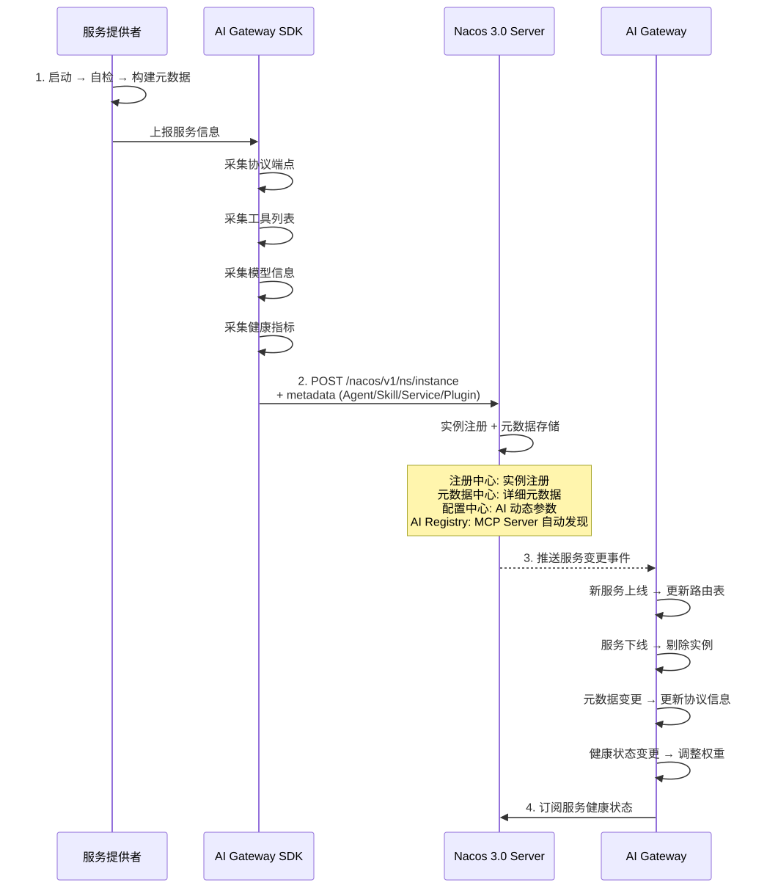

---

## 5. 协议支持详细设计

### 5.1 RESTful 协议

**支持范围**：
- 标准 RESTful（OpenAPI 3.0 规范）
- OpenAI Compatible API（Chat Completions、Embeddings、Models）
- 自定义业务 API

**核心处理流程**：


### 5.2 MCP (Model Context Protocol) 协议

**支持范围**：
- MCP 2025-11-25 规范
- SSE 传输
- Streamable HTTP 传输
- Tools、Resources、Prompts 三大原语
- OAuth 2.0 授权
- Server 自动发现与注册

**MCP 架构设计**：


**MCP Session 管理**：

```java
// McpSessionManager.java
@Service
public class McpSessionManager {

    private final RedisTemplate<String, McpSession> redisTemplate;

    /**
     * 创建 MCP SSE 会话
     */
    public McpSession createSession(String clientId) {
        String sessionId = UUID.randomUUID().toString();
        McpSession session = McpSession.builder()
            .sessionId(sessionId)
            .clientId(clientId)
            .transport(TransportType.SSE)
            .createdAt(Instant.now())
            .ttl(Duration.ofMinutes(30))
            .status(SessionStatus.ACTIVE)
            .build();

        redisTemplate.opsForValue().set(
            "mcp:session:" + sessionId, session, Duration.ofMinutes(30));

        return session;
    }

    /**
     * SSE → Streamable HTTP 协议桥接
     */
    public Flux<ServerSentEvent<String>> bridgeToStreamableHttp(
            String sessionId, McpRequest request) {
        return Flux.create(sink -> {
            // 注册到 Redis pub/sub
            redisTemplate.listenTo("mcp:response:" + sessionId)
                .doOnNext(msg -> sink.next(parseSse(msg)))
                .doOnComplete(sink::complete)
                .subscribe();
        });
    }
}
```

### 5.3 A2A (Agent-to-Agent) 协议

**支持范围**：
- A2A v0.3+ 规范
- Agent Card 自动生成与托管
- 基于 JSON-RPC 2.0 的 Task 管理
- SSE 流式任务更新
- gRPC 传输（v0.3+）
- OAuth 2.0 / OIDC 认证

**A2A 架构设计**：


**网关级 Agent Card 自动生成**：

```json
{
  "name": "AI Gateway — Unified Agent Platform",
  "description": "通过 AI Gateway 统一接入的企业级 Agent 平台",
  "url": "https://ai-gateway.example.com/a2a",
  "version": "1.0.0",
  "provider": {
    "organization": "MyCompany",
    "url": "https://mycompany.com"
  },
  "capabilities": {
    "streaming": true,
    "stateTransitionHistory": true,
    "humanInTheLoop": true
  },
  "authentication": {
    "schemes": ["bearer_token", "oauth2", "api_key"]
  },
  "defaultInputModes": ["text", "text/structured", "application/json"],
  "defaultOutputModes": ["text", "text/structured", "application/json"],
  "skills": [
    {
      "id": "weather_query",
      "name": "天气查询",
      "description": "全球城市天气查询与预报",
      "tags": ["weather", "utility"],
      "examples": ["北京今天天气怎么样？", "未来三天上海会下雨吗？"],
      "inputModes": ["text"],
      "outputModes": ["text", "text/structured"]
    }
  ]
}
```

### 5.4 ACP (Agent Communication Protocol) 协议

**支持范围**：
- ACP v1.0 规范（IBM/Linux Foundation 版本）
- REST + OpenAPI + JSON 传输
- SSE/WebSocket 流式通信
- mDNS/DNS-SD 本地服务发现
- 内置状态管理
- OAuth2 + 审计日志

**ACP 架构设计**：


### 5.5 协议转换矩阵

AI Gateway 核心能力之一是**任意协议之间的透明转换**：


**转换示例 — RESTful API → MCP Tool**：

```java
// RestToMcpTransformer.java
@Component
public class RestToMcpTransformer implements ProtocolTransformer {

    /**
     * 将 RESTful API (OpenAPI spec) 转换为 MCP Tool 定义
     */
    public McpToolDefinition transform(OpenApiSpec openApiSpec) {

        McpToolDefinition tool = new McpToolDefinition();
        tool.setName(toSnakeCase(openApiSpec.getOperationId()));
        tool.setDescription(openApiSpec.getDescription());
        tool.setInputSchema(openApiSpec.getRequestBodySchema());
        tool.setOutputSchema(openApiSpec.getResponseSchema());

        // 生成 MCP 工具调用处理器
        tool.setHandler(args -> {
            // 将 MCP 工具调用参数转换为 HTTP 请求
            HttpRequest httpRequest = buildHttpRequest(openApiSpec, args);
            // 通过 AI Gateway 代理执行 HTTP 调用
            return httpClient.execute(httpRequest);
        });

        return tool;
    }
}
```

---

## 6. 安全管理设计

### 6.1 多层安全架构


### 6.2 AI 特有能力

- **Prompt 注入检测**：基于 LangChain4j 的 PromptTemplate 安全校验 + 规则引擎
- **模型输出脱敏**：正则 + NER 双重策略（手机号、身份证、银行卡、邮箱）
- **越狱检测**：接入内容安全模型（如 OpenAI Moderation API 或自建模型）
- **Token 配额管理**：租户级/用户级/模型级三维 Token 预算控制
- **审计追踪**：完整记录每次 LLM 调用的 prompt、response、token 用量

### 6.3 认证配置示例

```java
// SecurityConfig.java
@Configuration
@EnableWebFluxSecurity
public class SecurityConfig {

    @Bean
    public SecurityWebFilterChain aiGatewaySecurityFilterChain(
            ServerHttpSecurity http) {

        return http
            // AI 端点 — API Key + JWT 双模式
            .securityMatcher(path -> path instanceof PathPatternParserServerWebExchangeMatcher
                && ((PathPatternParserServerWebExchangeMatcher) path).getPattern()
                    .toString().startsWith("/v1/"))
            .authorizeExchange(exchange -> exchange
                .pathMatchers("/v1/models").permitAll()
                .pathMatchers("/v1/chat/**").hasRole("AI_CONSUMER")
                .pathMatchers("/v1/admin/**").hasRole("ADMIN")
                .anyExchange().authenticated()
            )
            .oauth2ResourceServer(oauth2 -> oauth2
                .jwt(Customizer.withDefaults())
            )
            .addFilterBefore(apiKeyAuthFilter(), SecurityWebFiltersOrder.AUTHENTICATION)
            .addFilterBefore(rateLimitFilter(), SecurityWebFiltersOrder.AUTHORIZATION)
            .build();
    }
}
```

---

## 7. 观测与运维设计

### 7.1 可观测堆栈


### 7.2 AI 专用指标

| 指标分类 | 指标名称 | 说明 |
|---------|---------|------|
| **请求** | `ai_gateway_requests_total` | 总请求数（按 model, consumer, protocol） |
| **Token** | `ai_gateway_tokens_total` | Token 用量（input/output 分别统计） |
| **延迟** | `ai_gateway_latency_seconds` | P50/P95/P99 延迟 |
| **TTFT** | `ai_gateway_time_to_first_token_seconds` | 首 Token 延迟（流式专用） |
| **流式** | `ai_gateway_streaming_tokens_per_second` | 流式输出速率 |
| **错误** | `ai_gateway_errors_total` | 错误计数（按错误类型） |
| **限流** | `ai_gateway_rate_limited_total` | 限流拒绝数 |
| **Agent** | `ai_gateway_agent_tool_calls_total` | Agent 工具调用次数 |
| **Agent** | `ai_gateway_agent_loop_iterations` | ReAct 循环迭代数 |
| **费用** | `ai_gateway_cost_usd_total` | 预估费用（按定价 × Token） |

### 7.3 Agent 执行轨迹追踪

```java
// AgentTraceExporter.java
@Component
public class AgentTraceExporter {

    private final Tracer tracer;

    /**
     * 记录 Agent ReAct 循环的每一步
     */
    public Span recordReActStep(AgentContext context, ReActStep step) {
        Span span = tracer.spanBuilder("agent.react.step")
            .setAttribute("agent.name", context.getAgentName())
            .setAttribute("agent.step.type", step.getType().name())  // REASONING / ACTION / OBSERVATION
            .setAttribute("agent.step.iteration", step.getIteration())
            .setAttribute("agent.step.thought", step.getThought())
            .setAttribute("agent.step.action", step.getAction())
            .setAttribute("agent.step.tool_name", step.getToolName())
            .setAttribute("agent.step.tool_input", step.getToolInput())
            .setAttribute("agent.step.observation", step.getObservation())
            .startSpan();

        // 关联到父 trace
        span.setParent(Context.current()
            .with(Span.wrap(context.getRootSpanContext())));

        return span;
    }
}
```

---

## 8. 基础设施与部署

### 8.1 部署架构


### 8.2 Nacos 3.0 高可用配置

```yaml
# application.yml — Nacos 3.0 客户端配置
spring:
  cloud:
    nacos:
      discovery:
        server-addr: nacos-headless.ai-gateway.svc.cluster.local:8848
        namespace: ai-gateway-prod
        group: AI-GATEWAY
        # Nacos 3.0 特性
        metadata-service-enabled: true          # 启用元数据服务
        ai-registry-enabled: true               # 启用 AI Registry
        mcp-registry-enabled: true              # 启用 MCP Registry
      config:
        server-addr: nacos-headless.ai-gateway.svc.cluster.local:8848
        namespace: ai-gateway-prod
        group: AI-GATEWAY
        file-extension: yaml
        # Nacos 3.0 AI 配置
        ai-config:
          prompt-templates: true                # Prompt 模板管理
          model-parameters: true                # 模型参数动态管理
```

---

## 9. 开发工作流

### 9.1 本地开发

```bash
# 1. 启动 Nacos 3.0（开发模式）
docker run -d --name nacos-standalone \
  -e MODE=standalone \
  -e NACOS_AUTH_ENABLE=true \
  -p 8848:8848 -p 9848:9848 \
  nacos/nacos-server:v3.0.0

# 2. 启动 Redis
docker run -d --name redis -p 6379:6379 redis:7-alpine

# 3. 启动 AI Gateway
cd ai-gateway
./mvnw spring-boot:run -pl gateway-core \
  -Dspring.profiles.active=dev

# 4. 验证
curl http://localhost:8080/actuator/health
```

### 9.2 CI/CD 流水线


---

## 10. 风险评估

| 风险 | 影响 | 可能性 | 缓解措施 |
|------|------|-------|---------|
| **LLM 服务不可用** | 高 | 中 | 多模型降级链、自动重试、熔断器 |
| **Token 费用失控** | 高 | 中 | 三维 Token 配额（租户/用户/模型）、实时费用追踪、硬上限熔断 |
| **Prompt 注入攻击** | 高 | 中 | 多层检测（规则引擎 + AI 模型）、输入净化、租户隔离 |
| **Nacos 3.0 集群故障** | 高 | 低 | 本地缓存快照、3 节点 HA、跨可用区部署 |
| **协议兼容性问题** | 中 | 中 | 协议版本协商、灰度升级、兼容性测试矩阵 |
| **Wasm 插件沙箱逃逸** | 中 | 低 | Chicory 沙箱、资源限制、独立进程隔离 |
| **数据隐私泄露** | 高 | 低 | 传输/存储加密、强制脱敏、审计日志、数据驻留策略 |

---

## 11. 实施路线图

### 第一阶段：网关基础（第 1-2 周）
- [x] 项目骨架搭建（Maven 多模块）
- [x] Spring Cloud Gateway + WebFlux 基础集成
- [x] Nacos 3.0 注册中心集成
- [x] 基础路由转发（RESTful）
- [x] 健康检查与基础指标

### 第二阶段：协议支持（第 3-4 周）
- [ ] RESTful 协议适配器（OpenAI Compatible）
- [ ] MCP 协议适配器（SSE + Streamable HTTP）
- [ ] MCP Tool Registry
- [ ] A2A 协议适配器（Agent Card + Task）
- [ ] 协议转换引擎（至少 3 种转换路径）

### 第三阶段：安全与治理（第 5-6 周）
- [ ] 统一认证（API Key + JWT + OAuth2）
- [ ] RBAC 权限模型
- [ ] 多维度限流（QPM/TPM/并发）
- [ ] 内容安全审核
- [ ] 审计日志

### 第四阶段：智能路由与插件（第 7-8 周）
- [ ] AI 感知路由（模型路由、灰度路由）
- [ ] 多模型降级与回退
- [ ] Java 插件加载器
- [ ] Wasm 沙箱运行时（Chicory）
- [ ] 插件市场基础功能

### 第五阶段：观测与运维（第 9-10 周）
- [ ] OpenTelemetry 全链路追踪
- [ ] AI 专用 Metrics + Grafana 仪表板
- [ ] Token 级计费追踪
- [ ] Agent 执行轨迹可视化
- [ ] 告警规则与通知

### 第六阶段：生产就绪（第 11-12 周）
- [ ] 性能压力测试与调优
- [ ] 管理控制台（Vue 3 / React）
- [ ] 安全加固与渗透测试
- [ ] 文档完善
- [ ] 生产环境部署

---

## 附录

### A. 术语表

| 术语 | 全称 | 定义 |
|------|------|------|
| **MCP** | Model Context Protocol | Anthropic 提出的模型上下文协议，标准化 AI 模型与外部工具/数据源的交互 |
| **A2A** | Agent-to-Agent | Google 提出的智能体间通信协议，支持多 Agent 发现、任务委派和协作 |
| **ACP** | Agent Communication Protocol | IBM/Linux Foundation 提出的智能体通信协议，本地优先、REST-based |
| **SSE** | Server-Sent Events | 服务器推送事件，用于流式传输协议 |
| **ReAct** | Reasoning + Acting | 推理与行动交替的 Agent 执行范式 |
| **TTFT** | Time To First Token | 首个 Token 生成的延迟 |
| **TPM** | Tokens Per Minute | 每分钟 Token 限额 |
| **QPM** | Queries Per Minute | 每分钟请求数限额 |
| **Wasm** | WebAssembly | 轻量级沙箱运行时，用于安全执行插件代码 |
| **CRD** | Custom Resource Definition | Kubernetes 自定义资源定义 |
| **OTLP** | OpenTelemetry Protocol | 可观测性遥测数据传输协议 |

### B. Nacos 3.0 服务分类总结

| 服务类型 | `serviceType` | 典型协议 | 核心特征 |
|---------|---------------|---------|---------|
| **Agent** | `agent` | MCP, A2A, ACP, RESTful | 有推理/规划能力、可调用工具、有记忆 |
| **Skill** | `skill` | MCP, RESTful, ACP | 无状态/有状态技能、沙箱执行、确定性输入输出 |
| **Service** | `service` | RESTful, OpenAI Compatible | 模型推理服务、数据服务、存储服务 |
| **Plugin** | `plugin` | RESTful | 网关扩展插件、可热加载、有钩子点 |

### C. 图表索引

| 编号 | 图表名称 | 章节 | 说明 |
|------|---------|------|------|
| 图 1 | [系统高层架构图](images/01-high-level-architecture.svg) | §2.1 | Client/Data Plane/Control Plane/Backend 四层架构 |
| 图 2 | [模块依赖关系图](images/02-module-dependencies.svg) | §3.2 | 11 个子模块的依赖关系拓扑 |
| 图 3 | [Nacos 3.0 注册模型](images/03-nacos-registry-model.svg) | §4.1 | 命名空间/分组/服务/实例四层结构 |
| 图 4 | [多协议端点注册模型](images/04-multi-protocol-endpoint.svg) | §4.3 | 单服务多协议端点注册示意 |
| 图 5 | [服务注册发现流程](images/05-service-registry-flow.svg) | §4.5 | 服务提供者→SDK→Nacos→Gateway 全流程 |
| 图 6 | [RESTful 协议处理流程](images/06-restful-protocol-flow.svg) | §5.1 | OpenAI Compatible 请求的 7 步处理流程 |
| 图 7 | [MCP 架构设计](images/07-mcp-architecture.svg) | §5.2 | MCP Session/Tool Registry/Protocol Converter 三层 |
| 图 8 | [A2A 架构设计](images/08-a2a-architecture.svg) | §5.3 | A2A Agent Card/Task/Message/Bridge 四模块 |
| 图 9 | [ACP 架构设计](images/09-acp-architecture.svg) | §5.4 | ACP Discovery/State/Negotiation 三模块 |
| 图 10 | [协议转换矩阵](images/10-protocol-conversion-matrix.svg) | §5.5 | RESTful/MCP/A2A/ACP 四种协议双向转换 |
| 图 11 | [多层安全架构](images/11-security-layers.svg) | §6.1 | TLS→认证→鉴权→限流→内容安全五层防御 |
| 图 12 | [可观测堆栈](images/12-observability-stack.svg) | §7.1 | Traces/Metrics/Logs → OTLP Collector → 后端 |
| 图 13 | [K8s 部署架构](images/13-deployment-architecture.svg) | §8.1 | Pod/Nacos/Redis/Observability 集群拓扑 |
| 图 14 | [CI/CD 流水线](images/14-cicd-pipeline.svg) | §9.2 | Build→Test→Package→Push→Deploy 四阶段 |
| 图 15 | [请求生命周期](images/15-request-lifecycle.svg) | §2.3 | Chat Completion 的 10 步完整生命周期 |

### D. 参考项目

- [Higress — AI Native API Gateway](https://github.com/alibaba/higress) — 阿里巴巴开源的 AI 原生 API 网关
- [AgentScope — Developer-Centric Agent Framework](https://github.com/agentscope-ai/agentscope) — 通义实验室开源的智能体框架
- [Nacos 3.0 — Dynamic Naming & Configuration](https://nacos.io/) — 阿里巴巴开源的动态服务发现与配置管理平台
- [Spring AI](https://spring.io/projects/spring-ai) — Spring 官方的 AI 应用开发框架
- [LangChain4j](https://langchain4j.dev/) — Java 生态的 LangChain 实现
- [Model Context Protocol (MCP)](https://modelcontextprotocol.io/) — 模型上下文协议规范
- [Agent2Agent Protocol (A2A)](https://developers.googleblog.com/en/a2a-a-new-era-of-agent-interoperability/) — Google A2A 协议
- [Agent Communication Protocol (ACP)](https://agentcommunicationprotocol.dev/) — IBM/Linux Foundation ACP 协议规范
